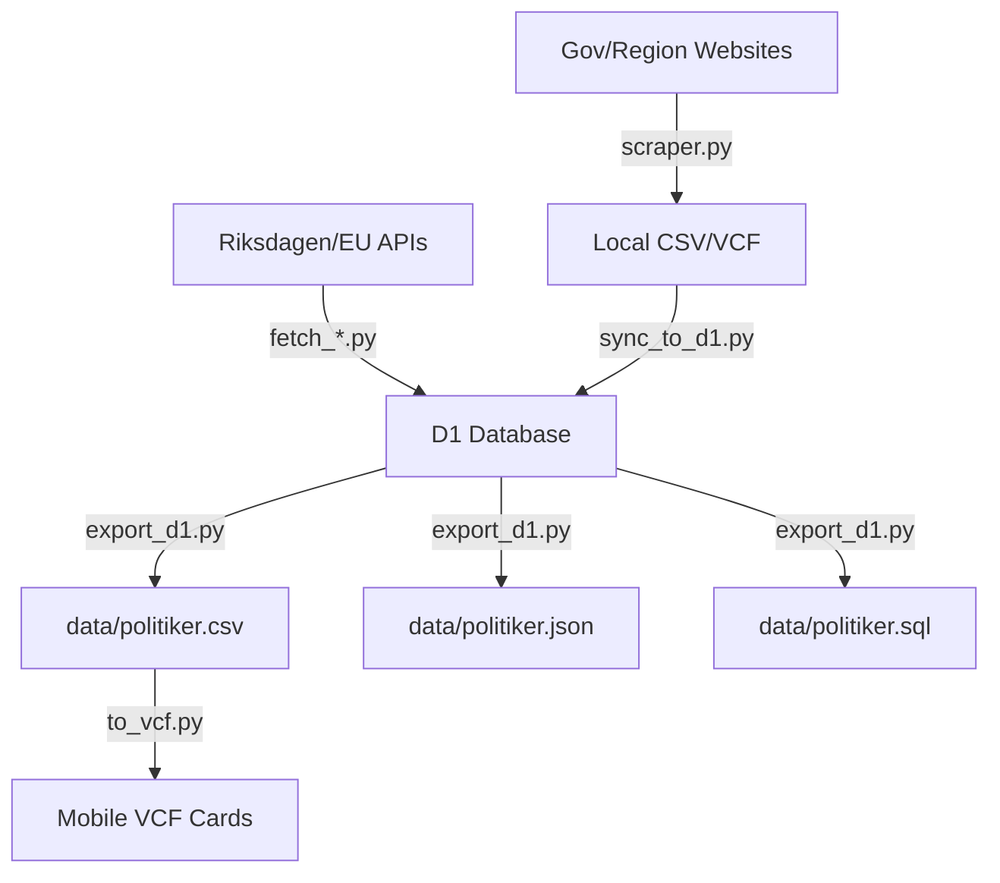

<details>
<summary>Relevant source files</summary>

The following files were used as context for generating this wiki page:

- [README.md](README.md)
- [AGENTS.md](AGENTS.md)
- [CLAUDE.md](CLAUDE.md)
- [scraper/scraper.py](scraper/scraper.py)
- [scraper/sync_to_d1.py](scraper/sync_to_d1.py)
- [export/export_d1.py](export/export_d1.py)
- [scraper/fetch_kyrka.py](scraper/fetch_kyrka.py)
</details>

# Introduction

Politiker-kontakter is a specialized web scraping and data synchronization system designed to collect publicly available contact information for elected officials across Sweden. This includes representatives in the 290 municipalities (kommuner), 21 regions, the Swedish Parliament (Riksdagen), the European Parliament (MEPs), and the Church of Sweden (Svenska kyrkan). The primary goal of the project is to aggregate this disparate data into a centralized, machine-readable format to support tools like the [politiker-webapp](https://politiker.denied.se).

The system automates the extraction of names, email addresses, party affiliations, and roles from various government portals and document formats (including PDF and server-rendered HTML). The final dataset is served through multiple formats—CSV, JSON, SQL, and VCF—allowing for easy integration into mobile contact lists or professional data analysis tools.

Sources: [README.md:1-10](README.md#L1-L10), [AGENTS.md:1-5](AGENTS.md#L1-L5), [CLAUDE.md:1-5](CLAUDE.md#L1-L5)

## System Architecture

The project is structured as a modular pipeline consisting of scrapers, synchronization utilities, and export scripts. The architecture relies on a centralized Cloudflare D1 database as the "source of truth" for the production environment.

### Core Components

| Component | Description | Primary Files |
| :--- | :--- | :--- |
| **Scraper Engine** | Uses Playwright and Python to navigate municipality and region websites. | `scraper/scraper.py` |
| **D1 Sync Utility** | Upserts scraped CSV data into the Cloudflare D1 database using a thread pool. | `scraper/sync_to_d1.py` |
| **Data Exporters** | Generates the public dataset (CSV/JSON/SQL) from the D1 database. | `export/export_d1.py` |
| **Specialized Fetchers** | Dedicated scripts for APIs like the Riksdagen API or EU Parliament API. | `scraper/fetch_riksdagen_members.py`, `scraper/fetch_eu_meps.py` |
| **Verification** | SMTP callout system to verify if extracted email addresses are still active. | `verify/verify_emails.py` |

Sources: [CLAUDE.md:13-25](CLAUDE.md#L13-L25), [README.md:38-65](README.md#L38-L65)

### Data Pipeline Flow

The following diagram illustrates the lifecycle of politician contact data, from the initial scraping of government websites to the final publication in the repository's `data/` directory.



The pipeline begins with automated scraping and API fetching, centralizes data in Cloudflare D1, and concludes with automated exports for public consumption.

Sources: [CLAUDE.md:38-45](CLAUDE.md#L38-L45), [README.md:12-36](README.md#L12-L36)

## Data Model

The system maintains a standardized record for every politician regardless of the source. The primary entity is the `politician`, stored in the `politicians` table in the D1 database.

### Schema Fields

| Field | Type | Description |
| :--- | :--- | :--- |
| `id` | TEXT | Unique identifier (often a hex/sha1 hash). |
| `name` | TEXT | Full name of the elected official. |
| `email` | TEXT | Official contact email address. |
| `area_name` | TEXT | The name of the municipality, region, or organization. |
| `area_type` | TEXT | Classification: `kommun`, `region`, `riksdag`, `eu`, `regering`, or `kyrka`. |
| `party` | TEXT | Political party affiliation. |
| `role` | TEXT | Current position (e.g., Ordförande, Ledamot). |
| `last_scraped_at` | INTEGER | Millisecond timestamp of the last successful scrape. |
| `verification_status`| TEXT | SMTP status: `valid`, `dead`, `catchall_unverified`, etc. |

Sources: [scraper/sync_to_d1.py:34-40](scraper/sync_to_d1.py#L34-L40), [export/export_d1.py:27-30](export/export_d1.py#L27-L30), [verify/verify_emails.py:46-55](verify/verify_emails.py#L46-L55)

## Scraper Strategy and Configurations

The scraper handles high variability across 300+ different websites by using a "type-based" configuration defined in `regioner.json`.

### Supported Scraper Types

The `scraper/scraper.py` script implements various logic branches based on the `"typ"` attribute in the configuration:

1.  **Netpublicator/Troman**: Proprietary platforms used by many Swedish regions. The scraper navigates their specific table structures to find profile links.
2.  **mailto**: Simple extraction of all `mailto:` links found on a given page.
3.  **namnmonster/namnlista**: Used when email addresses aren't directly linked but follow a known pattern (e.g., `firstname.lastname@municipality.se`).
4.  **PDF**: Uses `pypdf` to extract text and regex to find emails within uploaded documents.

Sources: [scraper/scraper.py:48-52](scraper/scraper.py#L48-L52), [CLAUDE.md:50-55](CLAUDE.md#L50-L55), [AGENTS.md:27-33](AGENTS.md#L27-L33)

### Error Handling and Sentry Integration

To manage the inherent instability of scraping hundreds of external sites, the system integrates Sentry for error tracking. Each municipality or region scrape is wrapped in a try-except block, ensuring that a failure on one site does not halt the entire process.

```python
# scraper/scraper.py:650-655
try:
    if region["typ"] == "netpublicator":
        people = await scrape_netpublicator(...)
    # ... other types
except Exception as e:
    log.error(f"{namn}: ohanterat fel, hoppar över ({e})")
    sentry_sdk.capture_exception(e)
    continue
```

Sources: [scraper/scraper.py:649-665](scraper/scraper.py#L649-L665), [README.md:41-45](README.md#L41-L45)

## Conclusion

Politiker-kontakter serves as a robust infrastructure for accessing Swedish democratic contact data. By combining modern web automation (Playwright) with cloud-native storage (D1), it transforms fragmented public records into a clean, verified, and accessible dataset. The system's modular design allows it to adapt to changing government website structures while providing a consistent API and file-based exports for the broader community.

Sources: [README.md:1-10](README.md#L1-L10), [CLAUDE.md:1-10](CLAUDE.md#L1-L10)
