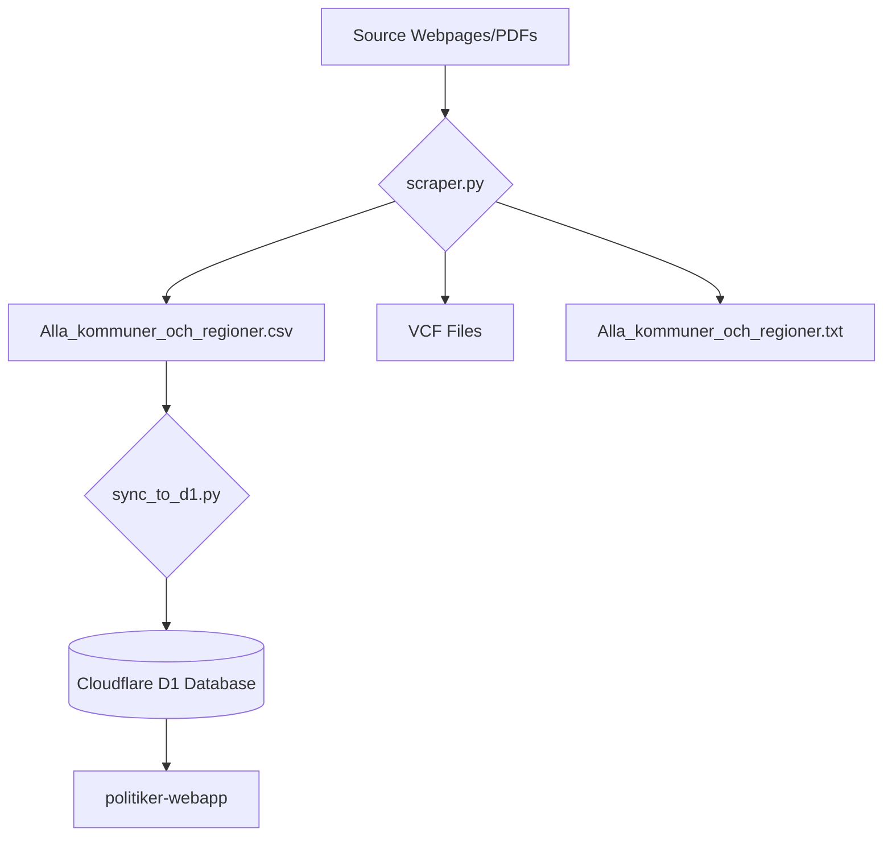
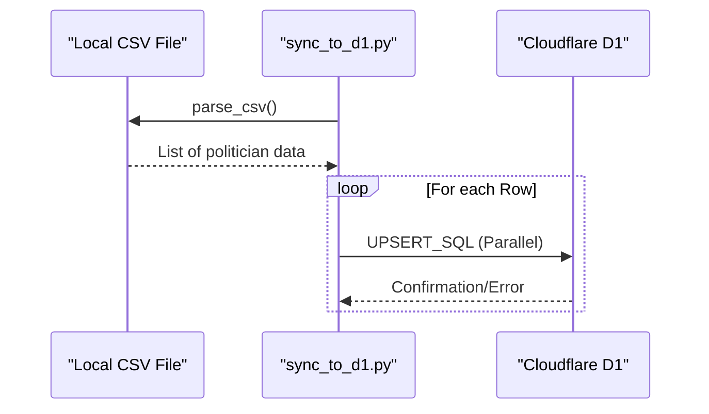

Relevant source files

The following files were used as context for generating this wiki page:

- [README.md](README.md)
- [AGENTS.md](AGENTS.md)
- [CLAUDE.md](CLAUDE.md)
- [docker-compose.yml](docker-compose.yml)
- [scraper/scraper.py](scraper/scraper.py)
- [scraper/quarterly_refresh.sh](scraper/quarterly_refresh.sh)
- [scraper/sync_to_d1.py](scraper/sync_to_d1.py)

# Getting Started

The **politiker-kontakter** project is a specialized scraping system designed to collect publicly available email addresses of elected officials across Sweden's 290 municipalities and 21 regions, as well as representatives in the EU Parliament, the Swedish Riksdag, and government departments. The primary purpose of this system is to maintain a synchronized database in Cloudflare D1 that powers the [politiker-webapp](https://politiker.denied.se).

The architecture relies on Python 3 with Playwright for headless browser automation and Docker for containerized execution. It extracts contact information from various sources including HTML tables, PDFs, and specific municipal software platforms like Troman or Netpublicator.

Sources: [README.md:1-5](README.md#L1-L5), [AGENTS.md:3-6](AGENTS.md#L3-L6), [CLAUDE.md:3-6](CLAUDE.md#L3-L6)

## Environment Setup and Installation

To begin working with the project, you must configure the environment variables and ensure Docker is installed. The system uses a `.env` file to manage directories for logs and output, as well as credentials for database synchronization.

### Initial Commands
1. Copy the example environment file: `cp .env.example .env`
2. Configure directories and tokens within `.env`.
3. Launch the scraper using Docker Compose: `docker compose up`

Sources: [AGENTS.md:14-19](AGENTS.md#L14-L19), [CLAUDE.md:14-19](CLAUDE.md#L14-L19), [README.md:33-37](README.md#L33-L37)

### Configuration Variables

| Variable | Description | Source File |
| :--- | :--- | :--- |
| `OUTPUT_DIR` | Local path where VCF, CSV, and TXT files are saved. | [docker-compose.yml:7](docker-compose.yml#L7) |
| `LOG_DIR` | Local path for scraper logs. | [docker-compose.yml:8](docker-compose.yml#L8) |
| `SENTRY_DSN` | Optional DSN for error tracking via Sentry. | [README.md:39-42](README.md#L39-L42) |
| `CLOUDFLARE_API_TOKEN` | Token with permissions to write to D1 database. | [CLAUDE.md:29-33](CLAUDE.md#L29-L33) |
| `D1_DATABASE_UUID` | The unique identifier for the Cloudflare D1 database. | [CLAUDE.md:29-33](CLAUDE.md#L29-L33) |

## Core Architecture and Data Flow

The project follows a linear data flow: scraping raw data, processing it into machine-readable formats, and synchronizing it with a remote database.

### System Workflow
The following diagram illustrates the lifecycle of data from municipal websites to the final database.

The scraper identifies contact patterns (scraped vs. pattern-guessed) and outputs them to the `OUTPUT_DIR`. The CSV file serves as the canonical transfer format for synchronization.

Sources: [CLAUDE.md:35-42](CLAUDE.md#L35-L42), [README.md:44-50](README.md#L44-L50), [scraper/scraper.py:657-675](scraper/scraper.py#L657-L675)

## Scraping Modules

The system is modularized into different scripts based on the target organization. 

### Regional and Municipal Scraping
The main logic resides in `scraper/scraper.py`. It uses `scraper/regioner.json` to define which "type" of scraper to apply to a specific URL.

*  **Supported Types:** `mailto`, `netpublicator`, `troman`, `w3d3`, `fmr`, `profilsidor`, `namnmonster`, `pdf`, `namnlista`.
*  **Key Logic:** Each type corresponds to a function (e.g., `scrape_netpublicator`) that returns a set of tuples containing `(name, email, party, role)`.

Sources: [AGENTS.md:41-47](AGENTS.md#L41-L47), [CLAUDE.md:61-66](CLAUDE.md#L61-L66), [scraper/scraper.py:61-65](scraper/scraper.py#L61-L65)

### Specialized Scrapers
| Script | Target | Data Retrieved |
| :--- | :--- | :--- |
| `fetch_eu_meps.py` | EU Parliament | Name, Party, Committee Role |
| `fetch_riksdagen_members.py` | Swedish Riksdag | Member Name, Party, Email |
| `sync_regeringen.py` | Gov. Departments | Department Registrar Emails |
| `fetch_kyrka.py` | Church of Sweden | Elected officials (nationally/Uppsala) |

Sources: [README.md:58-69](README.md#L58-L69), [scraper/quarterly_refresh.sh:25-40](scraper/quarterly_refresh.sh#L25-L40)

## Database Synchronization

The synchronization process moves local scraped results to the production database using the `D1Client` defined in `scraper/d1.py`.

### The sync_to_d1.py Logic
1.  **Read CSV:** Loads `Alla_kommuner_och_regioner.csv`.
2.  **Determine Area Type:** Uses `area_type_for()` to categorize entries as `region`, `riksdag`, `regering`, or `kommun`.
3.  **Parallel Upsert:** Uses a `ThreadPoolExecutor` with a default of 10 workers to perform SQL `INSERT OR IGNORE` or `UPDATE` operations.

Sources: [scraper/sync_to_d1.py:16-35](scraper/sync_to_d1.py#L16-L35), [scraper/sync_to_d1.py:84-100](scraper/sync_to_d1.py#L84-L100)

## Maintenance and Updates

The system is designed for periodic refreshes, particularly around electoral cycles. 

### Quarterly Refresh
The script `scraper/quarterly_refresh.sh` automates the entire pipeline:
1.  Build and run the Docker scraper.
2.  Sync municipal/regional results to D1.
3.  Fetch EU and Riksdag members.
4.  Backfill missing party or role information using `sync_party_from_val.py` (matching against Valmyndigheten open data).

Sources: [scraper/quarterly_refresh.sh:10-43](scraper/quarterly_refresh.sh#L10-L43), [scraper/sync_party_from_val.py:12-23](scraper/sync_party_from_val.py#L12-L23)

## Summary

To get started with **politiker-kontakter**, developers should focus on the Docker-based scraper and the `regioner.json` configuration. The system's robustness comes from its ability to handle multiple CMS types (Troman, Netpublicator, etc.) and its structured data flow from raw scraping to a Cloudflare D1 backend. Regular updates are managed through shell scripts that coordinate various specialized scrapers and synchronization tools.
