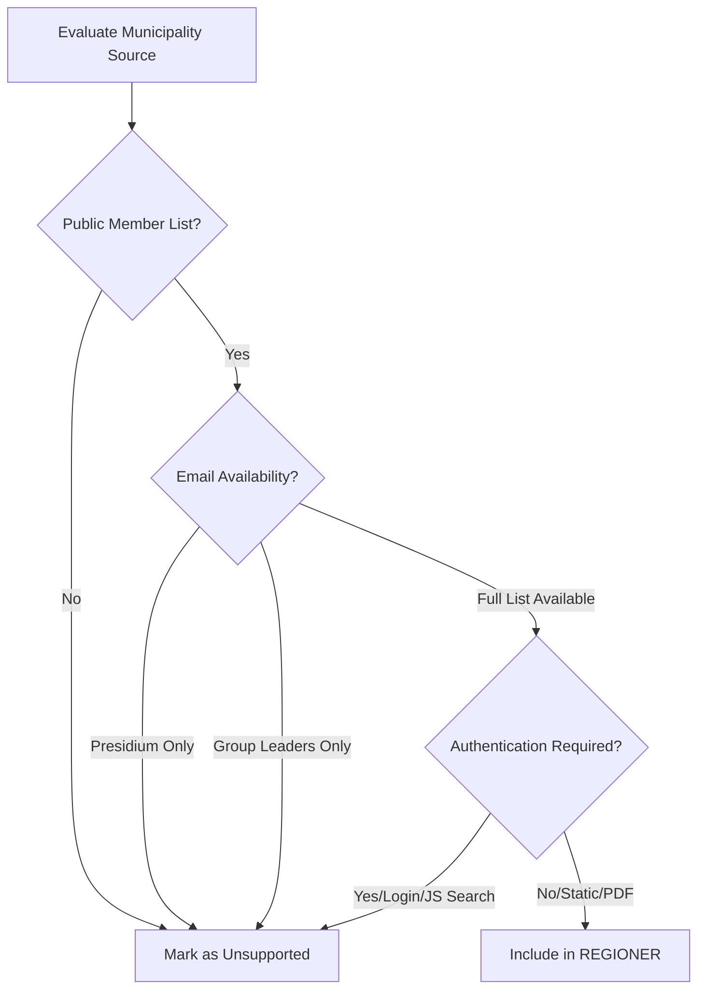

<details>
<summary>Relevant source files</summary>

The following files were used as context for generating this wiki page:

- [UNSUPPORTED\_KOMMUNER.md](UNSUPPORTED_KOMMUNER.md)
- [scraper/scraper.py](scraper/scraper.py)
- [scraper/regioner.json](scraper/regioner.json)
- [AGENTS.md](AGENTS.md)
- [CLAUDE.md](CLAUDE.md)
- [README.md](README.md)
</details>

# Unsupported Municipalities

The "Unsupported Municipalities" system within the `politiker-kontakter` project identifies and documents Swedish municipalities (*kommuner*) that cannot be automatically scraped for contact information. While the project successfully targets the majority of Sweden's 290 municipalities and 21 regions, a subset of 37 municipalities remains unsupported due to technical limitations, lack of public data, or restrictive access methods.

This categorization is crucial for maintaining the integrity of the contact database. It prevents the inclusion of guessed or incorrect data and provides a roadmap for future development if these municipalities update their web presence to a more accessible format.

Sources: [UNSUPPORTED\_KOMMUNER.md:1-12](UNSUPPORTED\_KOMMUNER.md#L1-L12), [AGENTS.md:1-5](AGENTS.md#L1-L5), [README.md:1-5](README.md#L1-L5)

## Criteria for Support

To be included in the automated scraping process, a municipality must provide a naming-consistent list of representatives with actual (not guessed) email addresses. The project follows a strict policy: "We never guess addresses" if SMTP verification is unavailable or if the source does not provide a reliable pattern.

Sources: [UNSUPPORTED\_KOMMUNER.md:4-9](UNSUPPORTED\_KOMMUNER.md#L4-L9), [scraper/fetch\_kyrka.py:22-24](scraper/fetch\_kyrka.py#L22-L24)

### Decision Flow for Municipality Support

The following diagram illustrates the logical checks used to determine if a municipality is moved to the "Unsupported" list or remains in the active `REGIONER` configuration.



Sources: [UNSUPPORTED\_KOMMUNER.md:14-88](UNSUPPORTED\_KOMMUNER.md#L14-L88), [scraper/scraper.py:610-660](scraper/scraper.py#L610-L660)

## Categories of Unsupported Municipalities

Municipalities are classified as unsupported based on the specific barrier preventing automated extraction.

### Partial Contact Disclosure
In many cases, municipalities publish a full list of names but only provide contact details for high-ranking officials.

| Barrier Type | Description | Examples |
| :--- | :--- | :--- |
| **Presidium Only** | Only the Chairman and Vice Chairmen have email links. | Ovanåker, Säffle, Vilhelmina, Skurup, Årjäng |
| **Group Leaders Only** | Only one leader per political party has an email address. | Arvidsjaur, Älvsbyn |
| **Presidium + Leaders** | Limited to specific roles; no uniform pattern for the whole council. | Vännäs, Vårgårda, Smedjebacken |

Sources: [UNSUPPORTED\_KOMMUNER.md:14-38](UNSUPPORTED\_KOMMUNER.md#L14-L38)

### Technical Access Barriers
Some municipalities use external systems or technologies that are incompatible with the current scraper's logic or require manual interaction.

*  **Authentication/SaaS Platforms**: Systems like Ciceron Assistent (Boden), Unikom (Hörby, Höör), or W3D3 (Enköping) that require logins or session-based searches.
*  **JS-Driven SPAs**: Single Page Applications (Luleå, Nordanstig) that do not provide a static list for scraping.
*  **Legacy Systems**: ASP-based search forms (Sjöbo) or sessions-based ASP.NET registers (Sandviken).

Sources: [UNSUPPORTED\_KOMMUNER.md:52-88](UNSUPPORTED\_KOMMUNER.md#L52-L88)

### Total Absence of Data
A significant number of municipalities (e.g., Falköping, Grums, Habo) list all members by name and party but provide zero email addresses, often redirecting users to generic info addresses or external party websites.

Sources: [UNSUPPORTED\_KOMMUNER.md:40-50](UNSUPPORTED\_KOMMUNER.md#L40-L50)

## Implementation in Codebase

The `scraper/scraper.py` file contains the primary logic for handled types, which are defined in `scraper/regioner.json`. When a municipality is deemed unsupported, it is excluded from `regioner.json` and documented in `UNSUPPORTED_KOMMUNER.md`.

### Comparison of Supported vs. Unsupported Logic
The supported types in the project utilize specific extraction functions, whereas unsupported municipalities lack these structures:

```python
# scraper/scraper.py:610-660
# Supported logic examples found in regioner.json
if region["typ"] == "netpublicator":
    people = await scrape_netpublicator(...)
elif region["typ"] == "troman":
    people = await scrape_troman(...)
elif region["typ"] == "w3d3":
    people = await scrape_w3d3(...)
# Unsupported municipalities fail to fit these patterns.
```

Sources: [scraper/scraper.py:610-660](scraper/scraper.py#L610-L660), [scraper/regioner.json:1-50](scraper/regioner.json#L1-L50)

## Summary of Statistics

| Metric | Count | Source |
| :--- | :--- | :--- |
| Total Municipalities in Sweden | 290 | [AGENTS.md:1-5](AGENTS.md#L1-L5) |
| Total Supported Entities (incl. Regions) | 253 | [UNSUPPORTED\_KOMMUNER.md:7-9](UNSUPPORTED\_KOMMUNER.md#L7-L9) |
| Unsupported Municipalities | 37 | [UNSUPPORTED\_KOMMUNER.md:3](UNSUPPORTED\_KOMMUNER.md#L3) |

The exclusion of these 37 municipalities ensures that the generated `Alla_kommuner_och_regioner.csv` and resulting D1 database entries maintain a high standard of accuracy, specifically avoiding "guessed" emails unless explicitly flagged as `pattern-guess` for verified name-pattern sources.

Sources: [UNSUPPORTED\_KOMMUNER.md:3-9](UNSUPPORTED\_KOMMUNER.md#L3-L9), [CLAUDE.md:40-50](CLAUDE.md#L40-L50), [scraper/scraper.py:566-575](scraper/scraper.py#L566-L575)
