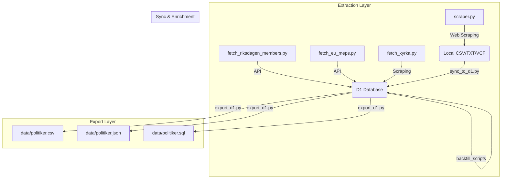
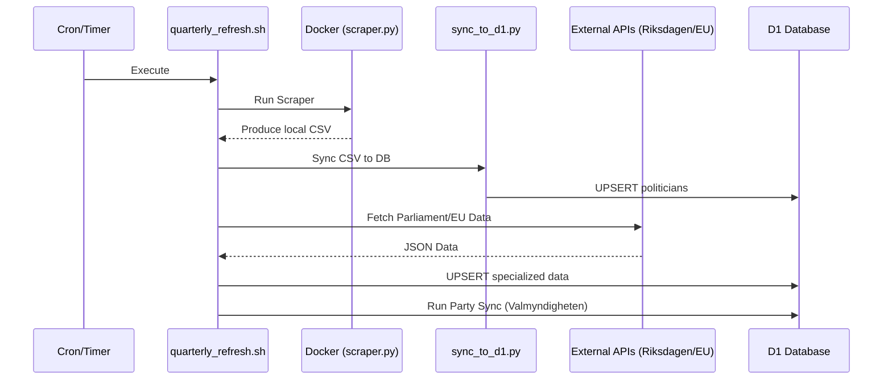

<details>
<summary>Relevant source files</summary>

The following files were used as context for generating this wiki page:

- [README.md](/README.md)
- [AGENTS.md](/AGENTS.md)
- [CLAUDE.md](/CLAUDE.md)
- [scraper/scraper.py](/scraper/scraper.py)
- [scraper/sync_to_d1.py](/scraper/sync_to_d1.py)
- [scraper/quarterly_refresh.sh](/scraper/quarterly_refresh.sh)
- [export/export_d1.py](/export/export_d1.py)
</details>

# Introduction

The **politiker-kontakter** project is a specialized web scraping and data synchronization system designed to collect publicly available contact information for elected officials in Sweden. Its primary scope covers representatives in all 290 municipalities (*kommuner*) and 21 regions, the Swedish Parliament (*Riksdagen*), the Government (*Regeringen*), the European Parliament (MEPs), and the Church of Sweden (*Svenska kyrkan*). The system automates the extraction of names, email addresses, political parties, and roles to maintain a centralized database that powers the [politiker-webapp](https://politiker.denied.se).

Sources: [README.md:3-8](README.md#L3-L8), [AGENTS.md:3-7](AGENTS.md#L3-L7), [CLAUDE.md:3-7](CLAUDE.md#L3-L7)

The project architecture relies on a modular set of Python scripts utilizing Playwright for browser-based scraping and a Cloudflare D1 database for storage. The extracted data is processed and exported into multiple formats, including CSV, JSON, and VCF (vCard) files, allowing for both programmatic use and easy import into mobile contact lists.

Sources: [AGENTS.md:10-15](AGENTS.md#L10-L15), [CLAUDE.md:10-15](CLAUDE.md#L10-L15), [README.md:11-16](README.md#L11-L16)

## System Architecture and Data Flow

The system operates through a multi-stage pipeline: extraction, enrichment, and synchronization. The core logic is housed in the `scraper/` directory, while export utilities reside in `export/`.

### High-Level Process Flow
The following diagram illustrates the lifecycle of data from initial scraping to the final exported database files.



Sources: [README.md:50-75](README.md#L50-L75), [scraper/quarterly_refresh.sh:15-38](scraper/quarterly_refresh.sh#L15-L38)

### Key Components

| Component | Responsibility | File Reference |
| :--- | :--- | :--- |
| **Main Scraper** | Handles browser-based scraping for 273+ municipalities/regions using Playwright. | `scraper/scraper.py` |
| **D1 Client** | A shared client (`D1Client`) used by all scripts to interact with the Cloudflare D1 database. | `scraper/d1.py` |
| **Sync Utility** | Upserts local CSV results from the scraper into the live database. | `scraper/sync_to_d1.py` |
| **Enrichment** | Matches representatives against Valmyndigheten data or backfills missing roles/parties. | `scraper/sync_party_from_val.py` |
| **Export Tool** | Generates stable, version-controlled snapshots of the database. | `export/export_d1.py` |

Sources: [CLAUDE.md:17-30](CLAUDE.md#L17-L30), [README.md:50-70](README.md#L50-L70)

## Data Model

The project maintains a unified schema for all elected officials. Data is categorized by `area_type` to distinguish between different levels of government.

### Politician Schema
The database table `politicians` contains the following primary fields:

*  **id**: A deterministic hex string (often derived from email and area name).
*  **name**: The full name of the representative.
*  **email**: The primary contact email address (used as part of the unique key).
*  **area_name**: The name of the municipality, region, or parliament.
*  **area_type**: Categorization: `kommun`, `region`, `riksdag`, `eu`, `regering`, or `kyrka`.
*  **party**: Political party affiliation.
*  **role**: The specific position held (e.g., *Ledamot*, *Ordförande*).
*  **last_scraped_at**: Timestamp of the last successful data retrieval.

Sources: [scraper/sync_to_d1.py:32-37](scraper/sync_to_d1.py#L32-L37), [export/export_d1.py:27-28](export/export_d1.py#L27-L28), [scraper/fetch_kyrka.py:48-54](scraper/fetch_kyrka.py#L48-L54)

## Execution and Automation

The system is designed for both manual execution via Docker and automated quarterly updates.

### Local Execution
To run the primary municipality and region scraper locally:

```bash
cp .env.example .env
# Adjust OUTPUT_DIR in .env
docker compose up
```

Sources: [README.md:38-42](README.md#L38-L42), [AGENTS.md:18-22](AGENTS.md#L18-L22)

### Automated Refresh Pipeline
The `scraper/quarterly_refresh.sh` script orchestrates a full update of all data sources. This is typically executed via cron or systemd-timers.



Sources: [scraper/quarterly_refresh.sh:10-38](scraper/quarterly_refresh.sh#L10-L38), [CLAUDE.md:43-48](CLAUDE.md#L43-L48)

## Conclusion

The **politiker-kontakter** project provides a robust, automated solution for maintaining an up-to-date registry of Swedish elected officials. By combining headless browser scraping with direct API integrations and database synchronization, it ensures high data quality across diverse public sources. The project's emphasis on open data is reflected in its automated export workflows, which provide the public with accessible CSV, JSON, and SQL formats of the collected contact information.

Sources: [README.md:11-20](README.md#L11-L20), [CLAUDE.md:43-48](CLAUDE.md#L43-L48)
