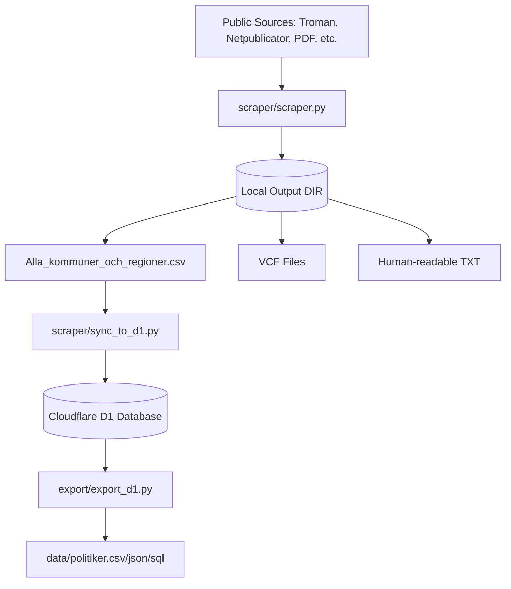

<details>
<summary>Relevant source files</summary>

The following files were used as context for generating this wiki page:

- [README.md](/README.md)
- [AGENTS.md](/AGENTS.md)
- [CLAUDE.md](/CLAUDE.md)
- [docker-compose.yml](/docker-compose.yml)
- [scraper/scraper.py](/scraper/scraper.py)
- [scraper/quarterly_refresh.sh](/scraper/quarterly_refresh.sh)
- [scraper/sync_to_d1.py](/scraper/sync_to_d1.py)
</details>

# Getting Started

The **politiker-kontakter** project is a specialized scraping system designed to extract publicly available email addresses of elected officials across Sweden's 290 municipalities, 21 regions, the Swedish Parliament (Riksdagen), the Government (Regeringen), and the EU Parliament. Its primary purpose is to aggregate this data into a centralized database (Cloudflare D1) and provide exportable formats such as CSV, JSON, and VCF for integration with mobile contacts and web applications.

Sources: [README.md:3-6](README.md#L3-L6), [AGENTS.md:5-10](AGENTS.md#L5-L10), [CLAUDE.md:5-10](CLAUDE.md#L5-L10)

## Prerequisites and Environment Setup

Before running the system, users must configure the environment and ensure necessary dependencies are available. The project utilizes Docker for containerization and Playwright for browser-based scraping.

### Environment Configuration
The system relies on a `.env` file for managing output directories, logging, and external service integrations.

1.  **Initialize Environment**: Copy the example file: `cp .env.example .env`.
2.  **Required Variables**:
  *  `OUTPUT_DIR`: Path where scraped results (CSV, TXT, VCF) are stored.
  *  `LOG_DIR`: Directory for scraper logs.
  *  `SENTRY_DSN` (Optional): For error tracking and crash reporting.
  *  `CLOUDFLARE_API_TOKEN`: Required for syncing data to Cloudflare D1.

Sources: [README.md:37-43](README.md#L37-L43), [AGENTS.md:18-22](AGENTS.md#L18-L22), [CLAUDE.md:18-22](CLAUDE.md#L18-L22), [docker-compose.yml:9-13](docker-compose.yml#L9-L13)

### Tech Stack
| Component | Technology |
| :--- | :--- |
| Runtime | Python 3 |
| Browser Automation | Playwright (Headless Chromium) |
| PDF Parsing | `pypdf` |
| Containerization | Docker & Docker Compose |
| Database | Cloudflare D1 |

Sources: [AGENTS.md:12-16](AGENTS.md#L12-L16), [CLAUDE.md:12-16](CLAUDE.md#L12-L16)

## Core System Architecture

The project is structured to separate data extraction, processing, and synchronization. The following diagram illustrates the high-level data flow from public websites to the final storage and export formats.



The diagram shows the lifecycle of data from initial scraping to synchronization with a remote database and subsequent export into canonical data files.
Sources: [README.md:52-73](README.md#L52-L73), [CLAUDE.md:33-51](CLAUDE.md#L33-L51), [scraper/sync_to_d1.py:10-20](scraper/sync_to_d1.py#L10-L20)

## Execution Workflows

### Running a Full Local Scrape
To execute the primary scraping logic for municipalities and regions, use Docker Compose. This ensures all dependencies like Playwright and Chromium are correctly configured.

```bash
docker compose up
```

This process performs the following:
1.  Loads configuration from `scraper/regioner.json`.
2.  Executes `scraper.py` which uses specific handlers (e.g., `scrape_netpublicator`, `scrape_troman`) based on the source type.
3.  Generates VCF cards for mobile import and a master CSV file.

Sources: [README.md:37-41](README.md#L37-L41), [AGENTS.md:37-43](AGENTS.md#L37-L43), [scraper/scraper.py:686-745](scraper/scraper.py#L686-L745)

### Database Synchronization
Once a scrape is complete, the data must be pushed to the Cloudflare D1 database that powers the [politiker-webapp](https://politiker.denied.se).

```bash
python3 scraper/sync_to_d1.py
```

This script reads `Alla_kommuner_och_regioner.csv` and performs asynchronous UPSERT operations to the `politicians` table.

Sources: [README.md:73-74](README.md#L73-L74), [scraper/sync_to_d1.py:27-33](scraper/sync_to_d1.py#L27-L33)

### Automation and Refresh
For long-term maintenance, the project includes a `quarterly_refresh.sh` script. This script orchestrates the entire pipeline:
1.  Running the Docker-based scraper.
2.  Syncing results to D1.
3.  Fetching specific updates for EU MEPs, Riksdagen members, and Government departments.
4.  Matching political parties via Valmyndigheten data.

Sources: [scraper/quarterly_refresh.sh:11-37](scraper/quarterly_refresh.sh#L11-L37)

## Data Models and Formats

The project handles various data representations depending on the stage of the pipeline.

### Database Schema (Politicians Table)
The core data structure used during synchronization and export:

| Field | Type | Description |
| :--- | :--- | :--- |
| `id` | TEXT | Unique identifier (derived from email/area hash or random) |
| `name` | TEXT | Full name of the official |
| `email` | TEXT | Public email address (canonical key) |
| `area_name` | TEXT | Municipality, Region, or Body name |
| `area_type` | TEXT | `kommun`, `region`, `riksdag`, `regering`, or `eu` |
| `party` | TEXT | Political party affiliation |
| `role` | TEXT | Official position or committee role |
| `last_scraped_at` | INTEGER | Millisecond timestamp of last update |

Sources: [scraper/sync_to_d1.py:35-41](scraper/sync_to_d1.py#L35-L41), [export/export_d1.py:31-33](export/export_d1.py#L31-L33), [scraper/fetch_eu_meps.py:38-42](scraper/fetch_eu_meps.py#L38-L42)

### Output Files
Scraped results are stored in the configured `OUTPUT_DIR`:
*  `Alla_kommuner_och_regioner.csv`: The machine-readable transfer format used for database sync.
*  `Alla_kommuner_och_regioner.txt`: Human-readable list with Swedish alphabetical sorting.
*  `vcf/`: Directory containing `.vcf` files for individual regions and a combined `Alla_regioner.vcf`.
*  `gissade_adresser.txt`: Logs addresses generated via name patterns (e.g., `namnmonster`) for verification.

Sources: [README.md:46-51](README.md#L46-L51), [CLAUDE.md:43-51](CLAUDE.md#L43-L51), [scraper/scraper.py:653-683](scraper/scraper.py#L653-L683)

## Summary
To get started with **politiker-kontakter**, configure your `.env` file and use `docker compose up` to perform an initial scrape. This system provides a robust pipeline for collecting and maintaining official contact data, with built-in tools for database synchronization and multi-format exports.

Sources: [README.md:3-6](README.md#L3-L6), [AGENTS.md:5-10](AGENTS.md#L5-L10)
