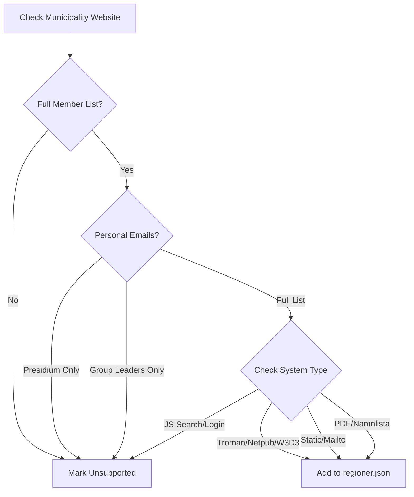

<details>
<summary>Relevant source files</summary>

The following files were used as context for generating this wiki page:

- [UNSUPPORTED\_KOMMUNER.md](/UNSUPPORTED_KOMMUNER.md)
- [scraper/scraper.py](/scraper/scraper.py)
- [scraper/regioner.json](/scraper/regioner.json)
- [README.md](/README.md)
- [AGENTS.md](/AGENTS.md)
- [CLAUDE.md](/CLAUDE.md)

</details>

# Unsupported Municipalities

Unsupported municipalities refer to the subset of Swedish local government entities (kommuner) that the project's scraper currently cannot process automatically. While the project aims to cover all 290 Swedish municipalities and 21 regions, as of the current status, 37 municipalities lack support due to specific deficiencies in how they publish public contact data.

The project requires a full, named list of members of the municipal council (kommunfullmäktige) accompanied by actual, verifiable email addresses. If a municipality only provides generic addresses, limits publication to high-ranking officials, or hides data behind complex search or login systems, it is classified as "Unsupported."

Sources: [UNSUPPORTED_KOMMUNER.md:1-10](UNSUPPORTED_KOMMUNER.md#L1-L10), [AGENTS.md:5-10](AGENTS.md#L5-L10)

## Classification of Support Deficiencies

Municipalities are excluded from the main scraping logic in `scraper/scraper.py` when they fail to meet transparency or accessibility requirements. These failures are categorized into several distinct types based on the level of data available.

### Partial Contact Information
Some municipalities publish member names but restrict email availability to specific roles. This prevents the scraper from building a comprehensive database of all elected officials.

*  **Presidium Only**: Only the Chairman and Vice-Chairmen have published email addresses. Examples include Ovanåker, Säffle, and Vilhelmina.
*  **Group Leaders Only**: Emails are restricted to one representative per political party. Examples include Arvidsjaur and Älvsbyn.
*  **Mixed Limited Groups**: A combination of the presidium, municipal commissioners (kommunalråd), and group leaders are the only ones with contact info. Examples include Vännäs and Smedjebacken.

Sources: [UNSUPPORTED_KOMMUNER.md:12-42](UNSUPPORTED_KOMMUNER.md#L12-L42)

### Complete Absence of Digital Contact Data
A significant group of unsupported municipalities provides a full list of names and party affiliations but fails to provide any individual email addresses, often redirecting users to a generic central address (e.g., `kommun@...`).

*  **Generic Redirection**: All council members are reachable only through a central administrative mailbox.
*  **External Party Links**: The municipality provides names but links only to external, private political party websites for contact.

Sources: [UNSUPPORTED_KOMMUNER.md:44-55](UNSUPPORTED_KOMMUNER.md#L44-L55)

## Technical Barriers and External Systems

Many municipalities utilize third-party platforms or legacy database systems to manage their elected official registers. These systems often implement anti-scraping measures or require manual interaction that the standard scraping logic cannot bypass.

### Systemic Barriers
The following table summarizes external systems that prevent automated data extraction:

| System Type | Barrier Description | Impacted Municipalities (Examples) |
| :--- | :--- | :--- |
| **Inloggningsbaserat** | Requires BankID or username/password authentication. | Boden (Ciceron Assistent), Kiruna (diariet.*) |
| **JS-SPA / Search Widgets** | Content is not present in static HTML; requires complex UI interaction or search queries. | Luleå (JS-SPA), Håbo (Search widget) |
| **Legacy / Session-based** | ASP.NET systems using session IDs or legacy ASP forms that require specific POST requests. | Sandviken (W3D3), Sjöbo (WinessInternetFms) |
| **Unikom / Ciceron** | External search registers that do not provide a flat, scrapable list of all members. | Hörby, Höör, Ronneby |

Sources: [UNSUPPORTED_KOMMUNER.md:57-89](UNSUPPORTED_KOMMUNER.md#L57-L89)

### Logic Flow of Municipality Support Identification

The following diagram illustrates the decision process used to determine if a municipality can be added to the supported `REGIONER` list in `scraper/regioner.json`.



The diagram shows the criteria used during manual verification to move a municipality from the unsupported list to the configuration file.

Sources: [UNSUPPORTED_KOMMUNER.md:94-101](UNSUPPORTED_KOMMUNER.md#L94-L101), [scraper/scraper.py:270-340](scraper/scraper.py#L270-L340)

## Integration and Recovery Process

Unsupported municipalities are not hard-coded for exclusion; they are simply omitted from `scraper/regioner.json`. To move a municipality from unsupported to supported status, it must be assigned a "typ" (type) that `scraper/scraper.py` can handle.

### Supported System Types
When a municipality fixes its data accessibility, it can be integrated using one of the following scrapable patterns:

*  **netpublicator**: Uses specific registry and board IDs.
*  **troman**: Crawls `tromanpublik.se` profiles.
*  **mailto**: Directly extracts mailto links from a static page.
*  **namnmonster**: Builds addresses based on a pattern (e.g., `firstname.lastname@domain.se`).
*  **pdf**: Extracts name/email pairs from a downloadable PDF list.

Sources: [scraper/scraper.py:480-530](scraper/scraper.py#L480-L530), [AGENTS.md:30-35](AGENTS.md#L30-L35), [CLAUDE.md:65-70](CLAUDE.md#L65-L70)

### Scraper Exception Handling
If a previously supported municipality changes its structure in a way that breaks the scrapers, the system logs the error and continues.

```python
# scraper/scraper.py:531-537
except Exception as e:
    log.error(f"{namn}: ohanterat fel, hoppar över ({e})")
    sentry_sdk.capture_exception(e)
    sentry_sdk.flush(timeout=5)
    continue
```

This ensures that a single broken municipality does not halt the entire process for the remaining 253 supported entities.

Sources: [scraper/scraper.py:531-537](scraper/scraper.py#L531-L537)

## Summary of Support Status

As of the latest verification, the project provides coverage for approximately 87% of Swedish municipalities and regions. The unsupported list serves as a backlog for future development or a record of transparency limitations in specific local governments.

| Status | Count | Description |
| :--- | :--- | :--- |
| **Supported** | 253 | Successfully scraped and synchronized to D1 database. |
| **Unsupported** | 37 | Excluded due to missing emails or technical barriers. |
| **Total Target** | 290 | All Swedish municipalities. |

Sources: [UNSUPPORTED_KOMMUNER.md:1-5](UNSUPPORTED_KOMMUNER.md#L1-L5), [README.md:10-15](README.md#L10-L15)
