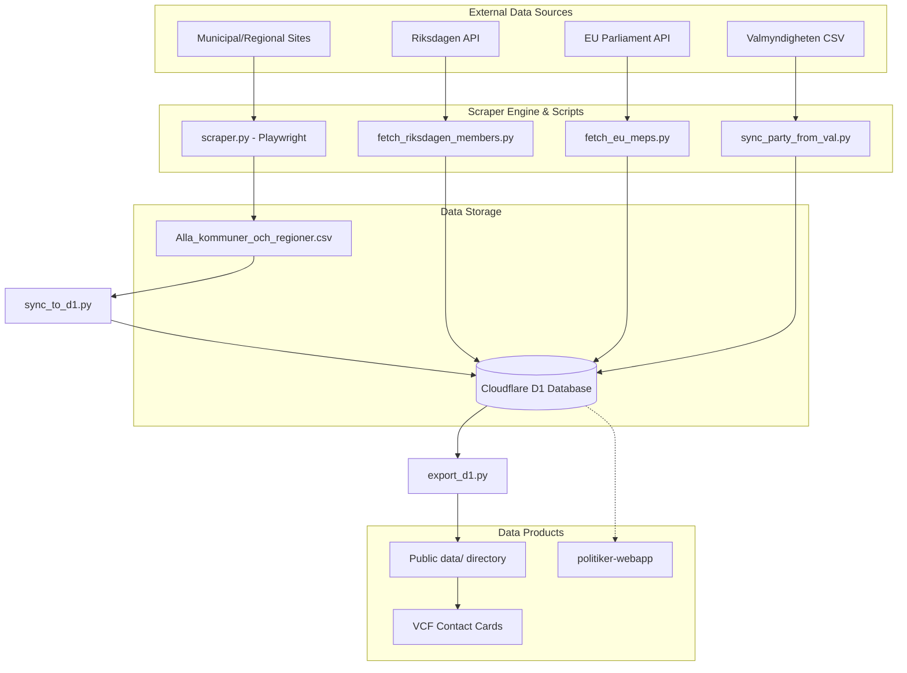
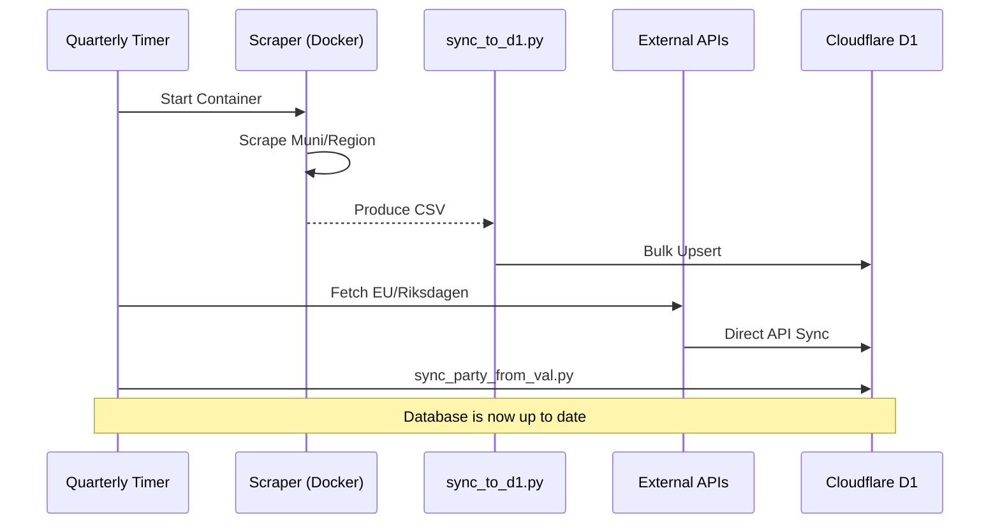

Relevant source files

The following files were used as context for generating this wiki page:

- [README.md](README.md)
- [AGENTS.md](AGENTS.md)
- [CLAUDE.md](CLAUDE.md)
- [scraper/scraper.py](scraper/scraper.py)
- [scraper/sync_to_d1.py](scraper/sync_to_d1.py)
- [scraper/quarterly_refresh.sh](scraper/quarterly_refresh.sh)
- [export/export_d1.py](export/export_d1.py)
- [scraper/fetch_eu_meps.py](scraper/fetch_eu_meps.py)

# Architecture Overview

The `politiker-kontakter` project is a specialized scraping and data synchronization system designed to collect publicly available contact information for elected officials in Sweden. Its primary scope includes all 290 municipalities (kommuner), 21 regions, the Swedish Parliament (Riksdagen), government departments, the European Parliament (MEPs), and Church of Sweden representatives.

The architecture is built around a modular Python-based scraping engine that utilizes Playwright for dynamic web content and specialized fetchers for various APIs. Data is unified in a Cloudflare D1 database, which serves as the backend for the [politiker-webapp](https://politiker.denied.se), while also being exported as CSV, JSON, and VCF files for public use.

Sources: [README.md:1-10](README.md#L1-L10), [AGENTS.md:3-8](AGENTS.md#L3-L8), [CLAUDE.md:3-8](CLAUDE.md#L3-L8)

## System Component Diagram

The following diagram illustrates the high-level flow from raw data sources to the final public data products and the web application database.

Sources: [README.md:12-40](README.md#L12-L40), [CLAUDE.md:12-25](CLAUDE.md#L12-L25), [scraper/quarterly_refresh.sh:15-35](scraper/quarterly_refresh.sh#L15-L35)

## Core Scraping Engine

The main scraping logic resides in `scraper/scraper.py`. It is designed to handle multiple web technologies used by Swedish public entities. The engine uses a configuration-driven approach where each municipality or region is assigned a "type" in `regioner.json`.

### Scraper Types and Methods
| Type | Description | Primary Method |
| :--- | :--- | :--- |
| `netpublicator` | Modern representative registers | `scrape_netpublicator()` |
| `troman` | Troman Publik portal data | `scrape_troman()` |
| `w3d3` | Formpipe W3D3 Ledamotspublicering | `scrape_w3d3()` |
| `mailto` | Direct scraping of email links | `scrape_mailto()` |
| `namnmonster` | Pattern-based email generation | `scrape_namnmonster()` |
| `pdf` | Parsing of uploaded PDF lists | `scrape_pdf_lista()` |

Sources: [scraper/scraper.py:64-70](scraper/scraper.py#L64-L70), [scraper/scraper.py:645-685](scraper/scraper.py#L645-L685), [CLAUDE.md:46-52](CLAUDE.md#L46-L52)

### Data Extraction Logic
The scraper collects a `set` of tuples containing `(name, email, party, role)`. It employs several heuristic strategies:
- **Cookie Acceptance:** Automatically clicks through common Swedish cookie banners to reach content.
- **Collapsible Expansion:** Fills out ARIA-expanded headers to ensure Playwright can "see" hidden email addresses.
- **Name Extraction:** Uses a best-effort approach via `<h1>` tags and page titles, cleaning common suffixes like "- Kommunnamn".

Sources: [scraper/scraper.py:105-115](scraper/scraper.py#L105-L115), [scraper/scraper.py:146-180](scraper/scraper.py#L146-L180), [AGENTS.md:27-32](AGENTS.md#L27-L32)

## Data Synchronization & D1 Integration

All collected data is eventually normalized into the Cloudflare D1 `politicians` table. The synchronization process is split into several specialized scripts to ensure robustness and maintainability.

### The Sync Pipeline
1. **Local CSV Generation:** The Playwright scraper outputs `Alla_kommuner_och_regioner.csv`.
2. **D1 Upsert:** `sync_to_d1.py` reads this CSV and performs an `INSERT ... ON CONFLICT` operation to update existing records or insert new ones.
3. **API Fetchers:** Scripts like `fetch_eu_meps.py` and `fetch_riksdagen_members.py` interact directly with the D1 database using `D1Client`.
4. **Backfilling:** `sync_party_from_val.py` matches scraped names against Valmyndigheten (Election Authority) data to fill in missing party affiliations.

Sources: [scraper/sync_to_d1.py:10-35](scraper/sync_to_d1.py#L10-L35), [scraper/fetch_eu_meps.py:10-25](scraper/fetch_eu_meps.py#L10-L25), [scraper/sync_party_from_val.py:10-30](scraper/sync_party_from_val.py#L10-L30)

### D1 Database Schema Model
Information is derived from the SQL `UPSERT` statements found in various sync scripts.

| Field | Type | Description |
| :--- | :--- | :--- |
| `id` | TEXT (hex) | Unique identifier generated via `lower(hex(randomblob(11)))`. |
| `name` | TEXT | Full name of the politician. |
| `email` | TEXT | Contact email address (part of UNIQUE constraint). |
| `area_name` | TEXT | Name of municipality, region, or parliament (part of UNIQUE constraint). |
| `area_type` | TEXT | One of: `kommun`, `region`, `riksdag`, `eu`, `regering`, `kyrka`. |
| `party` | TEXT | Political party abbreviation. |
| `role` | TEXT | Current position (e.g., Ordförande, Ledamot). |
| `last_scraped_at` | INTEGER | Millisecond timestamp of the last update. |
| `verification_status`| TEXT | SMTP verification status (e.g., `valid`, `dead`). |

Sources: [scraper/sync_to_d1.py:34-40](scraper/sync_to_d1.py#L34-L40), [scraper/fetch_kyrka.py:46-52](scraper/fetch_kyrka.py#L46-L52), [export/export_d1.py:92-105](export/export_d1.py#L92-L105)

## Automation & Lifecycle

The project maintains data freshness through a scheduled quarterly refresh and weekly automated exports.

### Refresh Workflow
The `quarterly_refresh.sh` script orchestrates the entire collection lifecycle:

Sources: [scraper/quarterly_refresh.sh:1-35](scraper/quarterly_refresh.sh#L1-L35)

### Data Exporting
To minimize database load, public data in the `data/` directory is updated weekly via GitHub Actions. The `export_d1.py` script performs keyset pagination (using `(email, area_name) > (?, ?)`) to safely extract all records from D1 without duplicate rows or skipping during concurrent writes.

Sources: [export/export_d1.py:30-55](export/export_d1.py#L30-L55), [README.md:15-25](README.md#L15-L25)

## Conclusion
The architecture of `politiker-kontakter` leverages a hybrid approach of heavy dynamic scraping (Playwright) and light API consumption. By decoupling the scraping logic from the database synchronization and utilizing a configuration-driven design, the system remains adaptable to the diverse web environments of the 300+ Swedish public organizations it monitors. Final data distribution is handled through a combination of a live D1 database and static public assets, ensuring accessibility for both developers and non-technical users.
