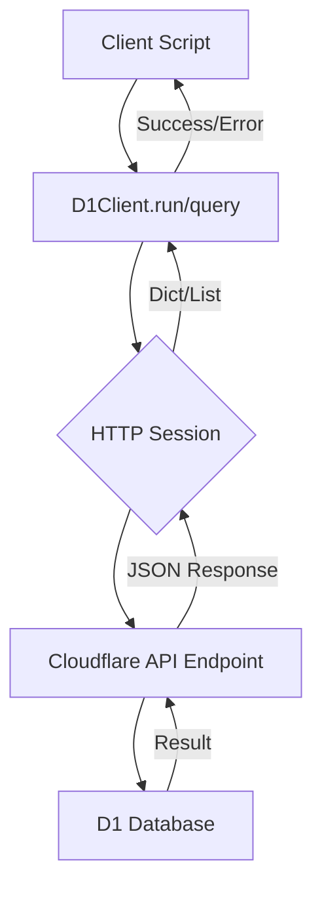
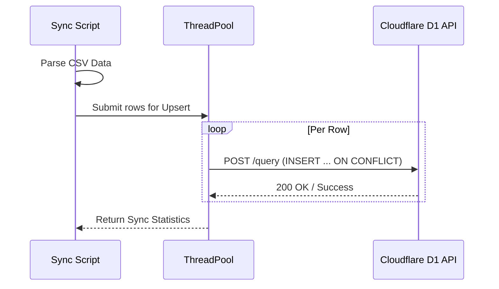

<details>
<summary>Relevant source files</summary>

The following files were used as context for generating this wiki page:

- [scraper/d1.py](scraper/d1.py)
- [scraper/sync_to_d1.py](scraper/sync_to_d1.py)
- [export/export_d1.py](export/export_d1.py)
- [scraper/fetch_eu_meps.py](scraper/fetch_eu_meps.py)
- [scraper/fetch_riksdagen_members.py](scraper/fetch_riksdagen_members.py)
- [verify/verify_emails.py](verify/verify_emails.py)
</details>

# Cloudflare D1 Integration

The Cloudflare D1 Integration serves as the central data persistence layer for the `politiker-kontakter` project. It provides a standardized mechanism for various scraper and synchronization scripts to interact with a Cloudflare D1 SQL database. This integration manages the storage of contact information for elected officials across Swedish municipalities, regions, the national parliament (Riksdagen), and the European Parliament.

The system is designed around a shared client architecture, ensuring consistent authentication, error handling, and API interaction across diverse modules including data scrapers, email verifiers, and export tools. Sources: [scraper/d1.py:1-15](scraper/d1.py#L1-L15), [README.md:1-10](README.md#L1-L10)

## Core Architecture: D1Client

The primary interface for database interaction is the `D1Client` class. It encapsulates Cloudflare's HTTP API, providing a simplified abstraction for executing SQL queries and managing authentication via Bearer tokens.

### Configuration and Authentication
The client initializes by reading environment variables. To support different deployment environments (such as GitHub Actions and local development), it accepts multiple aliases for required configuration keys. Sources: [scraper/d1.py:17-35](scraper/d1.py#L17-L35)

| Environment Variable | Alias | Description |
| :--- | :--- | :--- |
| `CLOUDFLARE_ACCOUNT_ID` | N/A | Unique Cloudflare account identifier. |
| `CLOUDFLARE_API_TOKEN_POLITIKER` | `CLOUDFLARE_API_TOKEN` | API token with D1 read/write permissions. |
| `D1_DATABASE_UUID` | `D1_DATABASE_ID` | The UUID of the specific D1 database. |

### Client Logic and API Flow
The client utilizes a `requests.Session` for connection pooling, which is critical for scripts performing thousands of concurrent updates. Sources: [scraper/d1.py:37-55](scraper/d1.py#L37-L55)



*This diagram shows the request flow from a specialized script through the shared D1Client to the Cloudflare API.*

## Data Model: The `politicians` Table

The integration centers on the `politicians` table. This table stores standardized information about officials, identified by a unique combination of their email address and the area they represent. Sources: [scraper/sync_to_d1.py:32-37](scraper/sync_to_d1.py#L32-L37), [export/export_d1.py:18-20](export/export_d1.py#L18-L20)

### Field Definitions

| Field | Type | Description |
| :--- | :--- | :--- |
| `id` | TEXT (PK) | Unique identifier, often generated via `randomblob` or SHA1 of email/area. |
| `name` | TEXT | Full name of the politician. |
| `email` | TEXT | Contact email address (normalized to lowercase). |
| `area_name` | TEXT | Name of the municipality, region, or department. |
| `area_type` | TEXT | Category: `kommun`, `region`, `riksdag`, `eu`, `regering`, or `kyrka`. |
| `party` | TEXT | Political party affiliation. |
| `role` | TEXT | Position/title held (e.g., Ordförande, Ledamot). |
| `last_scraped_at` | INTEGER | Millisecond timestamp of the last successful scrape. |
| `verification_status` | TEXT | SMTP verification result (e.g., `valid`, `dead`, `temporary`). |

Sources: [scraper/sync_to_d1.py:32-37](scraper/sync_to_d1.py#L32-L37), [export/export_d1.py:75-84](export/export_d1.py#L75-L84), [verify/verify_emails.py:46-56](verify/verify_emails.py#L46-L56)

## Synchronization and Upsert Logic

Data is ingested into D1 using an "Upsert" (Insert or Update) pattern. This ensures that existing records are updated with the latest name, party, or role information while new records are added automatically.

### Concurrency and Rate Limiting
Cloudflare D1's HTTP API does not support parameters with multiple statements in a single call. Consequently, `sync_to_d1.py` uses a `ThreadPoolExecutor` with a default of 10 workers to parallelize individual POST requests for efficiency. Sources: [scraper/sync_to_d1.py:19-25](scraper/sync_to_d1.py#L19-L25), [scraper/sync_to_d1.py:86-95](scraper/sync_to_d1.py#L86-L95)



*Sequence of the parallelized synchronization process used to update the database from scraped CSV files.*

## Data Export and Public Access

The integration facilitates the generation of public-facing data files. `export_d1.py` reads from the live D1 database to produce `politiker.csv`, `politiker.json`, and `politiker.sql`.

### Keyset Pagination
To handle large datasets without skipping records due to concurrent writes, the export system uses **Keyset Pagination**. It orders results by `(email, area_name)` and fetches the next page based on the values of the last record in the previous page. Sources: [export/export_d1.py:32-55](export/export_d1.py#L32-L55)

```python
# Keyset query example from export_d1.py
sql = (
    f"SELECT {cols} FROM politicians "
    f"WHERE (email, area_name) > (?, ?) ORDER BY email, area_name LIMIT {PAGE}"
)
```

Sources: [export/export_d1.py:41-44](export/export_d1.py#L41-L44)

## Verification and Maintenance

Beyond scraping, the D1 integration supports maintenance tasks like email verification.

### SMTP Verification Integration
The `verify_emails.py` script queries the `politicians` table to retrieve all email addresses, performs SMTP probes, and updates the `verification_status` and `last_verified_at` fields in D1. Sources: [verify/verify_emails.py:133-145](verify/verify_emails.py#L133-L145)

### Cleanup Operations
Specific fetchers, such as `fetch_riksdagen_members.py`, implement cleanup logic to remove officials who are no longer active (e.g., those who resigned or were replaced). This is done by performing a `DELETE` where the email is not present in the latest fetch results, but only if the fetch operation was entirely successful. Sources: [scraper/fetch_riksdagen_members.py:86-95](scraper/fetch_riksdagen_members.py#L86-L95)

## Summary

Cloudflare D1 Integration provides a robust backbone for the project's data lifecycle. By utilizing a shared `D1Client`, the system maintains high consistency across ingestion (scrapers), validation (email verifiers), and distribution (export scripts). The use of UPSERT logic and keyset pagination ensures the database remains accurate and performant even as the volume of tracked officials grows. Sources: [scraper/d1.py](scraper/d1.py), [scraper/sync_to_d1.py](scraper/sync_to_d1.py), [export/export_d1.py](export/export_d1.py)
