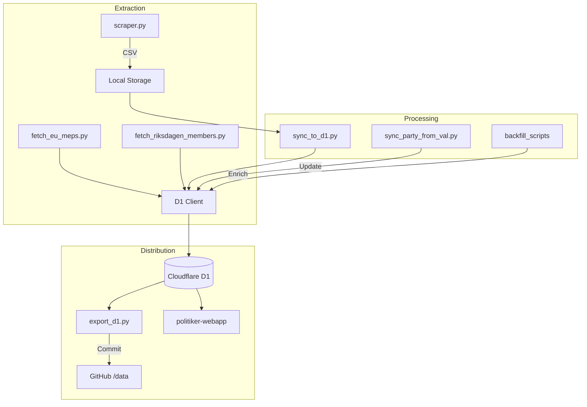
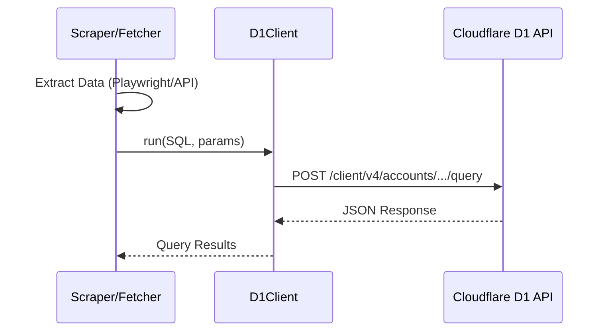

Relevant source files

The following files were used as context for generating this wiki page:

- [README.md](/README.md)
- [AGENTS.md](/AGENTS.md)
- [CLAUDE.md](/CLAUDE.md)
- [scraper/scraper.py](/scraper/scraper.py)
- [scraper/sync_to_d1.py](/scraper/sync_to_d1.py)
- [scraper/quarterly_refresh.sh](/scraper/quarterly_refresh.sh)
- [export/export_d1.py](/export/export_d1.py)
- [scraper/fetch_eu_meps.py](/scraper/fetch_eu_meps.py)

# Architecture Overview

The `politiker-kontakter` project is a specialized data collection and synchronization system designed to scrape public contact information (primarily email addresses) for elected officials in Sweden. This includes members of municipal and regional councils, the Swedish Parliament (Riksdagen), the Government (Regeringen), the European Parliament (MEPs), and the Church of Sweden. 

Sources: [README.md:1-5](README.md#L1-L5), [AGENTS.md:3-7](AGENTS.md#L3-L7)

The architecture follows a multi-stage pipeline: extraction from diverse web sources using Playwright and specialized API clients, normalization and enrichment (backfilling roles and parties), and synchronization to a centralized Cloudflare D1 database. The database then serves as the source of truth for the [politiker-webapp](https://politiker.denied.se).

Sources: [README.md:10-15](README.md#L10-L15), [CLAUDE.md:25-35](CLAUDE.md#L25-L35)

## Data Extraction Pipeline

The extraction layer is composed of a primary scraper for regional/municipal data and several specialized scripts for legislative bodies. 

### Scraper Engine
The core scraper (`scraper/scraper.py`) uses Playwright to navigate complex, JavaScript-heavy websites. It is configured via `scraper/regioner.json`, which defines the "type" of target site, allowing the scraper to apply different logic based on the underlying platform (e.g., Troman, Netpublicator, or PDF lists).

Sources: [scraper/scraper.py:46-51](scraper/scraper.py#L46-L51), [AGENTS.md:16-19](AGENTS.md#L16-L19), [CLAUDE.md:16-18](CLAUDE.md#L16-L18)

| Scraper Type | Description | Key Logic |
| :--- | :--- | :--- |
| `netpublicator` | Handles Netpublicator registers | Extracts from `table tbody tr` |
| `troman` | Handles Tromanpublik sites | Extracts from `#engagementTable` |
| `w3d3` | Handles Formpipe W3D3 instances | Identifies `#MainPagePlaceholder_Email` |
| `namnmonster` | Pattern-based guessing | Builds `first.last@domain` from text |
| `pdf` | PDF parsing | Uses `pypdf` to extract text from documents |

Sources: [scraper/scraper.py:167](scraper/scraper.py#L167), [scraper/scraper.py:223](scraper/scraper.py#L223), [scraper/scraper.py:255](scraper/scraper.py#L255), [scraper/scraper.py:365](scraper/scraper.py#L365), [scraper/scraper.py:488](scraper/scraper.py#L488)

### Specialized Fetchers
Legislative and institutional data is gathered through dedicated scripts that interface with official APIs or structured text files:
*  **EU MEPs**: Fetches from `data.europarl.europa.eu` and decodes obfuscated emails.
*  **Riksdagen**: Interfaces with `data.riksdagen.se` to retrieve 349 current members.
*  **Regeringen**: Reads registrar addresses from a local text file.
*  **Kyrkan**: Scrapes Swedish Church representatives using `requests` and `regex`.

Sources: [scraper/fetch_eu_meps.py:17-21](scraper/fetch_eu_meps.py#L17-L21), [scraper/fetch_riksdagen_members.py:22-24](scraper/fetch_riksdagen_members.py#L22-L24), [scraper/sync_regeringen.py:16-18](scraper/sync_regeringen.py#L16-L18), [scraper/fetch_kyrka.py:23-28](scraper/fetch_kyrka.py#L23-L28)

## Data Flow and Synchronization

The data flow follows a specific sequence, typically orchestrated by `scraper/quarterly_refresh.sh`.

*This diagram shows the movement of data from initial scraping to final distribution through GitHub and the web application.*

### Synchronization to D1
The `sync_to_d1.py` script acts as the bridge between the primary scraper's CSV output and the Cloudflare D1 database. It performs an `UPSERT` operation on the `politicians` table, ensuring records are updated if the unique combination of `email` and `area_name` already exists.

Sources: [scraper/sync_to_d1.py:31-35](scraper/sync_to_d1.py#L31-L35), [CLAUDE.md:38-42](CLAUDE.md#L38-L42)

### Database Export
To maintain a public version-controlled history, `export/export_d1.py` retrieves records from the live D1 database and generates canonical CSV, JSON, and SQL files in the `data/` directory.

Sources: [export/export_d1.py:1-12](export/export_d1.py#L1-L12), [README.md:13-17](README.md#L13-L17)

## Data Model

The project centers around a unified data model stored in the `politicians` table.

| Field | Type | Description |
| :--- | :--- | :--- |
| `id` | TEXT | Primary key (unique hash) |
| `name` | TEXT | Full name of the official |
| `email` | TEXT | Official contact address (unique with area_name) |
| `area_name` | TEXT | Name of municipality, region, or body |
| `area_type` | TEXT | Type (kommun, region, riksdag, eu, regering, kyrka) |
| `party` | TEXT | Political party affiliation |
| `role` | TEXT | Official role (e.g., Ordförande, Ledamot) |
| `last_scraped_at` | INTEGER | Millisecond timestamp of last update |
| `verification_status` | TEXT | SMTP verification status |

Sources: [scraper/sync_to_d1.py:31-35](scraper/sync_to_d1.py#L31-L35), [export/export_d1.py:22-25](export/export_d1.py#L22-L25), [CLAUDE.md:38-42](CLAUDE.md#L38-L42)

## Component Interactions

The system leverages a shared `D1Client` for all database interactions, abstracting the Cloudflare HTTP API.

*This sequence shows how individual components interact with the centralized Cloudflare D1 storage via the shared client.*

Sources: [CLAUDE.md:19-24](CLAUDE.md#L19-L24), [scraper/sync_to_d1.py:22-26](scraper/sync_to_d1.py#L22-L26)

## Operational Automation

The system is designed for periodic updates. 
1.  **Quarterly Refresh**: The `quarterly_refresh.sh` script executes a full pipeline: scraping regional data, syncing to D1, and fetching legislative updates.
2.  **Weekly Export**: A GitHub Action runs `export_d1.py` to update the public data files in the repository.
3.  **Renovate/Dependabot**: Automated dependency updates ensure the tech stack (Playwright, Python libraries) remains current.

Sources: [scraper/quarterly_refresh.sh:11-35](scraper/quarterly_refresh.sh#L11-L35), [README.md:18-22](README.md#L18-L22), [renovate.json:1-5](renovate.json#L1-L5)

## Conclusion

The architecture of `politiker-kontakter` is a robust extraction and synchronization engine that prioritizes data integrity through `UPSERT` logic and deterministic exports. By decoupling extraction (scrapers), enrichment (backfill scripts), and distribution (D1/GitHub exports), the system handles the highly heterogeneous landscape of Swedish public administration websites while providing a unified API for downstream applications.
