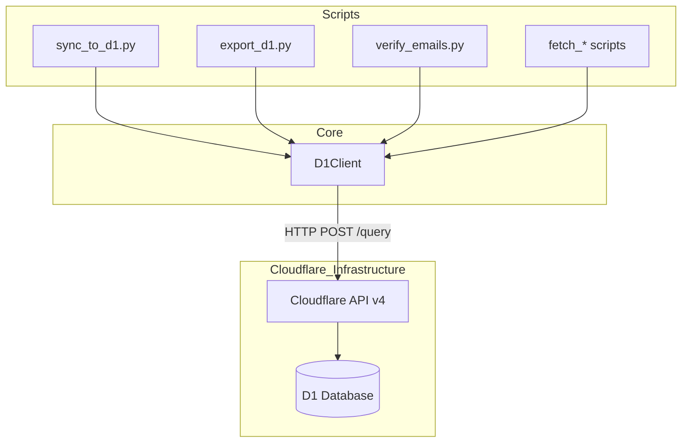
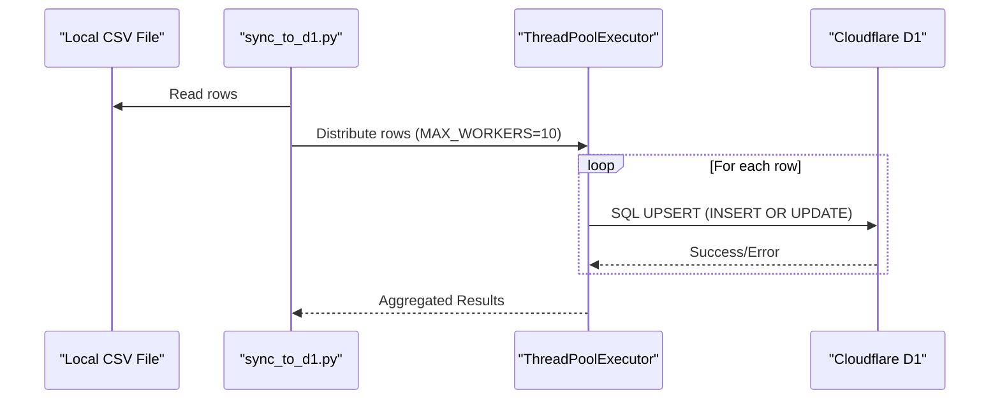

<details>
<summary>Relevant source files</summary>

The following files were used as context for generating this wiki page:

- [scraper/d1.py](/scraper/d1.py)
- [scraper/sync_to_d1.py](/scraper/sync_to_d1.py)
- [export/export_d1.py](/export/export_d1.py)
- [verify/verify_emails.py](/verify/verify_emails.py)
- [scraper/fetch_eu_meps.py](/scraper/fetch_eu_meps.py)
- [scraper/fetch_riksdagen_members.py](/scraper/fetch_riksdagen_members.py)
- [scraper/sync_regeringen.py](/scraper/sync_regeringen.py)
</details>

# Cloudflare D1 Integration

The Cloudflare D1 Integration serves as the persistence layer for the `politiker-kontakter` project, centralizing contact information for Swedish politicians, EU MEPs, and government officials. The system leverages Cloudflare's D1 SQL database to power the [politiker-webapp](https://politiker.denied.se), providing a structured storage mechanism for names, emails, political affiliations, and roles across various levels of government.

This integration includes components for synchronizing scraped data from local files, fetching data directly from external APIs (such as the EU Parliament and Swedish Riksdag) into the database, verifying the validity of stored email addresses, and exporting the database state into canonical formats like CSV, JSON, and SQL.

Sources: [scraper/d1.py](scraper/d1.py), [scraper/sync_to_d1.py:1-15](scraper/sync_to_d1.py#L1-L15), [README.md:1-10](README.md#L1-L10)

## Architecture and Components

The integration is built around a centralized client that abstracts the Cloudflare D1 HTTP API. This allows multiple specialized scripts to perform CRUD operations without duplicating authentication or connection logic.

### D1Client
The `D1Client` is a Python class that manages authentication and communication with the Cloudflare API. It uses a `requests.Session` to provide connection pooling, which is critical for scripts performing thousands of individual updates.

Sources: [scraper/d1.py:34-40](scraper/d1.py#L34-L40)



The diagram above illustrates how various scripts utilize the centralized `D1Client` to interact with the Cloudflare D1 infrastructure.
Sources: [scraper/d1.py](scraper/d1.py), [scraper/sync_to_d1.py](scraper/sync_to_d1.py), [export/export_d1.py](export/export_d1.py)

### Configuration
Configuration is managed via environment variables. The client supports several aliases to ensure compatibility across different deployment environments like local `.env` files and GitHub Actions secrets.

| Variable Name | Alias | Description |
| :--- | :--- | :--- |
| `CLOUDFLARE_ACCOUNT_ID` | N/A | Your Cloudflare Account ID |
| `CLOUDFLARE_API_TOKEN_POLITIKER` | `CLOUDFLARE_API_TOKEN` | API Token with D1 edit/read permissions |
| `D1_DATABASE_UUID` | `D1_DATABASE_ID` | The UUID of the specific D1 database |

Sources: [scraper/d1.py:13-25](scraper/d1.py#L13-L25), [CLAUDE.md:38-42](CLAUDE.md#L38-L42)

## Data Models and Schema

The primary table used within D1 is `politicians`. It stores the canonical record for every elected official or department contact.

### The `politicians` Table
The system uses an `UPSERT` logic (INSERT ... ON CONFLICT) to maintain data integrity, primarily using a combination of `email` and `area_name` as a unique identifier to prevent duplicates while allowing updates to names, parties, or roles.

| Field | Type | Description |
| :--- | :--- | :--- |
| `id` | TEXT | A unique identifier (often a random hex blob or SHA1 hash) |
| `name` | TEXT | Full name of the politician |
| `email` | TEXT | Primary contact email (lowercase) |
| `area_name` | TEXT | Name of the region, municipality, or department |
| `area_type` | TEXT | Category: `kommun`, `region`, `riksdag`, `eu`, `regering`, or `kyrka` |
| `party` | TEXT | Political party affiliation |
| `role` | TEXT | Official position or committee role |
| `last_scraped_at` | INTEGER | Millisecond timestamp of the last successful scrape |
| `verification_status` | TEXT | Result of SMTP verification (e.g., `valid`, `dead`, `temporary`) |

Sources: [scraper/sync_to_d1.py:32-36](scraper/sync_to_d1.py#L32-L36), [export/export_d1.py:80-90](export/export_d1.py#L80-L90), [verify/verify_emails.py:141-145](verify/verify_emails.py#L141-L145)

## Data Synchronization Flows

### Inbound Sync (Local Scraper to D1)
After the Playwright-based scraper generates a local `Alla_kommuner_och_regioner.csv` file, the `sync_to_d1.py` script parses this file and performs parallelized upserts to the database.



The synchronization process uses a `ThreadPoolExecutor` because the Cloudflare D1 HTTP API does not support parameterized batch statements in a single call, requiring individual POST requests for each row to maintain speed.
Sources: [scraper/sync_to_d1.py:17-25, 100-115](scraper/sync_to_d1.py#L17-L25)

### Outbound Export (D1 to Public Data)
To provide public access without stressing the live database, the `export_d1.py` script generates static files. It uses **keyset pagination** (WHERE (email, area_name) > (?, ?)) to fetch all rows reliably even if the database is being written to during the export.

Sources: [export/export_d1.py:33-45](export/export_d1.py#L33-L45)

## Email Verification Integration

The system includes a verification module (`verify_emails.py`) that performs "SMTP callouts." Since Cloudflare Workers block outgoing port 25, this script runs on external infrastructure but writes its results back to the D1 database.

1.  **MX Lookup**: Resolves the mail server for the politician's email domain.
2.  **SMTP Probe**: Initiates a connection and `RCPT TO` command.
3.  **Catch-all Detection**: Probes a random non-existent address to see if the server accepts all mail.
4.  **D1 Update**: Updates the `verification_status` and `last_verified_at` fields.

Sources: [verify/verify_emails.py:11-30, 80-100](verify/verify_emails.py#L11-L30)

## Implementation Details

### D1Client run/query methods
The `run` method returns the full result metadata, while `query` is a convenience wrapper specifically for `SELECT` statements that returns the row list.

```python
def run(self, sql: str, params: list | None = None, timeout: int = 30) -> dict:
    resp = self.session.post(
        self.url, json={"sql": sql, "params": params or []}, timeout=timeout
    )
    resp.raise_for_status()
    data = resp.json()
    if not data.get("success"):
        raise RuntimeError(f"D1-fel: {data.get('errors')}")
    return data["result"][0]
```

Sources: [scraper/d1.py:53-63](scraper/d1.py#L53-L63)

### Deterministic ID Generation
When exporting to SQL for imports or forks, the system generates deterministic IDs using SHA1 hashes of the `email|area_name` string. This ensures that the same politician always has the same ID across different database instances.

Sources: [export/export_d1.py:84-86](export/export_d1.py#L84-L86)

## Summary
The Cloudflare D1 Integration acts as the "Source of Truth" for the project. It provides a robust, HTTP-accessible SQL database that bridges the gap between various scraping scripts (running in Docker or via Cron) and the front-end web application. By utilizing standardized UPSERT patterns and centralized client logic, it ensures data consistency across over 17,000 politician records.
