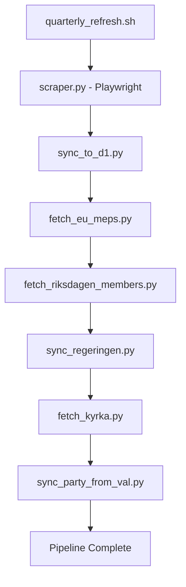
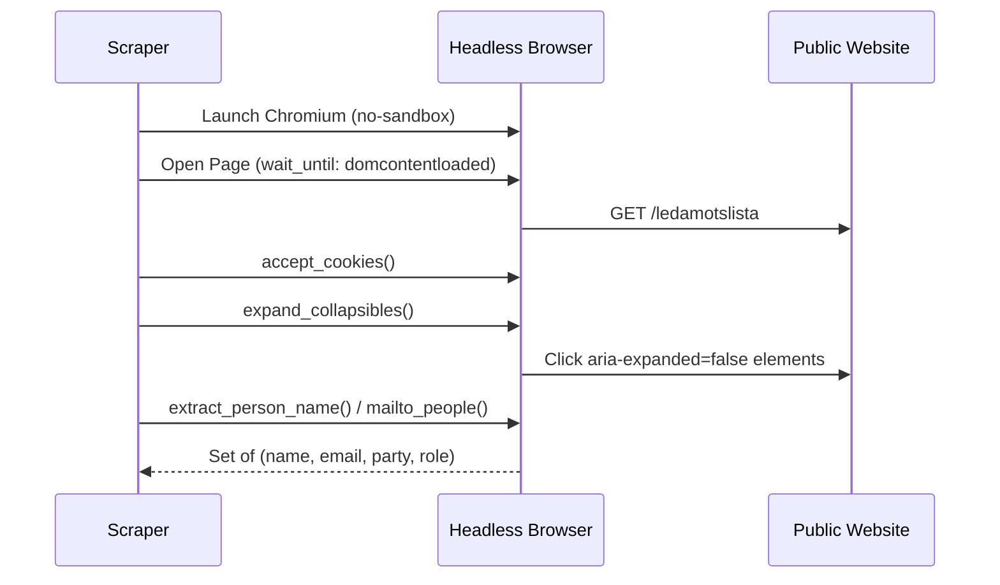
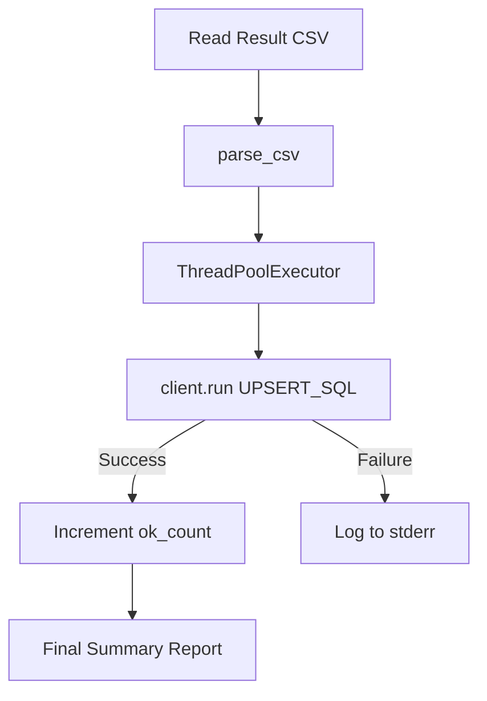

Relevant source files

The following files were used as context for generating this wiki page:

- [scraper/scraper.py](scraper/scraper.py)
- [scraper/sync_to_d1.py](scraper/sync_to_d1.py)
- [scraper/quarterly_refresh.sh](scraper/quarterly_refresh.sh)
- [scraper/fetch_kyrka.py](scraper/fetch_kyrka.py)
- [scraper/fetch_eu_meps.py](scraper/fetch_eu_meps.py)
- [AGENTS.md](AGENTS.md)
- [CLAUDE.md](CLAUDE.md)
- [README.md](README.md)

# Main Scraper Pipeline

The Main Scraper Pipeline is a multi-stage automated system designed to extract public contact information for elected officials across Swedish municipalities (kommuner), regions, the national parliament (Riksdagen), and the European Parliament. It utilizes a combination of headless browser automation, API integrations, and direct PDF/HTML parsing to maintain a comprehensive database of political contacts.

Sources: [README.md:3-10](README.md#L3-L10), [AGENTS.md:4-10](AGENTS.md#L4-L10)

## Pipeline Orchestration

The pipeline is orchestrated primarily through a quarterly refresh script and a containerized environment. While `scraper.py` handles the bulk of municipality and regional data extraction, several specialized scripts target different political tiers.

The diagram shows the sequential execution of data extraction and synchronization tasks as defined in the master refresh script.
Sources: [scraper/quarterly_refresh.sh:10-40](scraper/quarterly_refresh.sh#L10-L40)

## Data Extraction Strategies

The pipeline employs diverse strategies based on the target source's technical implementation. These configurations are stored in `regioner.json`.

### Scraper Types and Methods
| Type | Description | Key Components |
| :--- | :--- | :--- |
| `netpublicator` | Scrapes official registers using specific registry and board IDs. | `scrape_netpublicator` |
| `troman` | Extracts data from Troman-based public portals. | `scrape_troman` |
| `w3d3` | Interfaces with Formpipe W3D3 representative lists. | `scrape_w3d3` |
| `mailto` | Direct regex-based extraction of mailto links from a provided URL. | `scrape_mailto` |
| `namnmonster` | Generates emails based on name patterns (e.g., `firstname.lastname@domain`). | `scrape_namnmonster` |
| `pdf` | Parses downloadable PDF lists for contact pairs. | `scrape_pdf_lista` |

Sources: [scraper/scraper.py:64-70](scraper/scraper.py#L64-L70), [scraper/scraper.py:663-715](scraper/scraper.py#L663-L715), [CLAUDE.md:65-70](CLAUDE.md#L65-L70)

### Automated Browser Interaction
The pipeline uses Playwright (headless Chromium) to handle modern web interfaces, including cookie acceptance and accordion expansion.

The sequence shows how the scraper interacts with a web page to ensure all content (like hidden accordions) is visible before extraction.
Sources: [scraper/scraper.py:126-168](scraper/scraper.py#L126-L168), [scraper/scraper.py:643-660](scraper/scraper.py#L643-L660)

## Data Normalization and Storage

Extracted data is first gathered into a master dictionary (`alla_people`) before being written to various output formats.

### Output Formats
1.  **CSV (`Alla_kommuner_och_regioner.csv`)**: The canonical machine-readable format used for database synchronization.
2.  **TXT (`Alla_kommuner_och_regioner.txt`)**: Human-readable list with Swedish alphabetical sorting.
3.  **VCF**: Individual and collective vCard files for mobile import.
4.  **Gissade adresser**: A separate log of emails generated via pattern matching rather than direct scraping.

Sources: [scraper/scraper.py:593-635](scraper/scraper.py#L593-L635), [CLAUDE.md:38-50](CLAUDE.md#L38-L50), [AGENTS.md:23-30](AGENTS.md#L23-L30)

### D1 Database Schema
Data is synchronized to a Cloudflare D1 database into the `politicians` table.

| Field | Type | Constraint | Description |
| :--- | :--- | :--- | :--- |
| `id` | TEXT | PRIMARY KEY | Randomly generated 11-byte hex. |
| `name` | TEXT | | Full name of the politician. |
| `email` | TEXT | UNIQUE with area_name | Official email address. |
| `area_name` | TEXT | UNIQUE with email | Municipality, Region, or Parliament name. |
| `area_type` | TEXT | | 'kommun', 'region', 'riksdag', 'eu', 'regering', or 'kyrka'. |
| `party` | TEXT | | Political party affiliation. |
| `role` | TEXT | | Position (e.g., Ledamot, Ordförande). |
| `last_scraped_at` | INTEGER | | Unix timestamp (ms). |

Sources: [scraper/sync_to_d1.py:34-40](scraper/sync_to_d1.py#L34-L40), [scraper/fetch_kyrka.py:50-55](scraper/fetch_kyrka.py#L50-L55), [scraper/fetch_eu_meps.py:42-47](scraper/fetch_eu_meps.py#L42-L47)

## Specialized Extractors

Beyond the general municipality scraper, specific modules target high-level political entities:

### EU Parliament Extractor (`fetch_eu_meps.py`)
This module fetches all 27 countries' MEPs from the EU Open Data API. It performs a specific decoding of obfuscated email strings (reversing the string and replacing `[at]` and `[dot]`).
Sources: [scraper/fetch_eu_meps.py:10-30](scraper/fetch_eu_meps.py#L10-L30)

### Swedish Church Extractor (`fetch_kyrka.py`)
Targets the Church of Sweden's elected officials (Kyrkovalet). It filters lines based on `ROLE_KEYWORDS` such as "stiftsstyrelsen" or "kyrkostyrelsen" to avoid scraping administrative staff.
Sources: [scraper/fetch_kyrka.py:10-38](scraper/fetch_kyrka.py#L10-L38)

## Synchronization Logic

The `sync_to_d1.py` script manages the transfer of CSV data to the live database. It uses an `INSERT OR IGNORE` or `ON CONFLICT` strategy to ensure existing records are updated rather than duplicated.

The diagram illustrates the parallelized synchronization process used to upload data to Cloudflare D1.
Sources: [scraper/sync_to_d1.py:90-115](scraper/sync_to_d1.py#L90-L115)

## Conclusion
The Main Scraper Pipeline provides a robust, automated workflow for maintaining an up-to-date database of Swedish political contacts. By combining various extraction techniques and a centralized synchronization logic, the project ensures data accuracy while handling the technical diversity of over 300 different public portals.
