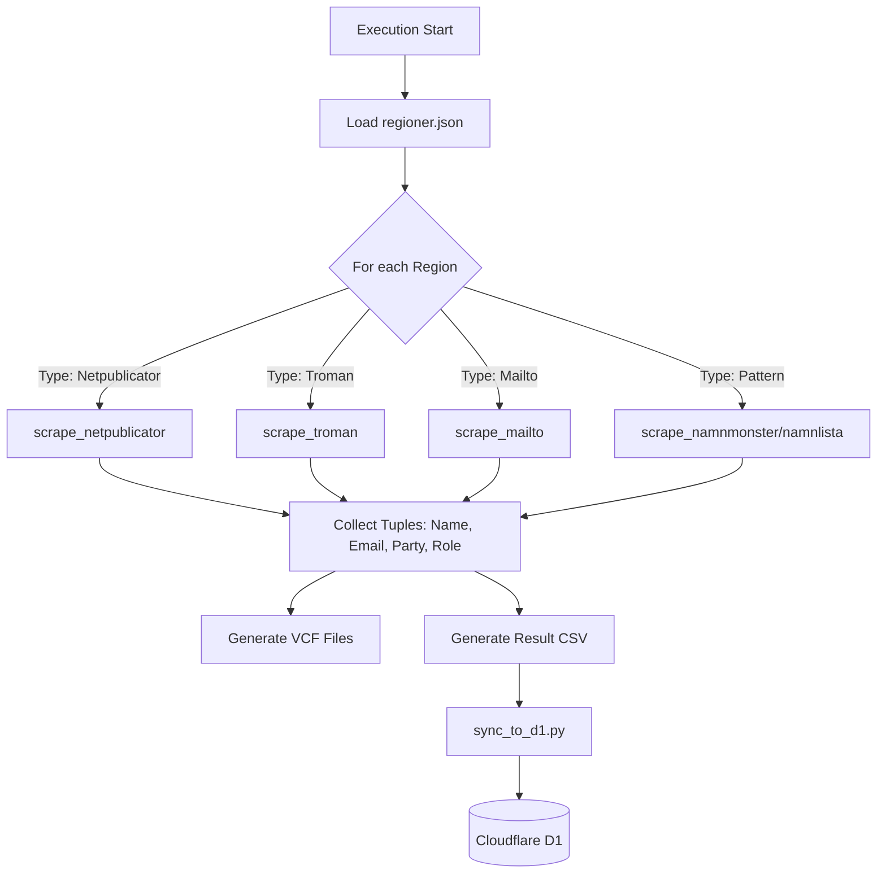
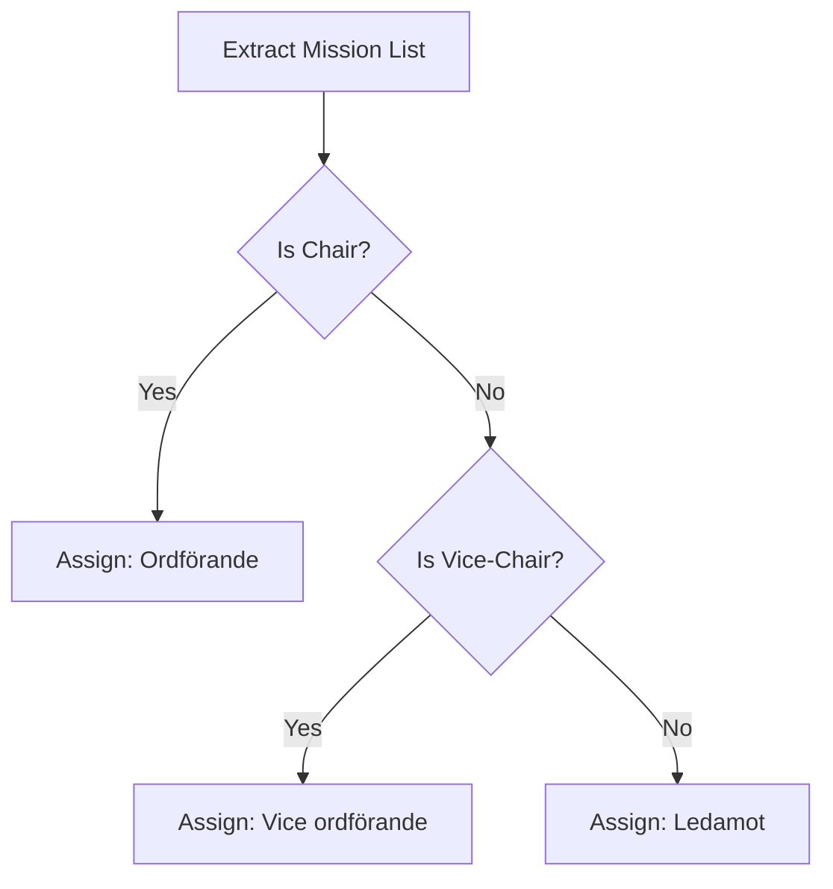

Relevant source files

The following files were used as context for generating this wiki page:

- [scraper/scraper.py](scraper/scraper.py)
- [scraper/regioner.json](scraper/regioner.json)
- [scraper/fetch_eu_meps.py](scraper/fetch_eu_meps.py)
- [scraper/fetch_riksdagen_members.py](scraper/fetch_riksdagen_members.py)
- [scraper/fetch_kyrka.py](scraper/fetch_kyrka.py)
- [scraper/backfill_kommun_role_party.py](scraper/backfill_kommun_role_party.py)
- [scraper/sync_to_d1.py](scraper/sync_to_d1.py)

# Scraper Types and Strategies

## Introduction
The "politiker-kontakter" project employs a multi-faceted scraping architecture designed to extract public contact information for elected officials across Swedish municipalities, regions, the national parliament (Riksdagen), and the European Parliament. The system utilizes various strategies ranging from headless browser automation using Playwright to direct API consumption and pattern-based email generation.

The core objective is to collect names, email addresses, party affiliations, and roles while ensuring data integrity and minimizing impact on target servers. This data is ultimately synchronized to a Cloudflare D1 database to power the [politiker-webapp](https://politiker.denied.se).

Sources: [README.md:1-10](README.md#L1-L10), [scraper/scraper.py:1-10](scraper/scraper.py#L1-L10), [CLAUDE.md:1-10](CLAUDE.md#L1-L10)

## Scraper Architecture and Data Flow

The project distinguishes between primary scraping (extracting data from web sources) and post-processing (backfilling roles or syncing to the database). The main entry point for municipal and regional data is `scraper/scraper.py`, which iterates through a configuration defined in `regioner.json`.

### High-Level Execution Flow
The following diagram illustrates how the system processes different types of political entities:

Sources: [scraper/scraper.py:596-665](scraper/scraper.py#L596-L665), [scraper/sync_to_d1.py:1-20](scraper/sync_to_d1.py#L1-L20), [CLAUDE.md:37-45](CLAUDE.md#L37-L45)

## Core Scraper Types

The system categorizes scrapers based on the target website's CMS or data structure.

### 1. Automated Browser Scrapers (Playwright)
These scrapers use `playwright` to navigate complex, JavaScript-heavy sites. They often involve a two-step process: identifying profile URLs and then visiting each profile to extract email addresses.

| Type | Target CMS / Structure | Logic Description |
| :--- | :--- | :--- |
| `netpublicator` | Netpublicator elected registers | Extracts roles and parties from a table, then visits profile pages for emails. |
| `troman` | Troman Publik | Collects links to person pages and extracts missions and emails from the profile. |
| `w3d3` | W3D3 Ledamotspublicering | Handles paginated lists via "Next" buttons and extracts email from specific IDs. |
| `fmr` | Livewire-based registers | Waits for `networkidle` to ensure Livewire components render before scraping. |

Sources: [scraper/scraper.py:171-294](scraper/scraper.py#L171-L294), [scraper/regioner.json](scraper/regioner.json)

### 2. Static and Pattern-Based Scrapers
When direct `mailto` links are not available or are structured predictably, the system uses pattern matching.

*  **Namnmonster / Namnlista**: These types build email addresses using the `fornamn.efternamn@domain.se` pattern based on names found in specific HTML sections.
*  **Mailto**: A fallback strategy that scans for any `a[href^='mailto:']` links on a given page.
*  **PDF**: Uses `pypdf` to extract text from downloadable PDF member lists and identify email patterns.

Sources: [scraper/scraper.py:339-498](scraper/scraper.py#L339-L498), [AGENTS.md:34-40](AGENTS.md#L34-L40)

## Specialized Entity Fetches

Certain political bodies are handled via dedicated scripts that often interface with official APIs or specific structured web pages.

### European Parliament (MEPs)
The MEP scraper uses the official EU Open Data API to get member lists and then scrapes individual profile pages to decode spam-protected email addresses (e.g., reversing strings and replacing `[at]` with `@`).
Sources: [scraper/fetch_eu_meps.py:15-50](scraper/fetch_eu_meps.py#L15-L50)

### Swedish Parliament (Riksdagen)
This scraper consumes the `data.riksdagen.se` JSON API. It specifically avoids the `rdlstatus=tjanst` parameter to prevent server instability and only fetch current members. It decodes email addresses by replacing `[på]` with `@`.
Sources: [scraper/fetch_riksdagen_members.py:16-45](scraper/fetch_riksdagen_members.py#L16-L45)

### Church of Sweden (Svenska kyrkan)
This scraper targets specific HTML pages on `svenskakyrkan.se`. It identifies members by searching for keywords like "kyrkostyrelsen" or "stiftsstyrelsen" in the text rows following a name.
Sources: [scraper/fetch_kyrka.py:18-40](scraper/fetch_kyrka.py#L18-L40)

## Data Extraction and Normalization Strategies

The scrapers employ several utility functions to ensure data consistency across different sources.

### Role Prioritization
In systems where a politician may have multiple roles (e.g., EU Parliament or Riksdagen), the scrapers use a priority map to select the most significant title (e.g., Chair > Member).

Sources: [scraper/fetch_eu_meps.py:46-51](scraper/fetch_eu_meps.py#L46-L51), [scraper/backfill_riksdagen_role.py:23-28](scraper/backfill_riksdagen_role.py#L23-L28)

### Email Validation and Filtering
To avoid collecting non-personal addresses, the system filters out emails containing specific keywords:
*  **Skip Keywords**: `noreply`, `webmaster`, `support`, `info@region`.
*  **Validation**: Uses `EMAIL_RE` and `is_valid_email()` to ensure the string matches standard formats and is not a generic contact point.

Sources: [scraper/scraper.py:53-65](scraper/scraper.py#L53-L65)

## Backfill and Maintenance Strategies

Since primary scraping may miss specific details like roles or party affiliations (especially for `mailto` types), the project includes backfill scripts.

*  **`backfill_kommun_role_party.py`**: A `requests`-based script that re-visits Troman and Netpublicator sites to update missing metadata for existing records in D1 without re-running the full Playwright suite.
*  **`sync_party_from_val.py`**: Matches scraped names against Valmyndigheten (Election Authority) open data to fill in party affiliations where they were not found on municipality websites.

Sources: [scraper/backfill_kommun_role_party.py:15-35](scraper/backfill_kommun_role_party.py#L15-L35), [scraper/sync_party_from_val.py:18-40](scraper/sync_party_from_val.py#L18-L40)

## Summary
The scraping strategy of "politiker-kontakter" is a hybrid approach tailored to the diverse landscape of Swedish public administration websites. By combining automated browser interactions for complex sites, API consumption for national/international bodies, and post-processing scripts for data enrichment, the system maintains a comprehensive and up-to-date database of ~17,000 elected officials.
