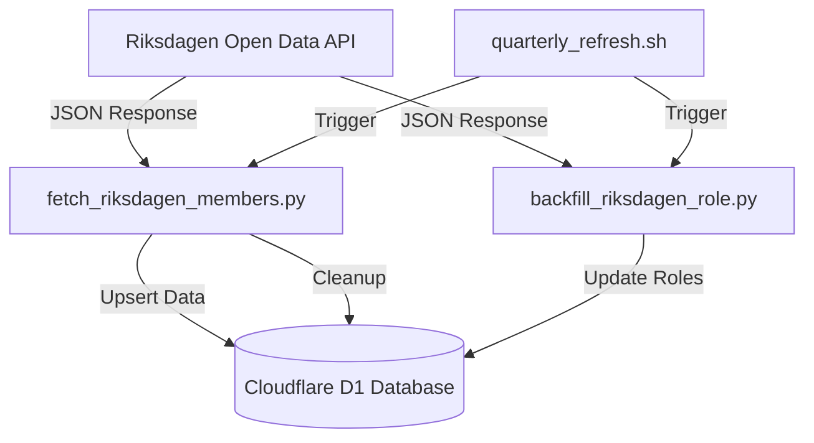
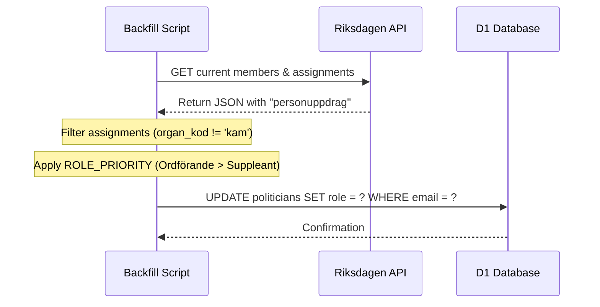

<details>
<summary>Relevant source files</summary>

The following files were used as context for generating this wiki page:

- [scraper/fetch_riksdagen_members.py](scraper/fetch_riksdagen_members.py)
- [scraper/backfill_riksdagen_role.py](scraper/backfill_riksdagen_role.py)
- [scraper/quarterly_refresh.sh](scraper/quarterly_refresh.sh)
- [README.md](README.md)
- [CLAUDE.md](CLAUDE.md)
</details>

# Riksdagen Scraper

The **Riksdagen Scraper** is a specialized module within the `politiker-kontakter` project designed to harvest contact information and committee roles for members of the Swedish Parliament (Sveriges riksdag). It serves as a critical data source for the [politiker-webapp](https://politiker.denied.se), ensuring that the central Cloudflare D1 database contains up-to-date records for all 349 current members of parliament.

The system is split into two primary operational phases: the initial fetching of member identities and email addresses, and a secondary "backfill" process that determines the most significant legislative role for each member based on committee assignments. This data is integrated into the global `politicians` table, facilitating mobile contact exports (VCF) and public data sharing.

Sources: [README.md:1-10](README.md#L1-L10), [scraper/fetch_riksdagen_members.py:6-12](scraper/fetch_riksdagen_members.py#L6-L12)

## Architecture and Data Flow

The Riksdagen Scraper utilizes the official Riksdagen Open Data API to retrieve member information. The architecture follows a multi-step synchronization pattern where data is first upserted into the D1 database and subsequently cleaned to remove inactive members.



The diagram shows the flow of data from the Riksdagen API to the Cloudflare D1 database via the fetching and backfilling scripts. Sources: [scraper/fetch_riksdagen_members.py:38-42](scraper/fetch_riksdagen_members.py#L38-L42), [scraper/backfill_riksdagen_role.py:33-40](scraper/backfill_riksdagen_role.py#L33-L40), [scraper/quarterly_refresh.sh:22-28](scraper/quarterly_refresh.sh#L22-L28)

### Synchronization Logic
The scraper implements a robust retry mechanism, attempting to contact the API up to five times to handle server instability. Once data is received, the script processes individual members to extract names, parties, and email addresses. A significant implementation detail is the conversion of spam-protected email strings (e.g., `[på]`) into standard `@` format.

Sources: [scraper/fetch_riksdagen_members.py:38-55](scraper/fetch_riksdagen_members.py#L38-L55), [scraper/fetch_riksdagen_members.py:59-65](scraper/fetch_riksdagen_members.py#L59-L65)

## Component Breakdown

### Fetching Member Data
The `fetch_riksdagen_members.py` script is responsible for the core ingestion of member data. It targets the current 349 members. Including the `rdlstatus` parameter is avoided to prevent heavy payloads and connection timeouts.

| Component | Description |
| :--- | :--- |
| `RIKSDAGEN_API` | `https://data.riksdagen.se/personlista/?utformat=json` |
| `UPSERT_SQL` | SQL command to insert or update member records on conflict of (email, area_name). |
| `extract_email` | Logic to find "Officiell e-postadress" and replace `[på]` with `@`. |
| `cleanup_sql` | Removes members no longer present in the latest API response to ensure data accuracy. |

Sources: [scraper/fetch_riksdagen_members.py:27-35](scraper/fetch_riksdagen_members.py#L27-L35), [scraper/fetch_riksdagen_members.py:59-65](scraper/fetch_riksdagen_members.py#L59-L65), [scraper/fetch_riksdagen_members.py:99-105](scraper/fetch_riksdagen_members.py#L99-L105)

### Role Backfilling
While the standard member list identifies everyone as a "Riksdagsledamot" (Member of Parliament), the `backfill_riksdagen_role.py` script enhances the database by identifying specific committee roles. Since a member can hold multiple positions, the system applies a priority-based selection.



The sequence shows how roles are determined by prioritizing specific titles over generic parliamentary membership. Sources: [scraper/backfill_riksdagen_role.py:12-25](scraper/backfill_riksdagen_role.py#L12-L25), [scraper/backfill_riksdagen_role.py:43-58](scraper/backfill_riksdagen_role.py#L43-L58)

#### Role Priority Table
The system assigns the role with the lowest numerical rank from the following priority mapping:

| Role Title (roll_kod) | Priority Rank |
| :--- | :--- |
| Ordförande (Chair) | 0 |
| Vice ordförande (Vice Chair) | 1 |
| Ledamot (Member) | 2 |
| Suppleant (Substitute) | 3 |
| Others | 50 |

Sources: [scraper/backfill_riksdagen_role.py:28](scraper/backfill_riksdagen_role.py#L28)

## Data Model Integration

Riksdagen data is stored in the central `politicians` table with specific identifiers to distinguish it from regional or municipal data.

- **area_type**: Hardcoded to `riksdag`.
- **area_name**: Hardcoded to `Sveriges riksdag`.
- **id**: A deterministic or random blob generated during upsert.
- **last_scraped_at**: A millisecond timestamp tracking the latest sync.

Sources: [scraper/fetch_riksdagen_members.py:31-35](scraper/fetch_riksdagen_members.py#L31-L35), [scraper/sync_to_d1.py:38-40](scraper/sync_to_d1.py#L38-L40)

## Execution and Maintenance

The Riksdagen Scraper is integrated into the `quarterly_refresh.sh` shell script, which orchestrates a full update of the political contact database.

```bash
# From scraper/quarterly_refresh.sh
echo "--- Hämtar riksdagens nuvarande ledamöter ---"
python3 fetch_riksdagen_members.py

# Backfilling usually follows or is triggered by specific maintenance needs
# as noted in project documentation.
```

Sources: [scraper/quarterly_refresh.sh:22-23](scraper/quarterly_refresh.sh#L22-L23), [CLAUDE.md:37-39](CLAUDE.md#L37-L39)

### Environment Configuration
The module requires the following environment variables to interact with the Cloudflare D1 environment:
- `CLOUDFLARE_ACCOUNT_ID`
- `CLOUDFLARE_API_TOKEN_POLITIKER`
- `D1_DATABASE_UUID`

Sources: [CLAUDE.md:31-35](CLAUDE.md#L31-L35), [scraper/fetch_riksdagen_members.py:21-25](scraper/fetch_riksdagen_members.py#L21-L25)

## Summary
The Riksdagen Scraper ensures the project maintains a high-fidelity list of Swedish national legislators. By utilizing a priority-based role assignment and a strict cleanup process, it provides more granular data than a simple membership list, facilitating specific filtering by committee leadership and party affiliation.
