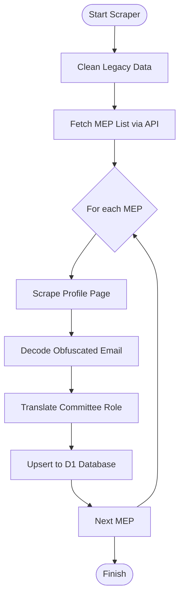

<details>
<summary>Relevant source files</summary>

The following files were used as context for generating this wiki page:

- [scraper/fetch_eu_meps.py](scraper/fetch_eu_meps.py)
- [scraper/quarterly_refresh.sh](scraper/quarterly_refresh.sh)
- [README.md](README.md)
- [CLAUDE.md](CLAUDE.md)
- [scraper/d1.py](scraper/d1.py)
</details>

# EU Parliament Scraper

The **EU Parliament Scraper** is a specialized module within the `politiker-kontakter` project designed to retrieve contact information for Members of the European Parliament (MEPs) across all 27 EU member states. Its primary objective is to populate the `politicians` table in a Cloudflare D1 database, which serves as the backend for the [politiker-webapp](https://politiker.denied.se).

The scraper combines data from the European Parliament's official Open Data API with targeted web scraping of individual MEP profile pages. It handles the extraction of names, political groups, committee roles, and complex anti-spam obfuscated email addresses, organizing them by country to allow for granular filtering in downstream applications.

Sources: [scraper/fetch_eu_meps.py:1-12](scraper/fetch_eu_meps.py#L1-L12), [README.md:1-5](README.md#L1-L5)

## Architecture and Data Flow

The system operates as a standalone Python script, typically executed as part of a broader maintenance cycle. It follows a multi-stage process: discovery via API, detail extraction via scraping, and persistence via a database client.

### Data Acquisition Process

1.  **API Discovery**: The scraper queries the European Parliament API v2 to identify all current MEPs.
2.  **Profile Scraping**: For each MEP, the script visits their official HTML profile page to extract information not present in the API, specifically email addresses and committee roles.
3.  **Data Normalization**: Obfuscated emails are decoded, and roles are translated into Swedish for consistency with other parts of the project (e.g., [Riksdagen Scraper](#riksdagen-scraper)).
4.  **Database Upsert**: Data is synchronized to the Cloudflare D1 database using an `INSERT OR IGNORE` or `UPDATE` strategy based on the uniqueness of the name and email within a specific area.

Sources: [scraper/fetch_eu_meps.py:46-135](scraper/fetch_eu_meps.py#L46-L135), [CLAUDE.md:28-34](CLAUDE.md#L28-L34)

### System Flow Diagram

The following diagram illustrates the sequence of operations performed by the `fetch_eu_meps.py` script:



Sources: [scraper/fetch_eu_meps.py:100-145](scraper/fetch_eu_meps.py#L100-L145)

## Key Components and Logic

### Email Decoding Strategy
Email addresses are not provided in the API. Instead, they are extracted from the profile page HTML where they are stored as spam-protected, reversed strings. The scraper identifies the `link_email` class, replaces specific tokens, and reverses the string to recover the plain-text address.

| Obfuscated Token | Replacement |
| :--- | :--- |
| `[dot]` | `.` |
| `[at]` | `@` |

Sources: [scraper/fetch_eu_meps.py:68-73](scraper/fetch_eu_meps.py#L68-L73)

### Role Prioritization
MEPs often hold multiple positions (e.g., Chair in one committee, Substitute in another). The scraper uses a priority system to select the most significant role to store in the database.

| Role (Source) | Translated Role (Swedish) | Priority (Lower is higher) |
| :--- | :--- | :--- |
| Chair | Ordförande | 0 |
| Vice-Chair | Vice ordförande | 1 |
| Member | Ledamot | 2 |
| Substitute | Suppleant | 3 |

Sources: [scraper/fetch_eu_meps.py:38-43](scraper/fetch_eu_meps.py#L38-L43), [scraper/fetch_eu_meps.py:75-81](scraper/fetch_eu_meps.py#L75-L81)

## API and Data Structures

### EP Open Data API
The scraper utilizes the following endpoint for MEP discovery:
- **Base URL**: `https://data.europarl.europa.eu/api/v2`
- **Endpoint**: `/meps/show-current`
- **Parameters**: `limit` (max 100), `offset`

Sources: [scraper/fetch_eu_meps.py:17](scraper/fetch_eu_meps.py#L17), [scraper/fetch_eu_meps.py:48-52](scraper/fetch_eu_meps.py#L48-L52)

### Database Schema (politicians table)
The scraper maps extracted data to the following fields in the Cloudflare D1 database:

| Field | Data Type | Logic / Description |
| :--- | :--- | :--- |
| `id` | TEXT | Random hex blob generated during insert. |
| `name` | TEXT | Combination of `givenName` and `familyName`. |
| `email` | TEXT | Decoded email address (unique key with area). |
| `area_name` | TEXT | Formatted as `Europaparlamentet (<Country Name>)`. |
| `area_type` | TEXT | Hardcoded as `eu`. |
| `party` | TEXT | Political group from API (e.g., `api:political-group`). |
| `role` | TEXT | Highest priority translated committee role. |
| `last_scraped_at` | INTEGER | Unix timestamp in milliseconds. |

Sources: [scraper/fetch_eu_meps.py:30-36](scraper/fetch_eu_meps.py#L30-L36), [scraper/fetch_eu_meps.py:113-117](scraper/fetch_eu_meps.py#L113-L117)

## Implementation Details

### Execution Lifecycle
The EU Parliament Scraper is integrated into the `quarterly_refresh.sh` script, ensuring data remains current with parliamentary changes.

```bash
# Excerpt from quarterly_refresh.sh
echo "--- Hämtar EU-parlamentariker (alla 27 länder) ---"
python3 fetch_eu_meps.py
```

Sources: [scraper/quarterly_refresh.sh:22-23](scraper/quarterly_refresh.sh#L22-L23)

### Integration with D1
Database operations are handled via the `D1Client` class (defined in `scraper/d1.py`). This client requires specific environment variables for authentication and database targeting:
- `CLOUDFLARE_ACCOUNT_ID`
- `CLOUDFLARE_API_TOKEN_POLITIKER`
- `D1_DATABASE_UUID`

Sources: [CLAUDE.md:23-26](CLAUDE.md#L23-L26), [scraper/fetch_eu_meps.py:14-16](scraper/fetch_eu_meps.py#L14-L16)

## Summary
The EU Parliament Scraper is a robust data collection tool that bridges the gap between structured API data and unstructured web content. By implementing custom decoding logic for obfuscated emails and a priority-based role translation system, it provides high-quality contact data for European representatives. Its integration into the project's quarterly refresh cycle ensures that the `politiker-webapp` maintains an accurate directory of MEPs across all member states.
