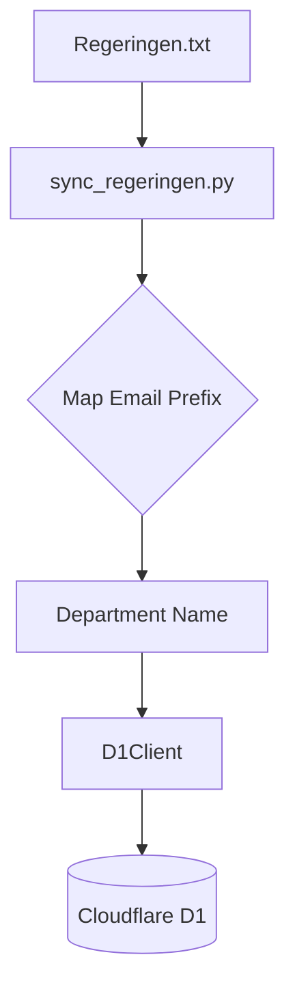
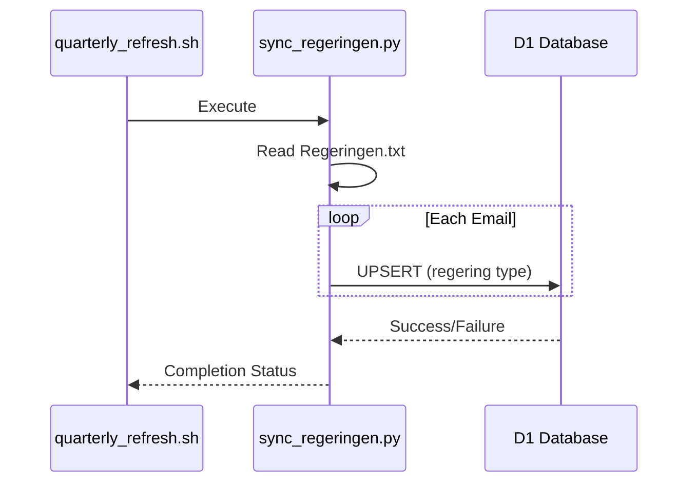

<details>
<summary>Relevant source files</summary>

The following files were used as context for generating this wiki page:

- [scraper/sync_regeringen.py](scraper/sync_regeringen.py)
- [Regeringen.txt](Regeringen.txt)
- [scraper/sync_to_d1.py](scraper/sync_to_d1.py)
- [scraper/quarterly_refresh.sh](scraper/quarterly_refresh.sh)
- [README.md](README.md)
- [CLAUDE.md](CLAUDE.md)
</details>

# Regeringen Scraper

The Regeringen Scraper is a specialized module within the `politiker-kontakter` project designed to synchronize contact information for the Swedish Government's departments. Unlike other scrapers in the project that target individual politicians, this module focuses on the official registrar (registrator) addresses for the 11 government departments. This approach is taken because personal email addresses for individual cabinet ministers are not publicly published; all formal contact is instead routed through departmental registrars.

Sources: [scraper/sync_regeringen.py:7-15](scraper/sync_regeringen.py#L7-L15), [README.md:1-5](README.md#L1-L5)

## System Architecture

The module functions as a synchronization script that reads pre-defined data and upserts it into a Cloudflare D1 database. It is integrated into the broader project workflow via the quarterly refresh cycle, ensuring that the departmental contact points remain current in the `politicians` table of the database.

### Data Flow

The following diagram illustrates how the Regeringen Scraper processes the local text data and updates the remote D1 database.



The process begins by reading `Regeringen.txt`, parsing the email addresses, and mapping them to formal department names using a predefined dictionary before executing SQL `UPSERT` operations.

Sources: [scraper/sync_regeringen.py:23-64](scraper/sync_regeringen.py#L23-L64), [scraper/quarterly_refresh.sh:31-32](scraper/quarterly_refresh.sh#L31-L32)

## Component Breakdown

### Data Source: Regeringen.txt
The primary data source is a text file containing one registrar email address per line. The script looks for this file in two locations: the parent directory of the script or the user's home directory.

Sources: [scraper/sync_regeringen.py:17](scraper/sync_regeringen.py#L17), [scraper/sync_regeringen.py:46-48](scraper/sync_regeringen.py#L46-L48)

### Logic: sync_regeringen.py
This script performs the following core tasks:
*  **Email Prefix Mapping**: It extracts the prefix from the registrar email (e.g., `justitiedepartementet` from `justitiedepartementet.registrator@...`) to determine the department name.
*  **Formal Naming**: It uses the `DEPARTMENT_NAMES` dictionary to convert slugs into human-readable Swedish titles (e.g., "Justitiedepartementet").
*  **Database Synchronization**: It utilizes the `D1Client` to perform an `INSERT OR IGNORE` operation that updates existing records if a conflict on `email` and `area_name` occurs.

Sources: [scraper/sync_regeringen.py:23-41](scraper/sync_regeringen.py#L23-L41), [scraper/sync_regeringen.py:53-62](scraper/sync_regeringen.py#L53-L62)

### Department Mapping Table

The module uses a specific mapping for the 11 core departments of the Swedish Government.

| Email Prefix | Formal Department Name (Swedish) |
| :--- | :--- |
| arbetsmarknadsdepartementet | Arbetsmarknadsdepartementet |
| finansdepartementet | Finansdepartementet |
| forsvarsdepartementet | Försvarsdepartementet |
| justitiedepartementet | Justitiedepartementet |
| klimat-naringslivsdepartementet | Klimat- och näringslivsdepartementet |
| kulturdepartementet | Kulturdepartementet |
| landsbygds-infrastrukturdepartementet | Landsbygds- och infrastrukturdepartementet |
| socialdepartementet | Socialdepartementet |
| statsradsberedningen | Statsrådsberedningen |
| utbildningsdepartementet | Utbildningsdepartementet |
| utrikesdepartementet | Utrikesdepartementet |

Sources: [scraper/sync_regeringen.py:23-35](scraper/sync_regeringen.py#L23-L35)

## Database Schema Integration

Records added by this scraper are categorized under the `regering` area type. The `sync_to_d1.py` utility provides a helper function to ensure consistency across different data sources by identifying "regering" based on the department name or presence of keywords.

```python
def area_type_for(area_name: str) -> str:
    if area_name.startswith("Region "):
        return "region"
    if area_name in ("Sveriges riksdag", "Riksdagen"):
        return "riksdag"
    if "departementet" in area_name.lower() or "regeringskansliet" in area_name.lower() or area_name == "Regeringen":
        return "regering"
    return "kommun"
```

Sources: [scraper/sync_to_d1.py:38-44](scraper/sync_to_d1.py#L38-L44)

### Data Model Fields

The `politicians` table entries created for the government use the following fields:

| Field | Type | Description |
| :--- | :--- | :--- |
| `id` | String | A random 11-byte hex blob. |
| `name` | String | The department name (e.g., "Försvarsdepartementet"). |
| `email` | String | The official registrator address. |
| `area_name` | String | Set to the department name for government entries. |
| `area_type` | String | Always 'regering' for this module. |
| `last_scraped_at` | Integer | Epoch timestamp in milliseconds. |

Sources: [scraper/sync_regeringen.py:38-41](scraper/sync_regeringen.py#L38-L41), [scraper/sync_to_d1.py:31-35](scraper/sync_to_d1.py#L31-L35)

## Execution and Maintenance

The Regeringen Scraper is part of the `quarterly_refresh.sh` sequence. This shell script automates the full update cycle of the project, including the government sync, to maintain the live contact database.



Sources: [scraper/quarterly_refresh.sh:31-32](scraper/quarterly_refresh.sh#L31-L32), [scraper/sync_regeringen.py:64](scraper/sync_regeringen.py#L64)

### Summary
The Regeringen Scraper ensures that the `politiker-kontakter` project includes official communication channels for the Swedish Government. By focusing on registrar addresses rather than individual ministers, it provides a stable and reliable point of contact for departmental inquiries within the `regering` area type of the database.

Sources: [scraper/sync_regeringen.py:7-15](scraper/sync_regeringen.py#L7-L15), [CLAUDE.md:65-68](CLAUDE.md#L65-L68)
