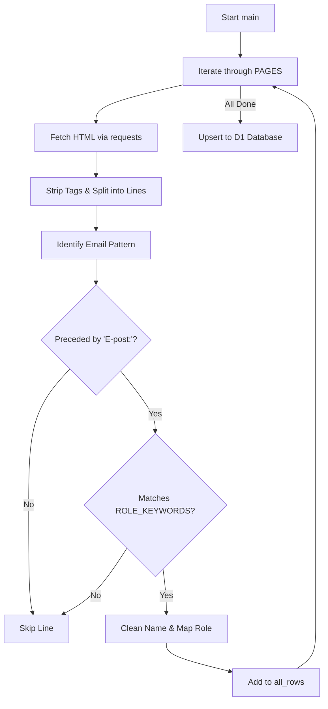
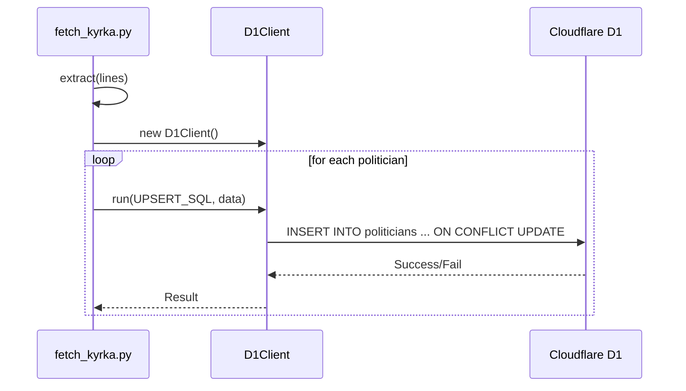

<details>
<summary>Relevant source files</summary>

The following files were used as context for generating this wiki page:

- [scraper/fetch\_kyrka.py](scraper/fetch_kyrka.py)
- [tests/test\_kyrka.py](tests/test_kyrka.py)
- [scraper/quarterly\_refresh.sh](scraper/quarterly_refresh.sh)
- [README.md](README.md)
- [scraper/d1.py](scraper/d1.py)
</details>

# Kyrka (Church) Scraper

The **Kyrka (Church) Scraper** is a specialized module designed to harvest public contact information for elected officials within the Church of Sweden (*Svenska kyrkan*). It focuses on high-level representatives including the National Board, the General Synod presidium, and specific diocesan boards. The collected data—specifically names, email addresses, political affiliations (nominating groups), and roles—is synchronized into a centralized Cloudflare D1 database.

This scraper operates as a standalone Python script integrated into the project's broader data collection pipeline. It is triggered during scheduled maintenance tasks to ensure the database remains current with the latest church election results and appointments.

Sources: [scraper/fetch_kyrka.py:1-25](scraper/fetch_kyrka.py#L1-L25), [README.md:1-25](README.md#L1-L25), [scraper/quarterly_refresh.sh:31-32](scraper/quarterly_refresh.sh#L31-L32)

## Architecture and System Logic

Unlike the primary project scraper which utilizes Playwright for browser automation, the Church Scraper employs a more lightweight approach using the `requests` library to fetch server-rendered HTML. This is possible because the target website (*svenskakyrkan.se*) provides consistent, static structures for representative lists.

### Scraping Workflow
The scraper follows a linear execution path for each configured target page:
1.  **Fetching**: It retrieves raw HTML from hardcoded paths on the Church of Sweden website.
2.  **Transformation**: The HTML is stripped of tags and converted into a list of cleaned text lines.
3.  **Extraction**: A pattern-matching engine identifies blocks of four lines typically representing a person: Name/Party, Role, "E-post:", and the Email address.
4.  **Validation**: It filters out staff members (e.g., secretaries or administrative personnel) by checking for specific keywords related to elected roles.
5.  **Persistence**: Validated data is upserted into the `politicians` table in the D1 database.

Sources: [scraper/fetch_kyrka.py:38-55](scraper/fetch_kyrka.py#L38-L55), [scraper/fetch_kyrka.py:59-64](scraper/fetch_kyrka.py#L59-L64), [scraper/fetch_kyrka.py:90-108](scraper/fetch_kyrka.py#L90-L108)

### Scraping Flow Diagram
The following diagram illustrates the internal logic of the `extract` function and the overall data acquisition flow.



The diagram shows the filtering mechanism that ensures only elected officials with published personal emails are captured while ignoring general office addresses.
Sources: [scraper/fetch_kyrka.py:90-110](scraper/fetch_kyrka.py#L90-L110), [tests/test_kyrka.py:27-44](tests/test_kyrka.py#L27-L44)

## Data Models and Configuration

### Configuration (PAGES)
The scraper targets specific areas where personal emails are verified to be public.

| Area Name | URL Path Component |
| :--- | :--- |
| Svenska kyrkan | `kyrkostyrelsens-ledamoter` |
| Svenska kyrkan | `kyrkomotet/ledamoter-mandat-presidium-och-kontakt` |
| Uppsala stift | `uppsalastift/fortroendevalda/stiftsstyrelsen` |

Sources: [scraper/fetch_kyrka.py:38-43](scraper/fetch_kyrka.py#L38-L43)

### Database Schema (politicians table)
The module maps scraped church data to the standard project database schema using the `area_type` set to `'kyrka'`.

| Field | Description | Constraints |
| :--- | :--- | :--- |
| `id` | Unique identifier | `lower(hex(randomblob(11)))` |
| `name` | Representative's full name | Normalized text |
| `email` | Personal email address | Unique per area |
| `area_name` | The specific body (e.g., "Uppsala stift") | Not NULL |
| `area_type` | Hardcoded to 'kyrka' | Not NULL |
| `party` | Nominating group (e.g., S, POSK) | Optional |
| `role` | Position (e.g., Ledamot, Ordförande) | Not NULL |
| `last_scraped_at` | Timestamp of last update | Milliseconds |

Sources: [scraper/fetch_kyrka.py:48-55](scraper/fetch_kyrka.py#L48-L55), [scraper/fetch_kyrka.py:113-146](scraper/fetch_kyrka.py#L113-L146)

## Key Implementation Details

### Data Cleaning and Parsing
The scraper includes robust logic for handling inconsistencies in source data, such as bishropic titles or naming errors.

*  **`clean_name()`**: Removes parenthetical party info, diocesan suffixes, and "Biskop" titles. It also fixes common source errors like "Roberth .Krantz".
*  **`role_from()`**: Normalizes various Swedish role descriptions (e.g., "1:e vice ordförande") into standardized categories.
*  **`extract()`**: Employs a look-back logic where once an email is found, it validates the preceding lines to ensure they contain the expected metadata.

Sources: [scraper/fetch_kyrka.py:67-87](scraper/fetch_kyrka.py#L67-L87), [tests/test_kyrka.py:4-24](tests/test_kyrka.py#L4-L24)

### Integration with Project Pipeline
The Church Scraper is executed as part of the `quarterly_refresh.sh` script. This shell script coordinates several fetchers to update the entire database of Swedish elected officials.

```bash
# Example from quarterly_refresh.sh
echo "--- Hämtar Svenska kyrkans kyrkovalda (kyrkostyrelse + Uppsala stift) ---"
python3 fetch_kyrka.py
```

Sources: [scraper/quarterly_refresh.sh:31-32](scraper/quarterly_refresh.sh#L31-L32)

## Database Synchronization Logic
The system uses an `INSERT OR UPDATE` (Upsert) strategy to avoid duplicate entries while keeping existing records fresh.



This sequence ensures that if a representative changes roles or parties, the database is updated based on their unique email and area combination.
Sources: [scraper/fetch_kyrka.py:133-144](scraper/fetch_kyrka.py#L133-L144), [scraper/d1.py](scraper/d1.py)

## Summary
The Church Scraper extends the project's coverage to religious governance, specifically identifying officials in the Church of Sweden. By utilizing targeted HTML parsing and a strict keyword-based filtering system, it maintains high data quality and distinguishes elected officials from administrative staff. It remains a key component of the automated quarterly refresh cycle, ensuring the `politicians` database provides a comprehensive view of Swedish democratic representatives.
