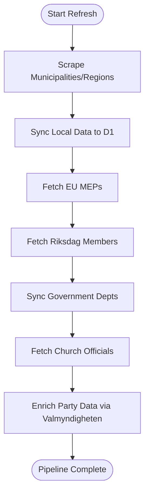
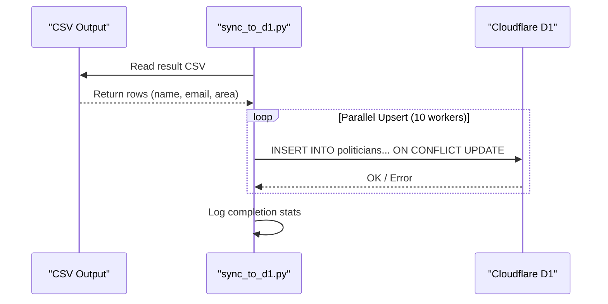

<details>
<summary>Relevant source files</summary>

The following files were used as context for generating this wiki page:

- [scraper/scraper.py](scraper/scraper.py)
- [scraper/sync_to_d1.py](scraper/sync_to_d1.py)
- [scraper/quarterly_refresh.sh](scraper/quarterly_refresh.sh)
- [README.md](README.md)
- [CLAUDE.md](CLAUDE.md)
- [AGENTS.md](AGENTS.md)
- [scraper/fetch_kyrka.py](scraper/fetch_kyrka.py)
- [scraper/fetch_eu_meps.py](scraper/fetch_eu_meps.py)
</details>

# Main Scraper Pipeline

The Main Scraper Pipeline is a multi-stage system designed to extract publicly available contact information for elected officials in Sweden's 290 municipalities and 21 regions. It also extends to the European Parliament, the Swedish Riksdag, Government departments, and the Church of Sweden. The pipeline automates the process of navigating diverse web structures—from modern JavaScript-heavy registries to legacy HTML tables and PDF documents—to consolidate data into standardized formats for mobile contact imports and database synchronization.

Sources: [README.md:1-5](README.md#L1-L5), [AGENTS.md:1-5](AGENTS.md#L1-L5), [CLAUDE.md:1-5](CLAUDE.md#L1-L5)

## Pipeline Architecture and Execution

The pipeline is orchestrated primarily through a shell script and containerized environment. The high-level flow involves full extraction of municipal and regional data followed by specialized scrapers for national and international bodies, concluding with a synchronization step to a Cloudflare D1 database.

### Core Execution Flow
The `quarterly_refresh.sh` script serves as the master controller for a full pipeline run, ensuring all components execute in the correct sequence.



Sources: [scraper/quarterly_refresh.sh:10-40](scraper/quarterly_refresh.sh#L10-L40)

### Component Breakdown
| Component | Functionality | Primary Source |
| :--- | :--- | :--- |
| `scraper.py` | Core Playwright-based scraper for 273+ municipalities/regions. | `scraper/scraper.py` |
| `sync_to_d1.py` | Upserts CSV results from the core scraper into the D1 database. | `scraper/sync_to_d1.py` |
| `fetch_eu_meps.py` | Retrieves EU parliamentarians using the official Open Data API. | `scraper/fetch_eu_meps.py` |
| `fetch_kyrka.py` | Extracts Church of Sweden officials from server-rendered HTML. | `scraper/fetch_kyrka.py` |
| `sync_party_from_val.py` | Matches names against Valmyndigheten to fill missing party data. | `scraper/sync_party_from_val.py` |

Sources: [README.md:55-85](README.md#L55-L85)

## Core Scraper Logic (`scraper.py`)

The heart of the pipeline uses Python with Playwright (Headless Chromium) to navigate complex municipal websites. It leverages a configuration file, `regioner.json`, which defines the "type" of extraction logic required for each area.

### Extraction Strategies
The scraper supports multiple "types" based on the target website's technology:

*  **Netpublicator/Troman/W3D3:** Specialized handlers for common Swedish administrative platforms.
*  **Namnmonster/Namnlista:** Logic for areas that don't provide direct links but follow predictable email patterns (e.g., `firstname.lastname@domain.se`).
*  **Mailto:** Direct extraction of `mailto:` links from general contact pages.
*  **PDF:** Extraction of names and emails from PDF member lists using `pypdf`.

Sources: [scraper/scraper.py:465-515](scraper/scraper.py#L465-L515), [CLAUDE.md:50-60](CLAUDE.md#L50-L60)

### Data Sanitization
The scraper implements rigorous validation to ensure data quality:
*  **Email Validation:** Uses `EMAIL_RE` and filters out common generic addresses like `noreply`, `info@`, or `webmaster`.
*  **Name Normalization:** Transliterates Swedish characters (å, ä, ö) for email pattern guessing and provides custom sorting keys for Swedish alphabetical order.

```python
def swedish_key(name: str):
    s = name.lower()
    return s.replace("å", "{").replace("ä", "|").replace("ö", "}")
```

Sources: [scraper/scraper.py:53-65](scraper/scraper.py#L53-L65), [scraper/scraper.py:112-117](scraper/scraper.py#L112-L117)

## Data Synchronization and Output

Once the core scraper completes, it generates several output files in the `OUTPUT_DIR` before the synchronization script pushes data to the live environment.

### Output Formats
| File Name | Format | Purpose |
| :--- | :--- | :--- |
| `Alla_kommuner_och_regioner.csv` | CSV | Canonical machine-readable transfer form for D1 sync. |
| `Alla_kommuner_och_regioner.txt` | TXT | Human-readable list with Swedish alphabetical sorting. |
| `[Area_Name].vcf` | VCF | Individual VCard files for mobile contact import. |
| `gissade_adresser.txt` | TXT | Audit log for addresses generated via pattern guessing. |

Sources: [CLAUDE.md:32-40](CLAUDE.md#L32-L40), [README.md:40-50](README.md#L40-L50), [scraper/scraper.py:435-460](scraper/scraper.py#L435-L460)

### D1 Database Synchronization
The `sync_to_d1.py` script reads the CSV output and performs an `UPSERT` operation on the `politicians` table. Due to D1 HTTP API limitations, requests are parallelized using a `ThreadPoolExecutor` (defaulting to 10 workers).



Sources: [scraper/sync_to_d1.py:15-35](scraper/sync_to_d1.py#L15-L35), [scraper/sync_to_d1.py:80-100](scraper/sync_to_d1.py#L80-L100)

## Specialized Extractors

### EU Parliament (MEPs)
The `fetch_eu_meps.py` script uses the EU Open Data API. It retrieves IDs and then scrapes individual profile pages to decode spam-protected email strings (reversed strings with `[dot]` and `[at]` placeholders).
Sources: [scraper/fetch_eu_meps.py:1-25](scraper/fetch_eu_meps.py#L1-L25)

### Church of Sweden
The `fetch_kyrka.py` script targets the national board and specific dioceses. It uses `requests` and `regex` to parse server-rendered HTML, specifically looking for patterns like `[Name] / [Role] / "E-post:" / [Email]`.
Sources: [scraper/fetch_kyrka.py:1-40](scraper/fetch_kyrka.py#L1-L40)

## Conclusion
The Main Scraper Pipeline provides a robust, automated framework for maintaining an up-to-date database of Swedish political contacts. By combining diverse scraping strategies with specialized API integrations and a centralized D1 synchronization process, it ensures that contact data across multiple tiers of government is preserved and accessible in both human and machine-readable formats.
