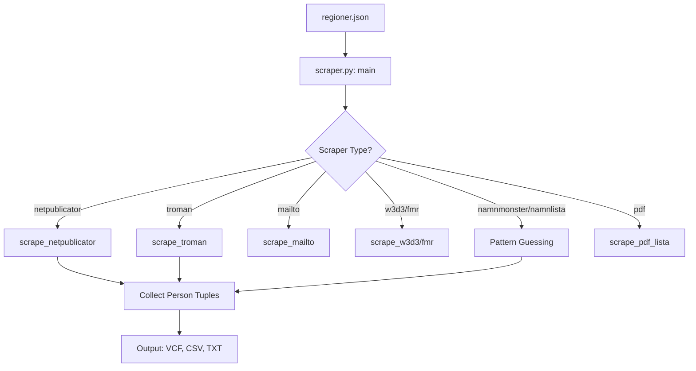
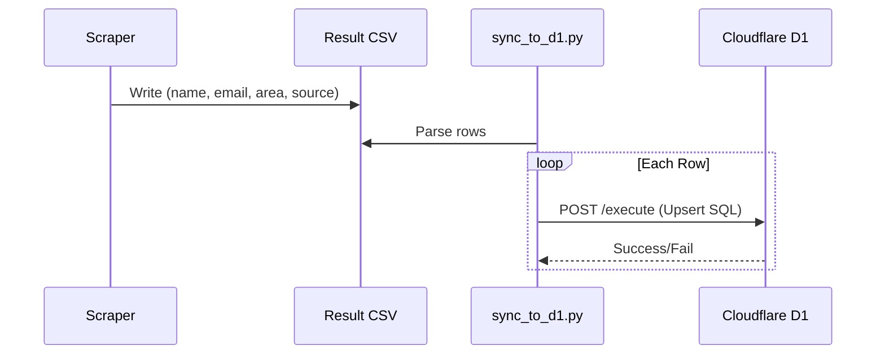

<details>
<summary>Relevant source files</summary>

The following files were used as context for generating this wiki page:

- [scraper/scraper.py](scraper/scraper.py)
- [scraper/regioner.json](scraper/regioner.json)
- [scraper/fetch_eu_meps.py](scraper/fetch_eu_meps.py)
- [scraper/fetch_riksdagen_members.py](scraper/fetch_riksdagen_members.py)
- [scraper/fetch_kyrka.py](scraper/fetch_kyrka.py)
- [scraper/backfill_kommun_role_party.py](scraper/backfill_kommun_role_party.py)
- [scraper/sync_to_d1.py](scraper/sync_to_d1.py)
- [README.md](README.md)
</details>

# Scraper Types and Strategies

The `politiker-kontakter` project implements a multi-tiered scraping architecture designed to extract public email addresses of elected officials in Sweden across municipalities (kommuner), regions, the national parliament (Riksdagen), and the European Parliament. The system utilizes a variety of strategies ranging from automated browser-based scraping with Playwright to direct API consumption and pattern-based email guessing.

The core objective is to normalize heterogeneous data sources into a unified format for export to VCF, CSV, and the project's D1 database.
Sources: [README.md:1-5](README.md#L1-L5), [scraper/scraper.py:11-16](scraper/scraper.py#L11-L16)

## Scraper Architecture Overview

The scraping process is driven by the configuration defined in `regioner.json`, which maps specific geographical areas to a scraper "type." The main entry point, `scraper/scraper.py`, iterates through this configuration and dispatches the appropriate asynchronous function based on the defined type.



The diagram shows the decision logic used by the main scraper to select a retrieval strategy based on the source platform's technical implementation.
Sources: [scraper/scraper.py:640-700](scraper/scraper.py#L640-L700), [scraper/regioner.json](scraper/regioner.json)

## Strategy Categories

The system categorizes scraping strategies based on the source's data structure and accessibility.

### 1. Platform-Specific Scrapers
These scrapers are tailored for common third-party registry platforms used by Swedish administrative bodies.

| Scraper Type | Target Platform | Strategy Description |
| :--- | :--- | :--- |
| `netpublicator` | Netpublicator | Extracts profile links from a central board table, then visits individual profile pages to extract `mailto` links. |
| `troman` | Troman (tromanpublik.se) | Identifies person-specific URLs and parses individual profile pages for names, parties, and roles. |
| `w3d3` | W3D3 Ledamotspublicering | Handles paginated lists via postback buttons and extracts email addresses from specific text placeholders. |
| `fmr` | Livewire-based FMR | Waits for network idle to allow Livewire components to render profile links in the DOM. |

Sources: [scraper/scraper.py:165-350](scraper/scraper.py#L165-L350), [scraper/backfill_kommun_role_party.py:75-155](scraper/backfill_kommun_role_party.py#L75-L155)

### 2. Pattern-Based Guessing Strategies
When email addresses are not explicitly linked, the system uses "guessing" strategies based on known organizational naming conventions (usually `firstname.lastname@domain.se`).

*  **Namnmonster:** Extracts names in the format `Firstname Lastname (Party)` between specific text markers (`section_start` and `section_end`).
*  **Namnlista:** Parses lists of names often grouped by party headers. It transliterates Swedish characters (å, ä, ö) and removes accents to construct the local part of the email address.

These entries are flagged in the final output with a `source` value of `pattern-guess` to indicate potential inaccuracies.
Sources: [scraper/scraper.py:440-540](scraper/scraper.py#L440-L540), [scraper/sync_to_d1.py:34-40](scraper/sync_to_d1.py#L34-L40)

### 3. API-Based Retrieval
For national and international bodies, the system bypasses HTML scraping in favor of structured data APIs.

*  **EU MEPs (`fetch_eu_meps.py`):** Consumes the EU Parliament's LD+JSON API. It includes a specialized decoding strategy for spam-protected email strings (replacing `[dot]` and `[at]` then reversing the string).
*  **Riksdagen (`fetch_riksdagen_members.py`):** Queries `data.riksdagen.se` for current members. It handles potential connection resets with a retry mechanism and maps party codes directly from the API response.
*  **Svenska Kyrkan (`fetch_kyrka.py`):** Uses line-based extraction from server-rendered HTML, filtering for specific keywords like `stiftsstyrelsen` to differentiate elected officials from staff.

Sources: [scraper/fetch_eu_meps.py:40-100](scraper/fetch_eu_meps.py#L40-L100), [scraper/fetch_riksdagen_members.py:38-65](scraper/fetch_riksdagen_members.py#L38-L65), [scraper/fetch_kyrka.py:66-90](scraper/fetch_kyrka.py#L66-L90)

## Core Logic Components

### Name and Party Extraction
The scraper uses regular expressions to isolate person names and political party affiliations from raw text or page titles.

```python
# scraper/scraper.py:92-94
NAME_CANDIDATE_RE = re.compile(
    r"[A-ZÅÄÖ][\wÅÄÖåäö´'`.\-]+(?:\s[A-ZÅÄÖ][\wÅÄÖåäö´'`.\-]+){1,3}"
)
```

The `extract_person_name` function attempts to find names in `<h1>` tags or `<title>` attributes, stripping common suffixes and party parentheses.
Sources: [scraper/scraper.py:105-135](scraper/scraper.py#L105-L135)

### Email Normalization
All extracted email addresses undergo validation against a regex and a blacklist (`SKIP_KEYWORDS`) containing addresses like `info@`, `support@`, or `noreply@`.
Sources: [scraper/scraper.py:61-68](scraper/scraper.py#L61-L68)

## Data Synchronization Strategy

After scraping, the data follows a specific path to the D1 database:
1.  **CSV Generation:** `scraper.py` writes a machine-readable CSV.
2.  **Upsert Logic:** `sync_to_d1.py` reads the CSV and performs an `INSERT ... ON CONFLICT` operation.
3.  **Parallelization:** Synchronization is parallelized using a `ThreadPoolExecutor` (default 10 workers) to handle the Cloudflare D1 HTTP API limitations.



The sequence diagram illustrates the handoff between the scraping logic and the database synchronization module.
Sources: [scraper/sync_to_d1.py:27-32, 75-100](scraper/sync_to_d1.py#L27-L32)

## Summary of Configuration Fields
The `regioner.json` file dictates the strategy for each municipality.

| Field | Description |
| :--- | :--- |
| `typ` | The scraper function to use (e.g., `troman`, `mailto`). |
| `url` | The starting URL for the scraper. |
| `domain` | Required for `namnmonster` to construct email addresses. |
| `netpub_registry` | Specific ID for Netpublicator instances. |
| `section_start` | Marker to begin parsing for pattern-based scrapers. |

Sources: [scraper/regioner.json](scraper/regioner.json), [scraper/scraper.py:642-695](scraper/scraper.py#L642-L695)

The project's strategy relies on extreme modularity, allowing new scraping logic to be added for specific municipalities without altering the global synchronization or export workflows.
Sources: [README.md:50-70](README.md#L50-L70), [AGENTS.md:25-35](AGENTS.md#L25-L35)
