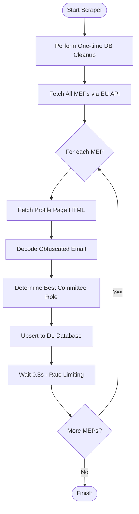
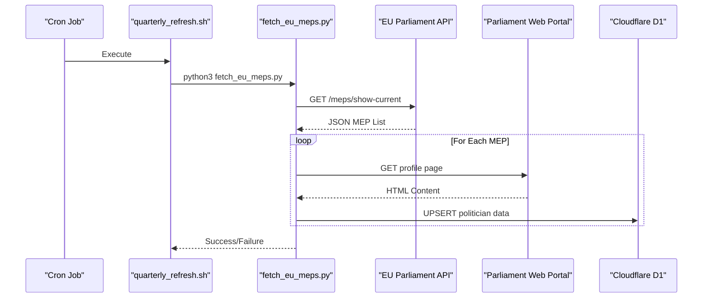

<details>
<summary>Relevant source files</summary>

The following files were used as context for generating this wiki page:

- [scraper/fetch\_eu\_meps.py](scraper/fetch_eu_meps.py)
- [scraper/quarterly\_refresh.sh](scraper/quarterly_refresh.sh)
- [README.md](README.md)
- [CLAUDE.md](CLAUDE.md)
- [AGENTS.md](AGENTS.md)
</details>

# European Parliament Scraper

The European Parliament Scraper is a specialized module within the `politiker-kontakter` project designed to harvest contact information for all Members of the European Parliament (MEPs) across all 27 EU member states. It bridges the gap between official open data APIs and individual profile pages to compile a comprehensive database of names, email addresses, political parties, and committee roles.

This module is integrated into the project's broader data pipeline, contributing to the central Cloudflare D1 database that powers the [politiker-webapp](https://politiker.denied.se). It operates alongside other scrapers for the Swedish Riksdag, government departments, and local municipalities to provide a unified contact repository for elected officials. Sources: [README.md:3-8](README.md#L3-L8), [scraper/fetch\_eu\_meps.py:4-10](scraper/fetch\_eu\_meps.py#L4-L10)

## Architecture and Data Flow

The scraper follows a multi-stage process: first querying a structured API for the list of current MEPs, then performing targeted web scraping on individual profile pages to bypass email obfuscation, and finally synchronizing the results to a remote database.

### Workflow Diagram
The following diagram illustrates the logical flow of the `fetch_eu_meps.py` script:



Sources: [scraper/fetch\_eu\_meps.py:84-135](scraper/fetch\_eu\_meps.py#L84-L135)

## Data Extraction Components

The system relies on two primary data sources: the official EU Open Data API and the European Parliament web portal.

### EU Open Data API Integration
The scraper uses the `data.europarl.europa.eu/api/v2` endpoint to retrieve a list of current MEPs. This provides structured metadata such as names, political groups, and country representation codes (ISO 3166-1 alpha-2).

| Feature | Description |
| :--- | :--- |
| **Base API URL** | `https://data.europarl.europa.eu/api/v2` |
| **Endpoint** | `/meps/show-current` |
| **Pagination** | Uses `limit` (100) and `offset` parameters for full traversal |
| **Response Format** | `application/ld+json` |

Sources: [scraper/fetch\_eu\_meps.py:24-41](scraper/fetch\_eu\_meps.py#L24-L41), [scraper/fetch\_eu\_meps.py:49-67](scraper/fetch\_eu\_meps.py#L49-L67)

### Email De-obfuscation Logic
Email addresses are not provided by the API and are instead scraped from the `https://www.europarl.europa.eu/meps/en/{mep_id}/x/home` profile pages. To prevent automated harvesting, the Parliament obfuscates email strings. The scraper reverses this process:

1.  Locate the string in the `href` attribute of the `link_email` class.
2.  Replace the `[dot]` token with `.` and the `[at]` token with `@`.
3.  Reverse the entire resulting string.

**Example Implementation:**

```python
# scraper/fetch_eu_meps.py:78-80
if match:
    encoded = match.group(1)
    email = encoded.replace("[dot]", ".").replace("[at]", "@")[::-1]
```

Sources: [scraper/fetch\_eu\_meps.py:12-16](scraper/fetch\_eu\_meps.py#L12-L16), [scraper/fetch\_eu\_meps.py:70-81](scraper/fetch\_eu\_meps.py#L70-L81)

### Role Ranking and Translation
MEPs often hold multiple positions. The scraper identifies the most prominent role by searching for committee titles (e.g., Chair, Vice-Chair) in the profile HTML and assigning a priority rank. These roles are then translated into Swedish for consistency within the project.

| Original Title | Priority (Lower is higher) | Swedish Translation |
| :--- | :--- | :--- |
| Chair | 0 | Ordförande |
| Vice-Chair | 1 | Vice ordförande |
| Member | 2 | Ledamot |
| Substitute | 3 | Suppleant |

Sources: [scraper/fetch\_eu\_meps.py:44-46](scraper/fetch\_eu\_meps.py#L44-L46)

## Database Synchronization

Data is synchronized to the `politicians` table in a Cloudflare D1 database via the `D1Client` class. The synchronization uses an `UPSERT` strategy (INSERT ON CONFLICT) based on the unique combination of the politician's email and area name.

### Data Model Mapping
The scraper maps extracted MEP data to the following database schema:

| Field | Source / Logic | Example |
| :--- | :--- | :--- |
| `id` | `lower(hex(randomblob(11)))` | `7a8b9c...` |
| `name` | `{givenName} {familyName}` | `Par Holmgren` |
| `email` | De-obfuscated profile email | `par.holmgren@europarl.europa.eu` |
| `area_name` | `Europaparlamentet ({country_name})` | `Europaparlamentet (Sverige)` |
| `area_type` | Hardcoded constant | `eu` |
| `party` | `api:political-group` | `Greens/EFA` |
| `role` | Best ranked translated role | `Ordförande` |
| `last_scraped_at` | Current Unix timestamp (ms) | `171999...` |

Sources: [scraper/fetch\_eu\_meps.py:42-47](scraper/fetch\_eu\_meps.py#L42-L47), [scraper/fetch\_eu\_meps.py:98-103](scraper/fetch\_eu\_meps.py#L98-L103)

## Integration and Maintenance

The European Parliament Scraper is intended to be executed periodically to ensure the database remains current with resignations or new appointments.

### Execution Sequence
The script is orchestrated as part of the `quarterly_refresh.sh` shell script, which runs every three months. It follows the Swedish municipality scraping and precedes the Riksdag and Church of Sweden updates.



Sources: [scraper/quarterly\_refresh.sh:10-25](scraper/quarterly\_refresh.sh#L10-L25), [CLAUDE.md:16-20](CLAUDE.md#L16-L20)

### Requirements and Dependencies
- **Environment Variables**: Requires `CLOUDFLARE_ACCOUNT_ID`, `CLOUDFLARE_API_TOKEN_POLITIKER`, and `D1_DATABASE_UUID`.
- **Libraries**: `requests` for API and HTTP calls, and the custom `D1Client` for database interaction.
- **Rate Limiting**: Includes a 0.3-second delay between individual MEP profile scrapes to avoid triggering anti-bot measures on the Parliament web portal.

Sources: [scraper/fetch\_eu\_meps.py:18-22](scraper/fetch\_eu\_meps.py#L18-L22), [scraper/fetch\_eu\_meps.py:129](scraper/fetch\_eu\_meps.py#L129), [AGENTS.md:12-15](AGENTS.md#L12-L15)

## Conclusion

The European Parliament Scraper provides a robust mechanism for harvesting official contact data while respecting server resources through rate limiting and efficient API usage. By automating the de-obfuscation of email addresses and standardizing role terminology, it ensures that the `politiker-kontakter` project offers high-quality, actionable data for EU-level representatives.
