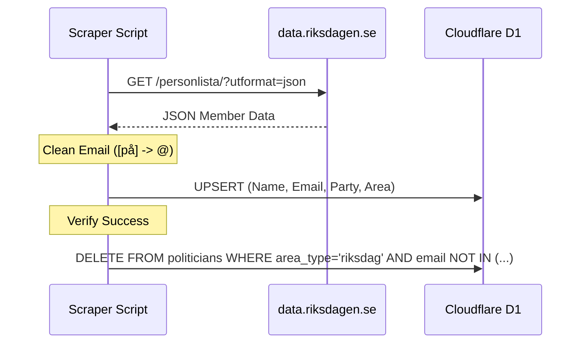

<details>
<summary>Relevant source files</summary>

The following files were used as context for generating this wiki page:

- [scraper/fetch_riksdagen_members.py](scraper/fetch_riksdagen_members.py)
- [scraper/backfill_riksdagen_role.py](scraper/backfill_riksdagen_role.py)
- [scraper/quarterly_refresh.sh](scraper/quarterly_refresh.sh)
- [README.md](README.md)
- [CLAUDE.md](CLAUDE.md)
- [scraper/sync_to_d1.py](scraper/sync_to_d1.py)
</details>

# Swedish Parliament Scraper

The Swedish Parliament Scraper is a specialized module within the `politiker-kontakter` project designed to harvest and synchronize contact information for the 349 members of the Riksdag (the Swedish Parliament). It interfaces directly with the Riksdag's Open Data API to ensure that names, party affiliations, and official email addresses are kept current within the project's central database.

Sources: [README.md:46](README.md#L46), [scraper/fetch_riksdagen_members.py:6-9](scraper/fetch_riksdagen_members.py#L6-L9)

This system operates as part of the broader synchronization pipeline, often triggered during quarterly refreshes to maintain data integrity as members are replaced or roles change within committees. It specifically targets current members, filtering out historical data to focus on active representatives.

Sources: [scraper/quarterly_refresh.sh:23](scraper/quarterly_refresh.sh#L23), [scraper/fetch_riksdagen_members.py:11-17](scraper/fetch_riksdagen_members.py#L11-L17)

## Architecture and Data Flow

The scraper is divided into two primary scripts: one for fetching core identity and contact data, and another for enriching that data with specific parliamentary roles.

### Core Fetching Logic
The `fetch_riksdagen_members.py` script performs the initial data acquisition. It queries the `data.riksdagen.se` API to retrieve a JSON list of all current members. The script handles the "instability" of the Riksdag server by implementing a retry mechanism (up to 5 attempts).

Sources: [scraper/fetch_riksdagen_members.py:34-51](scraper/fetch_riksdagen_members.py#L34-L51)

The following flowchart illustrates the high-level process of fetching and cleaning parliamentary data:

```mermaid
flowchart TD
    Start[Start Scraper] --> FetchAPI[Request JSON from Riksdagen API]
    FetchAPI -- Success --> Parse[Extract Name, Party, Email]
    FetchAPI -- Failure --> Retry{Retry < 5?}
    Retry -- Yes --> FetchAPI
    Retry -- No --> Error[Exit with Error]
    Parse --> EmailClean[Replace '[på]' with '@']
    EmailClean --> Upsert[Upsert to D1 Database]
    Upsert --> Cleanup{Failures == 0?}
    Cleanup -- Yes --> Stale[Delete Stale Members]
    Cleanup -- No --> End[End Process]
    Stale --> End
```

The diagram shows the logic flow from API request to database cleanup. 
Sources: [scraper/fetch_riksdagen_members.py:34-110](scraper/fetch_riksdagen_members.py#L34-L110)

### Role Enrichment (Backfilling)
Because the primary member list often provides generic "Member of Parliament" titles, the `backfill_riksdagen_role.py` script is used to determine more descriptive committee roles (e.g., Chairperson or Substitute). It assigns roles based on a strict priority hierarchy to ensure the most significant position is displayed.

Sources: [scraper/backfill_riksdagen_role.py:12-20](scraper/backfill_riksdagen_role.py#L12-L20)

## Key Components

### Data Processing Functions
| Function | Description | Source File |
| :--- | :--- | :--- |
| `fetch_current_members()` | Requests current member list from the Riksdagen API with a 120-180s timeout. | [fetch_riksdagen_members.py:34](fetch_riksdagen_members.py#L34) |
| `extract_email()` | Parses the `personuppgift` field and converts the anti-spam format `[på]` to `@`. | [fetch_riksdagen_members.py:54](fetch_riksdagen_members.py#L54) |
| `best_committee_role()` | Evaluates all active assignments to pick the highest priority role. | [backfill_riksdagen_role.py:44](backfill_riksdagen_role.py#L44) |

### Role Priority Hierarchy
Roles are ranked numerically, where a lower number indicates higher prominence for display in the database.

| Role | Priority Rank |
| :--- | :--- |
| Ordförande (Chair) | 0 |
| Vice ordförande (Vice Chair) | 1 |
| Ledamot (Member) | 2 |
| Suppleant (Substitute) | 3 |

Sources: [scraper/backfill_riksdagen_role.py:28](scraper/backfill_riksdagen_role.py#L28)

### Database Interaction
Data is synchronized to a Cloudflare D1 database using the `politicians` table. The scraper uses an `INSERT OR IGNORE` or `ON CONFLICT` strategy to prevent duplicate entries while updating existing records.



This diagram depicts the interaction between the scraper, the external API, and the D1 database.
Sources: [scraper/fetch_riksdagen_members.py:27-31, 100-105](scraper/fetch_riksdagen_members.py#L27-L31)

## Implementation Details

### API Configuration
The scraper uses the following endpoint for data retrieval:
`https://data.riksdagen.se/personlista/?utformat=json`

Critical Note: The `rdlstatus` parameter is intentionally omitted or left empty. Adding `rdlstatus=tjanst` would return all members since 2018, which is too heavy and increases the risk of connection timeouts.

Sources: [scraper/fetch_riksdagen_members.py:11-17, 24](scraper/fetch_riksdagen_members.py#L11-L17)

### Data Schema (Riksdag Context)
When storing Riksdag members, the following fields are populated in the `politicians` table:

| Field | Value / Logic |
| :--- | :--- |
| `id` | Generated via `lower(hex(randomblob(11)))` |
| `area_name` | Hardcoded as "Sveriges riksdag" |
| `area_type` | Hardcoded as "riksdag" |
| `email` | Extracted and normalized (e.g., `name@riksdagen.se`) |
| `party` | Extracted from the `parti` field in the API response |

Sources: [scraper/fetch_riksdagen_members.py:27-31](scraper/fetch_riksdagen_members.py#L27-L31), [scraper/sync_to_d1.py:33-34](scraper/sync_to_d1.py#L33-L34)

## Summary
The Swedish Parliament Scraper provides a robust mechanism for maintaining an up-to-date directory of Swedish MPs. By combining core data fetching from official APIs with a sophisticated role-priority backfilling system, it ensures that the `politiker-kontakter` project provides accurate and detailed contact information for the national legislature. It is a critical component of the quarterly update cycle, ensuring the database remains synchronized with the actual composition of the Riksdag.
