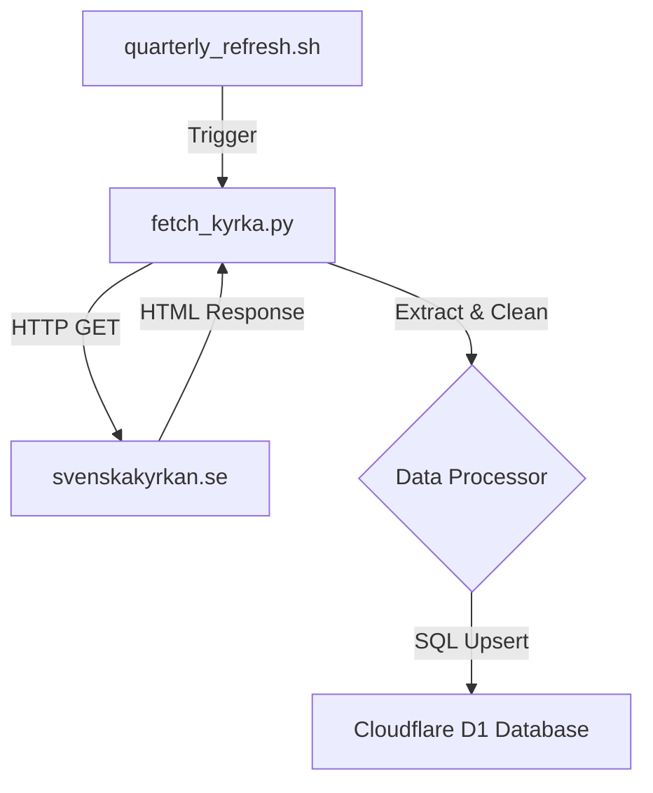
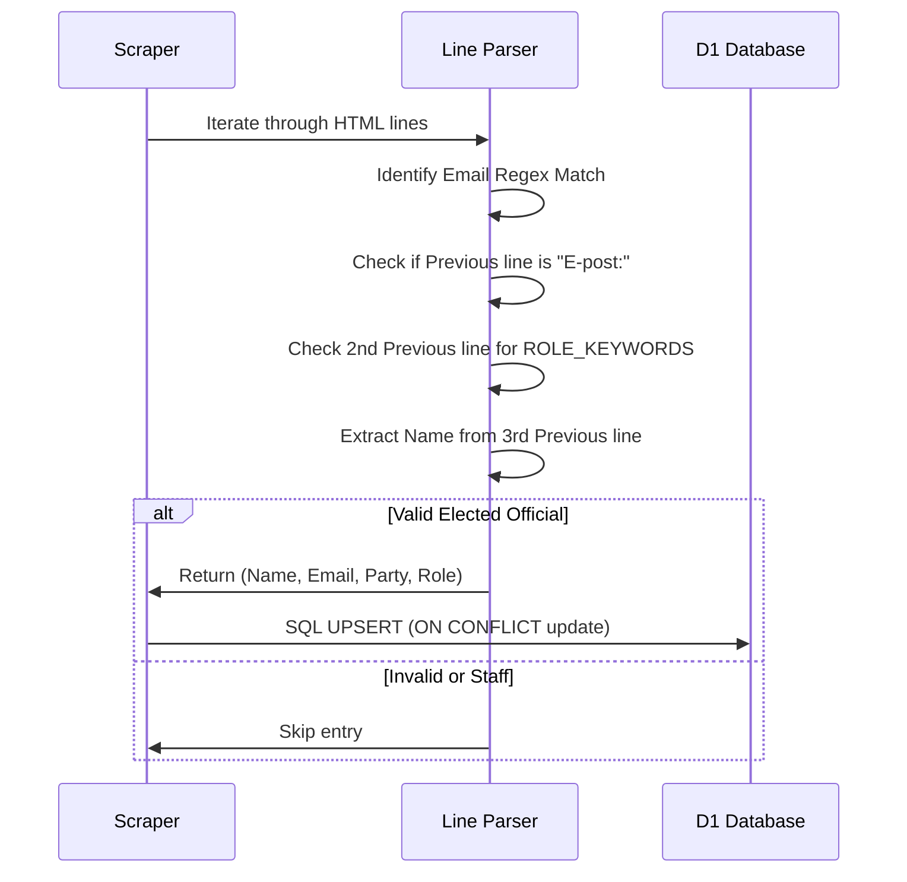

<details>
<summary>Relevant source files</summary>

The following files were used as context for generating this wiki page:

- [scraper/fetch_kyrka.py](scraper/fetch_kyrka.py)
- [scraper/quarterly_refresh.sh](scraper/quarterly_refresh.sh)
- [tests/test_kyrka.py](tests/test_kyrka.py)
- [README.md](README.md)
- [AGENTS.md](AGENTS.md)
</details>

# Church of Sweden Scraper

The Church of Sweden Scraper is a specialized module designed to harvest contact information for elected officials within the Church of Sweden (*Svenska kyrkan*). It targets specific national and diocesan bodies where personal email addresses are publicly disclosed, filling a critical gap in the project's database of democratic representatives.

This scraper specifically targets the Church Board (*Kyrkostyrelsen*), the presidium of the Church Synod (*Kyrkomötet*), and the Uppsala Diocesan Board (*Uppsala stiftsstyrelse*). Unlike the broader [Politiker Scraper](#scraper-logic), this module uses a direct HTML parsing approach via the `requests` library rather than headless browser automation, as the target site serves static HTML.

Sources: [scraper/fetch_kyrka.py:1-26](scraper/fetch_kyrka.py#L1-L26), [README.md:46-47](README.md#L46-L47)

## Architecture and Data Flow

The scraper operates as a standalone Python script integrated into the project's maintenance lifecycle. It communicates with a Cloudflare D1 database to persist the extracted data.

### System Overview Diagram
The following diagram illustrates the high-level flow of data from the Church of Sweden web portal to the local database.



A flowchart showing the execution flow from the shell script trigger to database persistence.
Sources: [scraper/fetch_kyrka.py:32-46](scraper/fetch_kyrka.py#L32-L46), [scraper/quarterly_refresh.sh:29-30](scraper/quarterly_refresh.sh#L29-L30)

### Key Components

| Component | Description |
| :--- | :--- |
| `PAGES` | A configuration list containing tuples of URL paths and their associated `area_name` (e.g., "Svenska kyrkan" or "Uppsala stift"). |
| `extract()` | The core logic that iterates through HTML lines to identify name, role, party, and email patterns. |
| `D1Client` | Shared utility used to execute SQL queries against the remote database. |
| `clean_name()` | Sanitizes raw text strings by removing group affiliations, titles, and formatting errors. |

Sources: [scraper/fetch_kyrka.py:40-45](scraper/fetch_kyrka.py#L40-L45), [scraper/fetch_kyrka.py:118-120](scraper/fetch_kyrka.py#L118-L120), [README.md:33-35](README.md#L33-L35)

## Extraction Logic

The scraper relies on the consistent HTML structure of the Church of Sweden website. The logic identifies a specific sequence of information: Name → Role/Position → "E-post:" label → Email address.

### Target Identification
The system uses `ROLE_KEYWORDS` to filter out administrative staff and ensure only elected officials are scraped. These keywords include:
*  `stiftsstyrelsen`
*  `kyrkostyrelsen`
*  `kyrkomötets ordförande`
*  `kyrkomötets förste vice`
*  `kyrkomötets andre vice`

Sources: [scraper/fetch_kyrka.py:53-54](scraper/fetch_kyrka.py#L53-L54)

### Data Sanitization
Extensive cleaning is performed to ensure high data quality in the database.

*  **Name Cleaning:** Removes nomination group suffixes (e.g., "(posk)"), geographical suffixes, and ecclesiastical titles such as "Biskop". It also fixes common source data errors like "Roberth .Krantz".
*  **Role Normalization:** Converts various descriptive strings into standard roles like "Ordförande", "Vice ordförande", "Ledamot", or "Ersättare".
*  **Party Extraction:** Uses a regular expression `GROUP_RE` to extract the nomination group (party) from parentheses within the name line.

Sources: [scraper/fetch_kyrka.py:72-78](scraper/fetch_kyrka.py#L72-L78), [scraper/fetch_kyrka.py:82-95](scraper/fetch_kyrka.py#L82-L95), [tests/test_kyrka.py:4-10](tests/test_kyrka.py#L4-L10)

### Extraction Sequence
The following sequence diagram details the line-by-line parsing logic within the `extract` function.



A sequence diagram showing the conditional logic used to distinguish between elected officials and administrative staff.
Sources: [scraper/fetch_kyrka.py:98-121](scraper/fetch_kyrka.py#L98-L121)

## Data Model

The scraped data is mapped to the standard `politicians` table used across the entire project. The `area_type` for all entries from this scraper is hardcoded as `'kyrka'`.

### Database Schema Mapping

| Field | Type | Description | Source Mapping |
| :--- | :--- | :--- | :--- |
| `id` | TEXT | Random hex blob (11 bytes) | Generated via `randomblob` |
| `name` | TEXT | Representative's full name | `clean_name(lines[i-3])` |
| `email` | TEXT | Personal email address | `EMAIL_RE.search(line)` |
| `area_name` | TEXT | Governing body or Diocese | Mapped from `PAGES` config |
| `area_type` | TEXT | Category of politician | Hardcoded as `'kyrka'` |
| `party` | TEXT | Nomination group (S, POSK, etc.) | Extracted via `GROUP_RE` |
| `role` | TEXT | Position (e.g., Ordförande) | Derived via `role_from()` |
| `last_scraped_at` | INTEGER | Millisecond timestamp | `time.time() * 1000` |

Sources: [scraper/fetch_kyrka.py:57-63](scraper/fetch_kyrka.py#L57-L63), [scraper/fetch_kyrka.py:107-111](scraper/fetch_kyrka.py#L107-L111)

## Orchestration and Maintenance

The Church of Sweden Scraper is executed as part of the `quarterly_refresh.sh` routine. This script ensures that all political contact data is refreshed every three months to account for resignations or substitutions.

```bash
# Extract from quarterly_refresh.sh
echo "--- Hämtar Svenska kyrkans kyrkovalda (kyrkostyrelse + Uppsala stift) ---"
python3 fetch_kyrka.py
```

Sources: [scraper/quarterly_refresh.sh:29-30](scraper/quarterly_refresh.sh#L29-L30)

### Execution Modes
The script supports a `--dry-run` flag which allows developers to preview the extraction results in the console without committing changes to the Cloudflare D1 database.

Sources: [scraper/fetch_kyrka.py:126-135](scraper/fetch_kyrka.py#L126-L135)

## Conclusion

The Church of Sweden Scraper provides a robust, regex-based parsing mechanism for extracting ecclesiastical representatives. By implementing strict keyword filtering and name sanitization, it maintains the integrity of the project's central database while ensuring that the Church's elected leadership is accessible for contact alongside secular municipal and regional politicians.

Sources: [scraper/fetch_kyrka.py:1-26](scraper/fetch_kyrka.py#L1-L26), [AGENTS.md:5-9](AGENTS.md#L5-L9)
