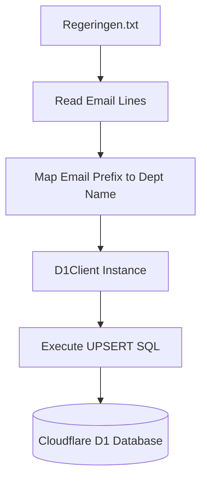
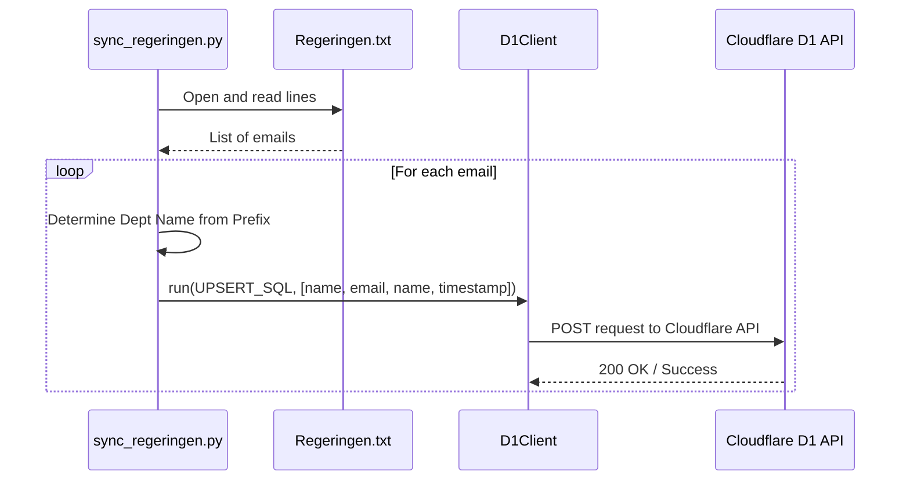

<details>
<summary>Relevant source files</summary>

The following files were used as context for generating this wiki page:

- [scraper/sync_regeringen.py](scraper/sync_regeringen.py)
- [Regeringen.txt](Regeringen.txt)
- [README.md](https://github.com/bliker85/politiker-kontakter/blob/fb90f70fe5cf9a010de8dfbef330819898bdd810/README.md)
- [scraper/sync_to_d1.py](scraper/sync_to_d1.py)
- [scraper/quarterly_refresh.sh](scraper/quarterly_refresh.sh)
- [scraper/d1.py](scraper/d1.py)
</details>

# Government Departments Scraper

The Government Departments Scraper is a specialized module within the `politiker-kontakter` project designed to synchronize contact information for the 11 departments of the Swedish Government (Regeringskansliet). Unlike other modules that scrape individual representatives, this system focuses on the official registrar (registrator) addresses, as formell contact with the government is channeled through these official department emails rather than personal accounts of individual ministers.
Sources: [scraper/sync_regeringen.py:8-14](scraper/sync_regeringen.py#L8-L14), [README.md:1-5](README.md#L1-L5)

This component serves as a critical data source for the [politiker-webapp](https://politiker.denied.se), ensuring that users have access to correct contact channels for the executive branch of the Swedish government. It operates alongside other scrapers for the Riksdag, EU Parliament, and local municipalities to provide a comprehensive database of political contacts.
Sources: [README.md:1-5](README.md#L1-L5), [scraper/quarterly_refresh.sh:25-32](scraper/quarterly_refresh.sh#L25-L32)

## Architecture and Data Flow

The system operates by reading a pre-existing list of registrar emails and mapping them to their respective department names before performing an "upsert" operation into a Cloudflare D1 database.

### System Flow
The following diagram illustrates the data progression from the source text file to the final database storage.



Sources: [scraper/sync_regeringen.py:43-63](scraper/sync_regeringen.py#L43-L63), [scraper/d1.py](scraper/d1.py)

### Key Components

| Component | Description |
| :--- | :--- |
| `Regeringen.txt` | A local text file containing a list of official registrar email addresses, one per line. |
| `DEPARTMENT_NAMES` | A static dictionary mapping email prefixes (e.g., "justitiedepartementet") to their formal Swedish titles. |
| `sync_regeringen.py` | The primary script responsible for parsing the file and executing the database synchronization. |
| `D1Client` | A shared utility class used to interact with the Cloudflare D1 HTTP API. |
Sources: [scraper/sync_regeringen.py:22-41](scraper/sync_regeringen.py#L22-L41), [scraper/d1.py](scraper/d1.py), [scraper/sync_regeringen.py:46-48](scraper/sync_regeringen.py#L46-L48)

## Data Mapping and Transformation

The script performs a transformation on the raw email data to generate human-readable department names. It splits the email address at the `.registrator@` delimiter to extract the prefix.

### Department Mapping Table
The system uses the following mapping for the 11 official departments:

| Email Prefix | Formatted Department Name |
| :--- | :--- |
| `arbetsmarknadsdepartementet` | Arbetsmarknadsdepartementet |
| `finansdepartementet` | Finansdepartementet |
| `forsvarsdepartementet` | Försvarsdepartementet |
| `justitiedepartementet` | Justitiedepartementet |
| `klimat-naringslivsdepartementet` | Klimat- och näringslivsdepartementet |
| `kulturdepartementet` | Kulturdepartementet |
| `landsbygds-infrastrukturdepartementet` | Landsbygds- och infrastrukturdepartementet |
| `socialdepartementet` | Socialdepartementet |
| `statsradsberedningen` | Statsrådsberedningen |
| `utbildningsdepartementet` | Utbildningsdepartementet |
| `utrikesdepartementet` | Utrikesdepartementet |
Sources: [scraper/sync_regeringen.py:22-34](scraper/sync_regeringen.py#L22-L34), [scraper/sync_regeringen.py:53-54](scraper/sync_regeringen.py#L53-L54)

## Database Integration

The module uses an `INSERT OR IGNORE` strategy with an `ON CONFLICT` clause to ensure that department records are either created or updated with the latest scraping timestamp without creating duplicates.

### Database Schema Interaction
The scraper targets the `politicians` table with the following specific values for government departments:

*  **area_type**: Hardcoded as `'regering'`.
*  **area_name**: Set to the formal Department Name.
*  **name**: Set to the formal Department Name (since individual names are not used).
*  **id**: Generated using `lower(hex(randomblob(11)))`.
Sources: [scraper/sync_regeringen.py:37-41](scraper/sync_regeringen.py#L37-L41), [scraper/sync_to_d1.py:34-39](scraper/sync_to_d1.py#L34-L39)



Sources: [scraper/sync_regeringen.py:43-63](scraper/sync_regeringen.py#L43-L63), [scraper/d1.py](scraper/d1.py)

### UPSERT Logic

```sql
INSERT INTO politicians (id, name, email, area_name, area_type, last_scraped_at)
VALUES (lower(hex(randomblob(11))), ?, ?, ?, 'regering', ?)
ON CONFLICT(email, area_name) 
DO UPDATE SET name = excluded.name, last_scraped_at = excluded.last_scraped_at
```

Sources: [scraper/sync_regeringen.py:37-41](scraper/sync_regeringen.py#L37-L41)

## Execution Context

The `sync_regeringen.py` script is part of the broader maintenance lifecycle of the project. It is specifically included in the `quarterly_refresh.sh` shell script, which orchestrates the update of all political categories.
Sources: [scraper/quarterly_refresh.sh:31](scraper/quarterly_refresh.sh#L31)

### Environment Requirements
The module relies on the following environment variables (defined in `d1.py` and sourced in the refresh script):
*  `CLOUDFLARE_ACCOUNT_ID`
*  `CLOUDFLARE_API_TOKEN_POLITIKER`
*  `D1_DATABASE_UUID`
Sources: [scraper/d1.py](scraper/d1.py), [scraper/sync_regeringen.py:16-19](scraper/sync_regeringen.py#L16-L19)

The Government Departments Scraper ensures the Swedish Government's executive branch is represented in the contact database through its official registrar channels, maintaining a 1:1 relationship between departments and their primary public contact points.
