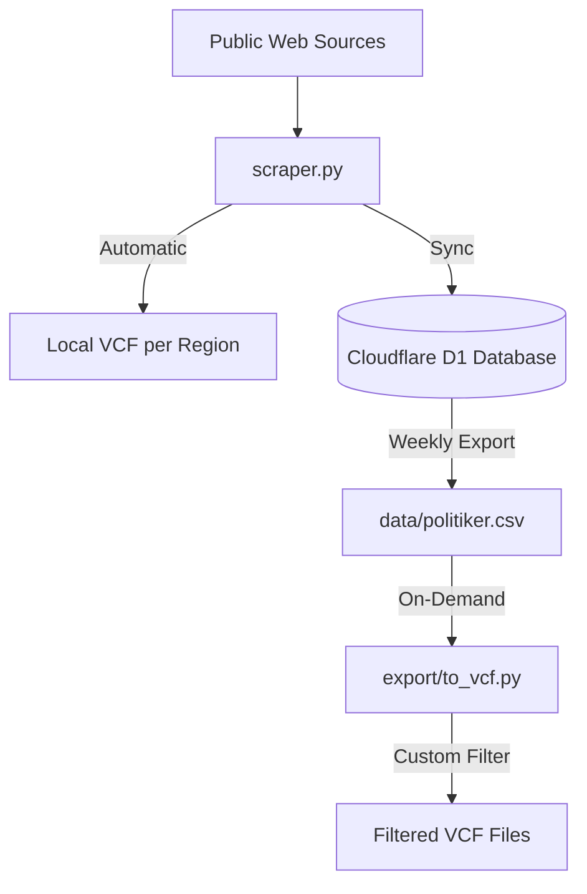
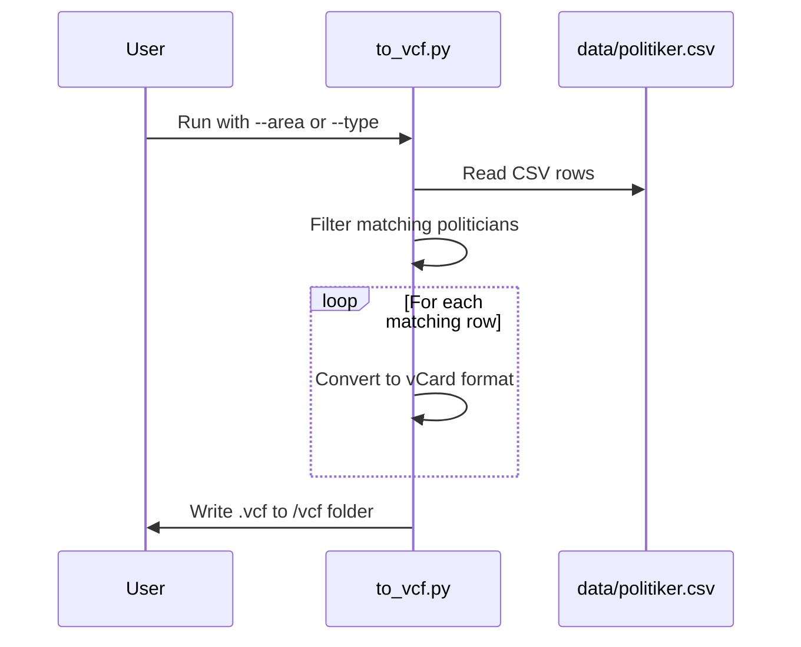

Relevant source files

The following files were used as context for generating this wiki page:

- [export/to_vcf.py](export/to_vcf.py)
- [scraper/scraper.py](scraper/scraper.py)
- [README.md](README.md)
- [AGENTS.md](AGENTS.md)
- [CLAUDE.md](CLAUDE.md)
- [export/export_d1.py](export/export_d1.py)

# VCF Contact Card Generation

VCF Contact Card Generation is a core feature of the `politiker-kontakter` project designed to transform scraped political contact data into a mobile-friendly format (vCard 3.0). This allows users to import public email addresses of elected officials—including municipal, regional, and national representatives—directly into mobile phone contact lists.

The system supports two primary modes of generation: automated export during the scraping process and manual on-demand generation from existing CSV datasets. The project emphasizes local generation to avoid unnecessary load on public databases or live web applications.
Sources: [README.md](README.md), [export/to_vcf.py:1-12](export/to_vcf.py#L1-L12), [AGENTS.md](AGENTS.md)

## Architecture and Data Flow

The generation process follows a structured pipeline from raw web scraping to final file output. Data is initially gathered by the `scraper/scraper.py` module, which organizes information into sets of tuples containing names and emails.

### Generation Pipeline
The following diagram illustrates the flow from data source to the final VCF output.

The system maintains a local data cache in `data/politiker.csv` which acts as the source for custom on-demand exports, while the initial scraper provides immediate region-specific VCFs.
Sources: [README.md](README.md), [CLAUDE.md](CLAUDE.md), [export/to_vcf.py:65-73](export/to_vcf.py#L65-L73)

## VCF Mapping Logic

The transformation logic maps specific fields from the project's data model to standard vCard 3.0 properties. This ensures compatibility with modern mobile operating systems.

### Field Mapping Table

| Data Field | vCard Property | Logic / Handling |
| :--- | :--- | :--- |
| `name` | `FN`, `N` | Escaped for vCard; defaults to email prefix if name is missing. |
| `email` | `EMAIL` | Flagged as `TYPE=INTERNET` (on-demand) or `TYPE=WORK` (scraper). |
| `area_name` | `ORG` | Represents the municipality, region, or government body. |
| `role` | `TITLE` | The official's position (e.g., Ledamot, Ordförande). |
| `party`, `area_type` | `NOTE` | Concatenated into a human-readable note field. |

Sources: [export/to_vcf.py:27-44](export/to_vcf.py#L27-L44), [scraper/scraper.py:537-550](scraper/scraper.py#L537-L550)

### Character Escaping
To maintain VCF file integrity, the `_esc` function handles specific reserved characters:
- Backslashes (`\`) are doubled (`\\`).
- Commas (`,`) are escaped (`\,`).
- Semicolons (`;`) are escaped (`\;`).
- Newlines (`\n`) are converted to literal `\n` strings.

Sources: [export/to_vcf.py:17-25](export/to_vcf.py#L17-L25)

## Implementation Modules

### Scraper Integration (`scraper.py`)
During a full scrape, the system automatically generates VCF files for each processed region. It also creates a consolidated file named `Alla_regioner.vcf`.
- **Function:** `spara_vcf(namn, emails, path)`
- **Scope:** Creates one ORG-level contact per region containing all associated email addresses.
- **Output Directory:** Configured via `OUTPUT_DIR` environment variable.

Sources: [scraper/scraper.py:537-550](scraper/scraper.py#L537-L550), [scraper/scraper.py:655-671](scraper/scraper.py#L655-L671)

### On-Demand Export (`to_vcf.py`)
This standalone script allows users to generate specific subsets of the database using CLI arguments.

Sources: [export/to_vcf.py:47-97](export/to_vcf.py#L47-L97)

## CLI Configuration
The `export/to_vcf.py` script provides several parameters for tailoring the output:

| Argument | Description | Default |
| :--- | :--- | :--- |
| `--csv` | Path to the source CSV file. | `../data/politiker.csv` |
| `--area` | Filter by exact `area_name` (e.g., "Lysekils kommun"). | None |
| `--type` | Filter by level (eu, riksdag, regering, region, kommun). | None |
| `--per-area` | Generate one `.vcf` file per area instead of one large file. | False |
| `--out` | Target directory for generated files. | `../vcf` |

Sources: [export/to_vcf.py:53-62](export/to_vcf.py#L53-L62)

## Summary
VCF Contact Card Generation provides a bridge between scraped data and end-user utility. By utilizing the vCard 3.0 standard and providing flexible filtering options via the `to_vcf.py` script, the project enables efficient management of political contacts. The implementation ensures data reliability through character escaping and offers multiple ways to consume the data, ranging from automated region-wide files to granular, user-filtered exports.
Sources: [README.md](README.md), [export/to_vcf.py:5-12](export/to_vcf.py#L5-L12)
