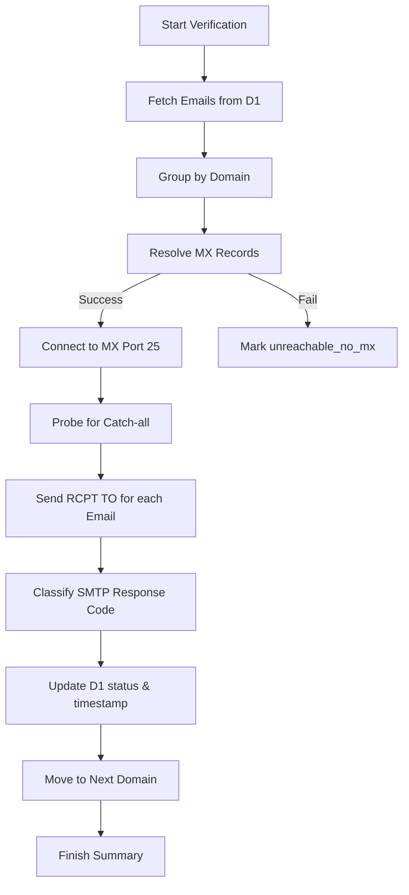
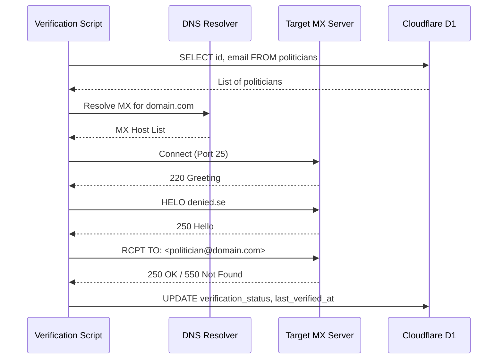

<details>
<summary>Relevant source files</summary>

The following files were used as context for generating this wiki page:

- [verify/verify_emails.py](verify/verify_emails.py)
- [scraper/d1.py](scraper/d1.py)
- [README.md](README.md)
- [CLAUDE.md](CLAUDE.md)
- [export/export_d1.py](export/export_d1.py)
</details>

# Automated Email Verification

Automated Email Verification is a periodic system within the `politiker-kontakter` project designed to validate the existence and deliverability of email addresses stored in the `politicians` table of the Cloudflare D1 database. This process is crucial because the project aggregates data from various sources—including direct scraping, pattern-based guesses, and official APIs—which may contain outdated or incorrect contact information.

The verification engine utilizes "SMTP callouts" to probe mail servers without actually sending emails. It is specifically designed to run on external infrastructure (such as a cron job on a Linux server) rather than within Cloudflare Workers, as Cloudflare unconditionally blocks outgoing port 25 traffic required for SMTP communication.

Sources: [verify/verify_emails.py:1-13](verify/verify_emails.py#L1-L13), [README.md:1-10](README.md#L1-L10)

## Architecture and System Flow

The verification system operates by fetching active records from the D1 database, grouping them by domain to optimize connections, and performing network probes. It updates each record with a `verification_status` and a `last_verified_at` timestamp.

### Process Flow
The following diagram illustrates the high-level logic of the verification lifecycle:



The system implements a politeness delay (`DELAY_BETWEEN_DOMAINS`) between domain checks to avoid being flagged as a malicious scanner.

Sources: [verify/verify_emails.py:118-164](verify/verify_emails.py#L118-L164), [verify/verify_emails.py:34-36](verify/verify_emails.py#L34-L36)

## Technical Implementation

### SMTP Callout Logic
The core verification logic is handled by the `probe_domain` function. It performs a sequence of standard SMTP commands: `EHLO`, `MAIL FROM`, and `RCPT TO`. The verification concludes before the `DATA` command is issued, ensuring no actual email is transmitted.

| Step | Action | Description |
| :--- | :--- | :--- |
| 1 | DNS Lookup | Resolves MX records for the domain using `dns.resolver`. |
| 2 | Connect | Establishes a socket connection on port 25 to the highest priority MX host. |
| 3 | Catch-all Check | Probes a random, non-existent address (e.g., `probe-xyz@domain.com`). |
| 4 | Individual Probes | Validates specific politician emails against the server's response. |

Sources: [verify/verify_emails.py:17-23](verify/verify_emails.py#L17-L23), [verify/verify_emails.py:75-115](verify/verify_emails.py#L75-L115)

### Catch-all Detection
Many large providers (e.g., Microsoft 365, Google Workspace) accept all `RCPT TO` commands to prevent directory harvest attacks. The script detects this by testing a `random_local_part()`. If the fake address is accepted, the domain is flagged as `is_catchall`, and subsequent results are downgraded from `valid` to `catchall_unverified`.

```python
def _classify(code: int, is_catchall: bool) -> str:
    if 250 <= code < 260:
        return "catchall_unverified" if is_catchall else "valid"
    if 500 <= code < 600:
        return "dead"
    if 400 <= code < 500:
        return "temporary"
    return f"unknown_code_{code}"
```

Sources: [verify/verify_emails.py:40-42](verify/verify_emails.py#L40-L42), [verify/verify_emails.py:59-72](verify/verify_emails.py#L59-L72)

## Data Integration

The verification script interacts with the Cloudflare D1 database through the `D1Client` class. It specifically updates the `politicians` table, which serves as the canonical store for all scraped data.

### Database Schema (Verification Fields)
The verification process updates specific fields in the database that are excluded from public data exports to maintain stability in version control.

| Field | Type | Description |
| :--- | :--- | :--- |
| `id` | TEXT | Unique identifier (used for targeting updates). |
| `verification_status` | TEXT | The result of the SMTP probe (e.g., `valid`, `dead`, `temporary`). |
| `last_verified_at` | INTEGER | Unix timestamp (ms) of the last check. |

Sources: [scraper/d1.py:1-20](scraper/d1.py#L1-L20), [export/export_d1.py:15-20](export/export_d1.py#L15-L20), [verify/verify_emails.py:155-159](verify/verify_emails.py#L155-L159)

### Status Classifications
The system maps SMTP response codes to internal project statuses:

*  **valid**: Address accepted and domain is not a catch-all.
*  **dead**: Permanent failure (5xx code); the address definitely does not exist.
*  **temporary**: Temporary failure (4xx code); typically caused by greylisting or rate limits.
*  **catchall_unverified**: Address accepted, but the server accepts everything, making the result uncertain.
*  **unreachable_***: Network-level failures (no MX records or connection refused).

Sources: [verify/verify_emails.py:60-72](verify/verify_emails.py#L60-L72), [verify/verify_emails.py:100-112](verify/verify_emails.py#L100-L112)

## Execution and Configuration

Verification is intended to run as a standalone Python script, separate from the primary scraping logic.

### Configuration Requirements
The script requires several environment variables to communicate with the Cloudflare API:
*  `CLOUDFLARE_ACCOUNT_ID`: The account identifier for the Cloudflare project.
*  `CLOUDFLARE_API_TOKEN_POLITIKER`: API token with permissions to execute D1 queries.
*  `D1_DATABASE_UUID`: The unique ID of the production database.

Sources: [verify/verify_emails.py:27-31](verify/verify_emails.py#L27-L31), [CLAUDE.md:32-37](CLAUDE.md#L32-L37)

### Connectivity Sequence
The following sequence diagram shows the interaction between the Verification Script, DNS, the Target Mail Server, and the D1 Database:



Sources: [verify/verify_emails.py:118-164](verify/verify_emails.py#L118-L164), [verify/verify_emails.py:44-57](verify/verify_emails.py#L44-L57)

## Summary
Automated Email Verification provides a robust, low-impact method for maintaining data hygiene within the `politiker-kontakter` database. By leveraging SMTP callouts and specific error handling for catch-all domains, it ensures that contact information for Swedish officials remains accurate while respecting network boundaries and Avoiding SMTP port blocks inherent in serverless environments.
