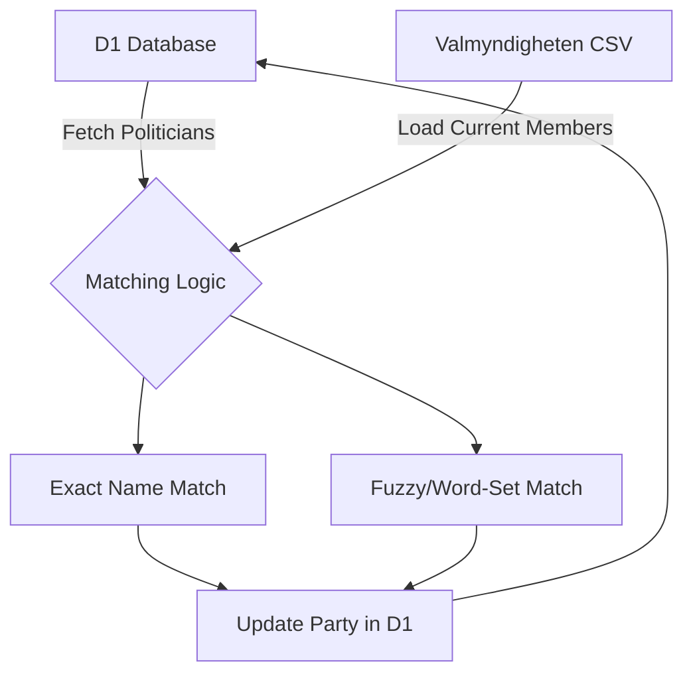
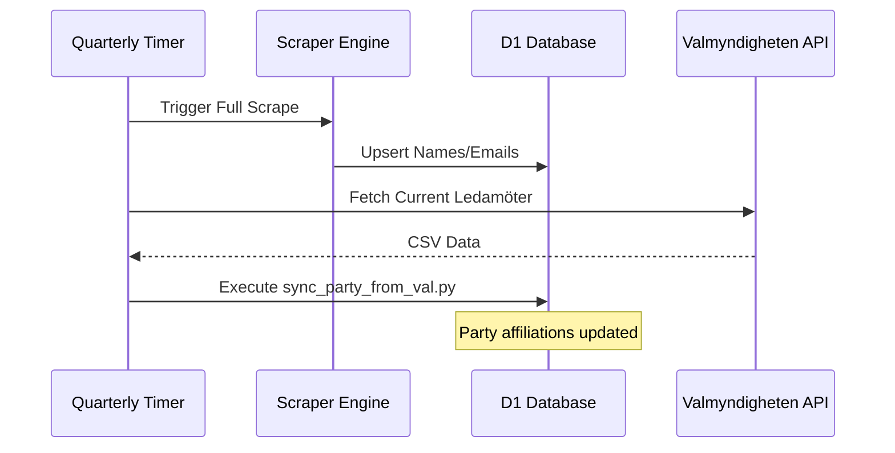

<details>
<summary>Relevant source files</summary>

The following files were used as context for generating this wiki page:

- [scraper/sync_party_from_val.py](scraper/sync_party_from_val.py)
- [scraper/politiker_common.py](scraper/politiker_common.py)
- [scraper/backfill_kommun_role_party.py](scraper/backfill_kommun_role_party.py)
- [scraper/scraper.py](scraper/scraper.py)
- [scraper/fetch_eu_meps.py](scraper/fetch_eu_meps.py)
- [scraper/fetch_kyrka.py](scraper/fetch_kyrka.py)
</details>

# Party Matching and Synchronization

## Introduction

The Party Matching and Synchronization system is a critical component of the `politiker-kontakter` project, responsible for ensuring that political party affiliations are accurately associated with elected officials in the database. Because initial web scraping of municipal and regional sites often yields contact information without explicit party data, this system employs multiple strategies to backfill and synchronize these details. It leverages external data sources like Valmyndigheten (the Swedish Election Authority) and specialized extraction logic to maintain data integrity across approximately 17,000 politicians.

Sources: [scraper/sync_party_from_val.py:12-25](scraper/sync_party_from_val.py#L12-L25), [README.md:16-20](README.md#L16-L20)

## Architecture and Data Flow

The system operates as a post-processing or enrichment layer within the scraping pipeline. While `scraper.py` focuses on extracting names and emails, dedicated synchronization scripts match these records against structured datasets to update party fields in the Cloudflare D1 database.

### Core Synchronization Logic
The primary synchronization mechanism uses a multi-tiered matching approach to connect scraped names with official election data.



*The diagram above illustrates the data flow between the central database and the Valmyndigheten external data source.*

Sources: [scraper/sync_party_from_val.py:112-140](scraper/sync_party_from_val.py#L112-L140)

## Matching Strategies

The project implements several techniques to ensure high match rates despite variations in how names are recorded across different government websites.

### Exact and Fuzzy Matching
1.  **Exact Matching:** Matches names and areas (e.g., "Stockholm kommun") exactly. If a name is ambiguous (multiple people with the same name in the same area but different parties), the match is discarded to prevent incorrect assignments.
2.  **Fuzzy (Word-Set) Matching:** Normalizes names into sets of words. This handles cases where Valmyndigheten includes middle names that are omitted on municipal sites, or differences in hyphenation. A match is successful if the scraped name's words are a subset of the official record's words.

Sources: [scraper/sync_party_from_val.py:44-65](scraper/sync_party_from_val.py#L44-L65), [scraper/sync_party_from_val.py:80-100](scraper/sync_party_from_val.py#L80-L100)

### Party Normalization
To maintain consistency, full party names are mapped to standard abbreviations. This ensures that "Socialdemokraterna" and "S" are treated as the same entity in the database.

| Full Name | Abbreviation |
| :--- | :--- |
| Socialdemokraterna | S |
| Moderaterna | M |
| Sverigedemokraterna | SD |
| Miljöpartiet de gröna | MP |

Sources: [scraper/politiker_common.py:14-26](scraper/politiker_common.py#L14-L26)

## Component Overview

| Component | File Path | Function |
| :--- | :--- | :--- |
| **Valmyndigheten Sync** | `scraper/sync_party_from_val.py` | Matches existing records against official election CSV data. |
| **Backfill Utility** | `scraper/backfill_kommun_role_party.py` | Ported logic from Playwright to Requests for faster HTML-based party extraction. |
| **EU/MEP Fetcher** | `scraper/fetch_eu_meps.py` | Synchronizes EU political groups using the Europarl API. |
| **Common Helpers** | `scraper/politiker_common.py` | Provides regex utilities for extracting parties from parentheses. |

### Technical Implementation: Name Normalization
The system uses a specific transliteration process to convert names for matching and email guessing, removing Swedish characters (å, ä, ö) and accents.

```python
def _email_local_part(namn_del):
    s = namn_del.strip().lower()
    s = (s.replace("å", "a").replace("ä", "a").replace("ö", "o")
           .replace("é", "e").replace("ü", "u").replace("ø", "o"))
    s = re.sub(r"[´’'`]", "", s)
    s = re.sub(r"[^a-z0-9\-]", "", s)
    return s
```

Sources: [scraper/scraper.py:441-449](scraper/scraper.py#L441-L449)

## Automated Workflows
The synchronization process is integrated into a quarterly refresh cycle. This ensures that the database reflects changes in mandates, replacements, or by-elections.



Sources: [scraper/quarterly_refresh.sh:12-34](scraper/quarterly_refresh.sh#L12-L34)

## Summary
The Party Matching and Synchronization system bridges the gap between raw contact scraping and a structured political database. By combining exact matching, word-set fuzzy logic, and official election data from Valmyndigheten, it provides a reliable method for identifying political affiliations. This multi-layered approach handles the inconsistencies of 290 municipal and 21 regional data sources, maintaining a high-quality dataset for the politiker-webapp.

Sources: [scraper/sync_party_from_val.py:140-155](scraper/sync_party_from_val.py#L140-L155), [README.md:65-80](README.md#L65-L80)
