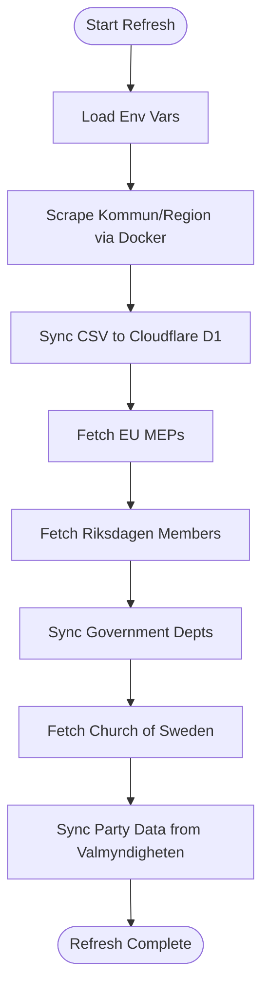
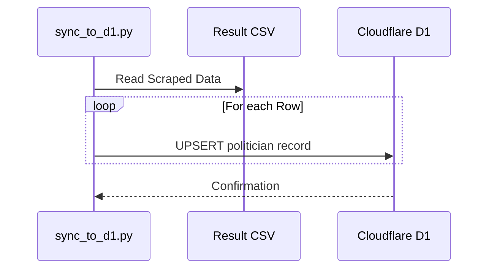

Relevant source files

The following files were used as context for generating this wiki page:

- [scraper/quarterly_refresh.sh](scraper/quarterly_refresh.sh)
- [scraper/sync_to_d1.py](scraper/sync_to_d1.py)
- [scraper/fetch_eu_meps.py](scraper/fetch_eu_meps.py)
- [scraper/fetch_riksdagen_members.py](scraper/fetch_riksdagen_members.py)
- [scraper/sync_party_from_val.py](scraper/sync_party_from_val.py)
- [scraper/fetch_kyrka.py](scraper/fetch_kyrka.py)
- [scraper/sync_regeringen.py](scraper/sync_regeringen.py)

# Quarterly Refresh Script

The **Quarterly Refresh Script** (`quarterly_refresh.sh`) is the primary orchestration utility for the politician contact database. It automates the end-to-end process of scraping, synchronizing, and updating political contact data across multiple jurisdictions including Swedish municipalities, regions, the Swedish Parliament (Riksdagen), the EU Parliament, and the Church of Sweden.

Sources: [scraper/quarterly_refresh.sh:1-5](scraper/quarterly_refresh.sh#L1-L5)

## Execution Overview

The script is designed to run every three months via cron. It handles environment configuration, coordinates Docker-based scraping for municipalities/regions, and executes specific Python sub-scripts to fetch data from various national and international APIs.

Sources: [scraper/quarterly_refresh.sh:6-14](scraper/quarterly_refresh.sh#L6-L14)

### Execution Flow
The following diagram illustrates the sequential execution of the refresh process:

Sources: [scraper/quarterly_refresh.sh:18-40](scraper/quarterly_refresh.sh#L18-L40)

## Script Components and Modules

The refresh process is composed of several specialized scripts, each responsible for a specific data source or synchronization task.

### Core Orchestration
The shell script manages the lifecycle of the refresh. It ensures the environment is set using a hidden configuration file and initiates the main scraper using Docker Compose to ensure a consistent Playwright environment.

Sources: [scraper/quarterly_refresh.sh:12-22](scraper/quarterly_refresh.sh#L12-L22), [docker-compose.yml](docker-compose.yml)

### Data Acquisition Modules

| Script | Responsibility | Data Source |
| :--- | :--- | :--- |
| `scraper.py` | Scrapes municipality and region data. | Netpublicator, Troman, W3D3, etc. |
| `fetch_eu_meps.py` | Fetches EU MEPs for all 27 countries. | data.europarl.europa.eu |
| `fetch_riksdagen_members.py` | Fetches Swedish Parliament members. | data.riksdagen.se |
| `fetch_kyrka.py` | Fetches Church of Sweden elected officials. | svenskakyrkan.se |
| `sync_regeringen.py` | Updates government department contacts. | Regeringen.txt (Local source) |

Sources: [scraper/quarterly_refresh.sh:24-38](scraper/quarterly_refresh.sh#L24-L38), [scraper/fetch_eu_meps.py:15-20](scraper/fetch_eu_meps.py#L15-L20), [scraper/fetch_riksdagen_members.py:15-20](scraper/fetch_riksdagen_members.py#L15-L20)

## Data Synchronization and Enrichment

After the initial scraping of municipalities, data is processed and enriched using two primary methods: CSV synchronization and external authority matching.

### Cloudflare D1 Integration
The `sync_to_d1.py` script parses the `Alla_kommuner_och_regioner.csv` file generated by the main scraper. It uses a thread pool to perform concurrent `UPSERT` operations into the Cloudflare D1 database.

Sources: [scraper/sync_to_d1.py:10-25](scraper/sync_to_d1.py#L10-L25), [scraper/d1.py:44-55](scraper/d1.py#L44-L55)

### Party Data Enrichment
The `sync_party_from_val.py` script matches scraped names against Valmyndigheten's official data to fill in missing party affiliations. This uses both exact matching and "fuzzy" word-set matching to handle differences in name formatting between sources.

Sources: [scraper/sync_party_from_val.py:14-25](scraper/sync_party_from_val.py#L14-L25), [scraper/sync_party_from_val.py:75-95](scraper/sync_party_from_val.py#L75-L95)

## Configuration and Environment

The script relies on a standard environment file located at `~/.appdata/.config/.env`. Key variables required for the refresh include:

| Variable | Description |
| :--- | :--- |
| `CLOUDFLARE_ACCOUNT_ID` | Account ID for D1 access. |
| `CLOUDFLARE_API_TOKEN` | API token with D1 write permissions. |
| `D1_DATABASE_UUID` | Target database ID. |
| `OUTPUT_DIR` | Directory for generated VCF and CSV files. |

Sources: [scraper/quarterly_refresh.sh:13](scraper/quarterly_refresh.sh#L13), [scraper/d1.py:35-42](scraper/d1.py#L35-L42)

## Error Handling
The script utilizes `set -e` to ensure execution halts immediately if any sub-command fails. Individual Python scripts such as `fetch_eu_meps.py` and `fetch_riksdagen_members.py` implement retry logic (e.g., up to 5 attempts) to handle network instability when communicating with government APIs.

Sources: [scraper/quarterly_refresh.sh:10](scraper/quarterly_refresh.sh#L10), [scraper/fetch_riksdagen_members.py:40-50](scraper/fetch_riksdagen_members.py#L40-L50)

## Conclusion
The Quarterly Refresh Script serves as the backbone of the politician-kontakter project, ensuring that the [politiker-webapp](https://politiker.denied.se) remains updated with accurate contact information. By combining web scraping, API consumption, and automated database synchronization, it maintains a database of approximately 17,000 officials across multiple levels of government.
