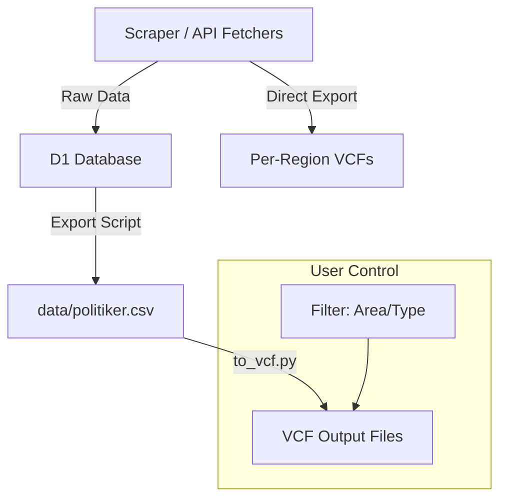
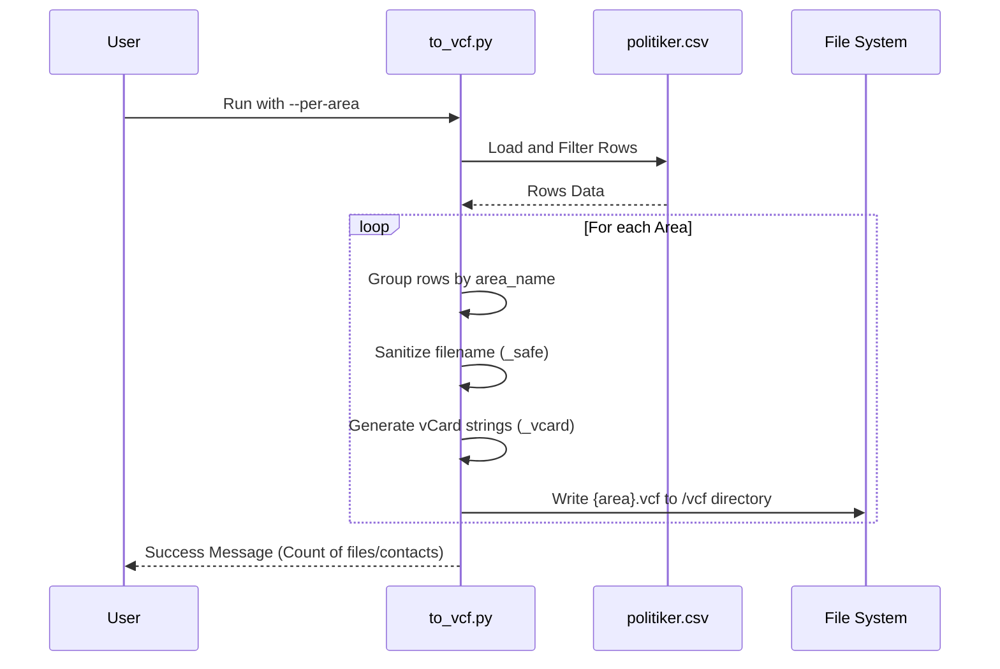

<details>
<summary>Relevant source files</summary>

The following files were used as context for generating this wiki page:

- [export/to_vcf.py](export/to_vcf.py)
- [README.md](README.md)
- [scraper/scraper.py](scraper/scraper.py)
- [CLAUDE.md](CLAUDE.md)
- [AGENTS.md](AGENTS.md)
- [export/export_d1.py](export/export_d1.py)
</details>

# VCF Contact Card Generation

VCF (Virtual Contact File) generation in the `politiker-kontakter` project serves the primary purpose of allowing users to import contact information for Swedish politicians directly into mobile devices, such as iPhones. The system supports generating individual contact cards for thousands of representatives, including those from municipal (kommun), regional (region), national (riksdag), and European (EU) levels.

The project employs two distinct methods for VCF generation: a real-time scraping-based approach that generates files per region during the scraping process, and a secondary on-demand export script that utilizes a local CSV database to create filtered VCF collections.
Sources: [README.md:32-37](README.md#L32-L37), [AGENTS.md:5-9](AGENTS.md#L5-L9), [export/to_vcf.py:1-12](export/to_vcf.py#L1-L12)

## Architecture and Data Flow

The project manages contact data through a pipeline that starts with web scraping and ends with file export. While the scraper generates VCF files as a byproduct of its execution, the dedicated export tool `to_vcf.py` is the primary interface for users to generate custom contact lists from the canonical dataset located in `data/politiker.csv`.

### Data Flow Overview



The diagram shows how data originates from scrapers, is centralized in a D1 database, and then flows into CSV format before being processed into VCF cards.
Sources: [README.md:46-75](README.md#L46-L75), [export/export_d1.py:11-20](export/export_d1.py#L11-L20), [CLAUDE.md:38-42](CLAUDE.md#L38-L42)

## Component Breakdown

### 1. On-Demand Export Tool (`to_vcf.py`)
This script reads from the published `data/politiker.csv` file. It allows for highly specific filtering so users do not have to import all ~17,000 contacts at once. It supports filtering by exact area name (e.g., "Lysekils kommun") or by administrative level (e.g., "riksdag").
Sources: [export/to_vcf.py:14-25](export/to_vcf.py#L14-L25), [README.md:10-15](README.md#L10-L15)

#### Configuration and Arguments
| Argument | Description | Default |
| :--- | :--- | :--- |
| `--csv` | Path to the source CSV file | `../data/politiker.csv` |
| `--area` | Filter by exact area name | None |
| `--type` | Filter by area type (eu, riksdag, regering, region, kommun) | None |
| `--per-area` | Generate one VCF file per area instead of one combined file | False |
| `--out` | Output directory for generated VCF files | `../vcf` |
Sources: [export/to_vcf.py:64-73](export/to_vcf.py#L64-L73)

### 2. Scraper Internal Export (`scraper.py`)
The main scraper script also includes a `spara_vcf` function. During a full run, it generates a VCF file for every region processed, as well as a collective `Alla_regioner.vcf` containing all unique email addresses found across all regions.
Sources: [scraper/scraper.py:465-478](scraper/scraper.py#L465-L478), [scraper/scraper.py:603-625](scraper/scraper.py#L603-L625)

## VCard Implementation Details

The system generates vCard version 3.0 files. Special care is taken to escape characters according to vCard standards (backslashes, commas, semicolons, and newlines).

### Data Mapping
The following table describes how CSV fields are mapped to vCard attributes:

| vCard Field | Source Data Field | Logic / Formatting |
| :--- | :--- | :--- |
| `FN` (Full Name) | `name` | Falls back to the email prefix if name is missing. |
| `N` (Name) | `name` | Formatted as `;{name};;;` |
| `EMAIL` | `email` | Tagged as `TYPE=INTERNET` or `TYPE=WORK`. |
| `ORG` | `area_name` | Represents the municipality or region. |
| `TITLE` | `role` | e.g., "Ledamot" or "Ordförande". |
| `NOTE` | `party` + `area_type` | Combined as "Parti: {party} \| Nivå: {area_type}". |
Sources: [export/to_vcf.py:38-57](export/to_vcf.py#L38-L57), [scraper/scraper.py:465-472](scraper/scraper.py#L465-L472)

### Escaping and Sanitation Logic

```python
def _esc(val: str) -> str:
    return (
        (val or "")
        .replace("\\", "\\\\")
        .replace(",", "\\,")
        .replace(";", "\\;")
        .replace("\n", "\\n")
    )
```

*Note: This ensures that data containing punctuation does not break the vCard format.*
Sources: [export/to_vcf.py:28-36](export/to_vcf.py#L28-L36)

## Generation Sequence

The following diagram illustrates the execution flow when a user runs the VCF generation script with the `--per-area` flag.



Sources: [export/to_vcf.py:75-103](export/to_vcf.py#L75-L103)

## Filename Safety
To ensure generated files are compatible with various operating systems, the script uses a sanitation function for area names used as filenames. It replaces non-alphanumeric characters (excluding dots and dashes) with underscores and strips leading/trailing underscores.
Sources: [export/to_vcf.py:60-61](export/to_vcf.py#L60-L61)

## Conclusion
VCF Contact Card Generation is a critical user-facing feature of the `politiker-kontakter` project, bridging the gap between a technical scraper and practical use by citizens. By providing both automated per-region exports during scraping and a flexible on-demand utility, the project ensures that the contact information of ~17,000 officials is easily accessible and portable to mobile devices.
Sources: [README.md:32-36](README.md#L32-L36), [CLAUDE.md:34-42](CLAUDE.md#L34-L42)
