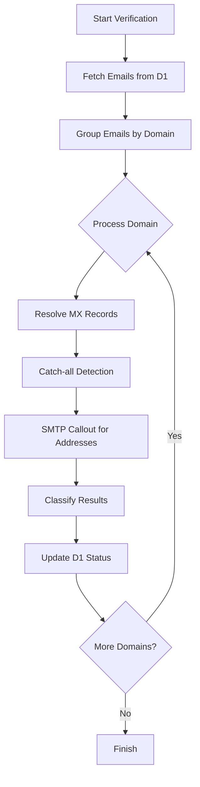
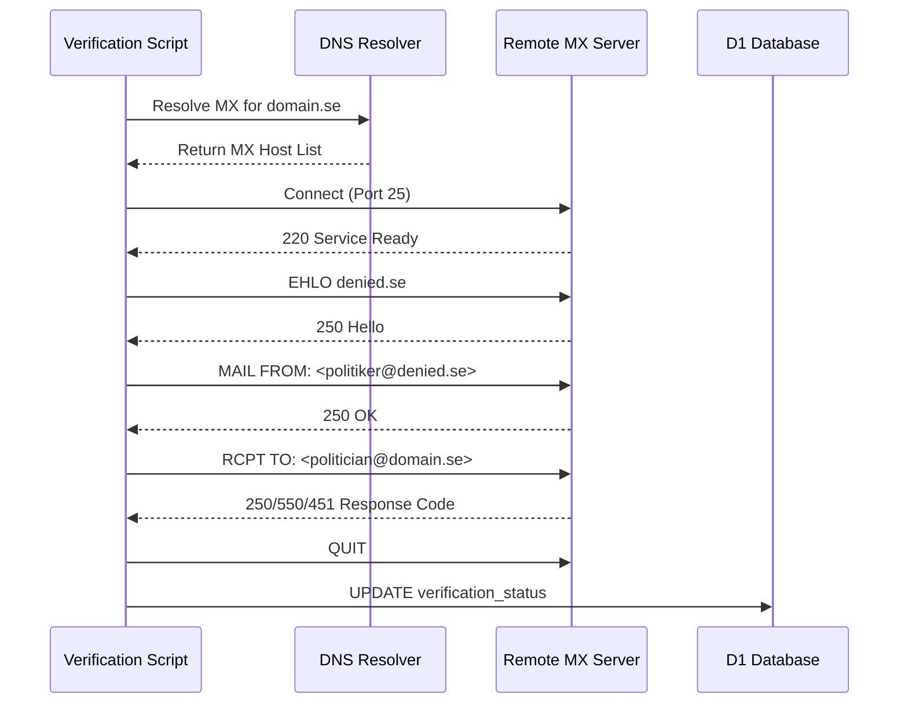

<details>
<summary>Relevant source files</summary>

The following files were used as context for generating this wiki page:

- [verify/verify_emails.py](verify/verify_emails.py)
- [scraper/d1.py](scraper/d1.py)
- [CLAUDE.md](CLAUDE.md)
- [README.md](README.md)
- [export/export_d1.py](export/export_d1.py)
- [scraper/sync_to_d1.py](scraper/sync_to_d1.py)
</details>

# Automated Email Verification

The Automated Email Verification system is a specialized utility designed to maintain the integrity of the contact database for Swedish politicians. It performs periodic validation of scraped email addresses to identify "dead" or invalid accounts without actually sending messages to the recipients.

This system operates as a secondary process to the primary scrapers, specifically targeting the `politicians` table within the Cloudflare D1 database. Due to network restrictions—specifically the unconditional blocking of outgoing port 25 in Cloudflare Workers—the verification script is designed to run on external infrastructure via cron or systemd-timers.
Sources: [verify/verify_emails.py:4-15](verify/verify_emails.py#L4-L15), [CLAUDE.md:27-31](CLAUDE.md#L27-L31)

## System Architecture

The verification process follows a decoupled architecture where the logic resides in a standalone Python script that communicates with the centralized Cloudflare D1 database through the `D1Client`.

### Workflow Diagram
The following diagram illustrates the end-to-end flow from database retrieval to status updates.



Sources: [verify/verify_emails.py:126-170](verify/verify_emails.py#L126-L170), [scraper/d1.py](scraper/d1.py)

## Verification Logic: SMTP Callout

The core technique used is an **SMTP callout**. This involves establishing a connection to the target domain's Mail Exchange (MX) server and simulating the initial stages of an email transmission. The script terminates the connection before the `DATA` command is issued, ensuring no actual email is delivered.

### The Handshake Sequence
The sequence below details the interaction between the verification script and a remote mail server.



Sources: [verify/verify_emails.py:11-15](verify/verify_emails.py#L11-L15), [verify/verify_emails.py:76-123](verify/verify_emails.py#L76-L123)

## Result Classification

The system interprets standard SMTP response codes to categorize the health of an email address. A critical component of this logic is the **Catch-all Detection**. If a domain responds with a success code (2xx) for a randomly generated, non-existent address (e.g., `probe-xyz123@domain.se`), the domain is flagged as a "catch-all," and subsequent positive results for that domain are downgraded to `catchall_unverified` to maintain data accuracy.
Sources: [verify/verify_emails.py:17-23](verify/verify_emails.py#L17-L23), [verify/verify_emails.py:59-73](verify/verify_emails.py#L59-L73)

### Status Categories

| Status | Description | SMTP Context |
| :--- | :--- | :--- |
| `valid` | Address is confirmed to exist. | 250 OK (Non-catch-all) |
| `dead` | Address no longer exists or is invalid. | 5xx Permanent Failure |
| `temporary` | Graylisting or rate limiting active. | 4xx Transient Failure |
| `catchall_unverified` | Domain accepts all mail; individual existence unknown. | 250 OK (Catch-all domain) |
| `unreachable_no_mx` | Domain has no mail server records. | DNS Lookup Failure |
| `unreachable_connect_failed` | Connection to MX server timed out or failed. | Socket/Connection Error |

Sources: [verify/verify_emails.py:65-73](verify/verify_emails.py#L65-L73), [verify/verify_emails.py:108-112](verify/verify_emails.py#L108-L112)

## Data Integration and Configuration

The verification system relies on the same infrastructure configuration as the `sync_to_d1.py` script, utilizing environment variables to authenticate with Cloudflare's API.

### Required Environment Variables

| Variable | Description |
| :--- | :--- |
| `CLOUDFLARE_ACCOUNT_ID` | The ID of the Cloudflare account hosting the D1 instance. |
| `CLOUDFLARE_API_TOKEN_POLITIKER` | API token with read/write permissions for the D1 database. |
| `D1_DATABASE_UUID` | The unique identifier for the `politicians` database. |

Sources: [verify/verify_emails.py:25-29](verify/verify_emails.py#L25-L29), [scraper/d1.py:12-16](scraper/d1.py#L12-L16)

### Database Interaction
The script updates the `politicians` table using the following schema-aligned parameters:
- `verification_status`: The classified string (e.g., 'valid', 'dead').
- `last_verified_at`: A millisecond-precision timestamp of the check.

```sql
UPDATE politicians 
SET verification_status = ?, last_verified_at = ? 
WHERE id = ?;
```

Sources: [verify/verify_emails.py:165-168](verify/verify_emails.py#L165-L168), [export/export_d1.py:27-28](export/export_d1.py#L27-L28)

## Implementation Details

The implementation includes several "good neighbor" features to ensure stability and avoid being flagged as malicious:
1. **Delay Between Domains**: A configurable delay (`DELAY_BETWEEN_DOMAINS = 1.5` seconds) to avoid aggressive probing.
2. **Identification**: Uses a legitimate `HELO` name (`denied.se`) and a deliverable `PROBE_FROM` address.
3. **Robustness**: Handles `SMTPServerDisconnected` errors by attempting a single reconnection per domain if the server closes the connection during batch processing.
Sources: [verify/verify_emails.py:38-41](verify/verify_emails.py#L38-L41), [verify/verify_emails.py:104-118](verify/verify_emails.py#L104-L118)

### Summary
The Automated Email Verification system provides a non-intrusive way to validate the large-scale contact data scraped by the project. By implementing SMTP callouts and catch-all detection, it ensures that the `politicians` database remains a reliable source of contact information for the associated web application.
Sources: [README.md:1-5](README.md#L1-L5), [verify/verify_emails.py:173-178](verify/verify_emails.py#L173-L178)
