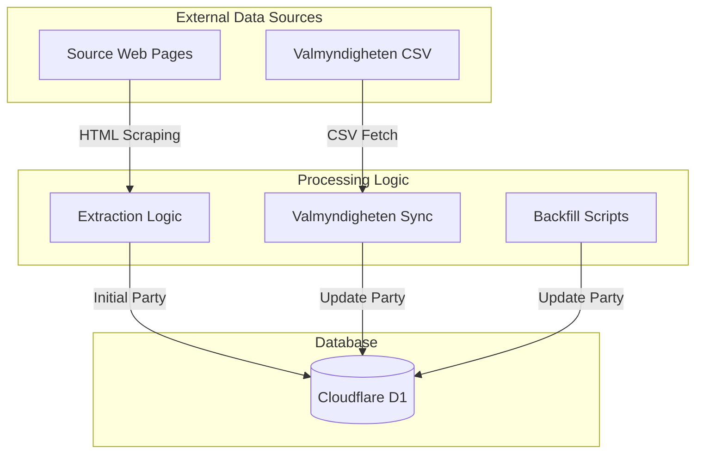
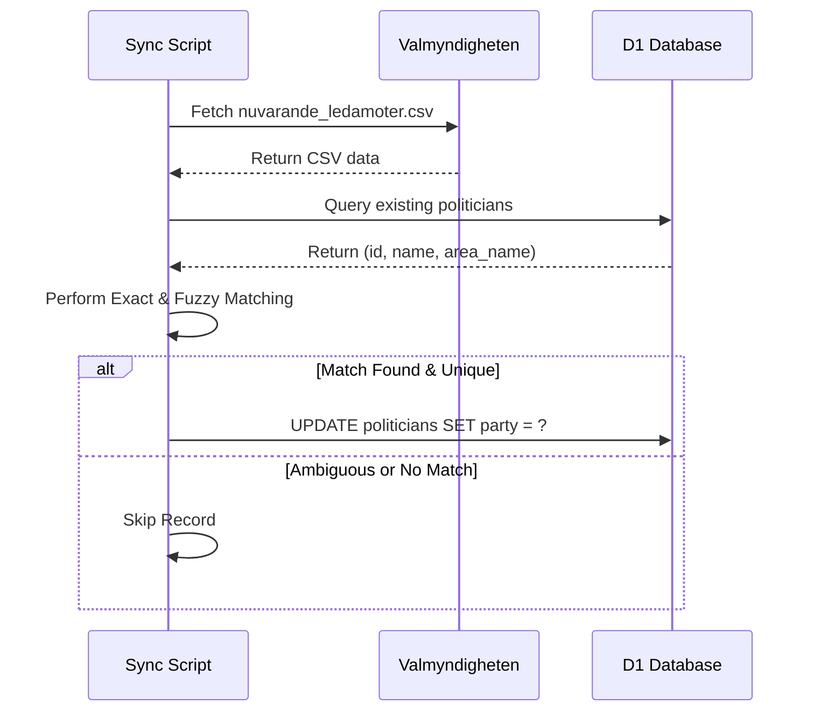

<details>
<summary>Relevant source files</summary>

The following files were used as context for generating this wiki page:

- [scraper/sync_party_from_val.py](scraper/sync_party_from_val.py)
- [scraper/politiker_common.py](scraper/politiker_common.py)
- [scraper/backfill_kommun_role_party.py](scraper/backfill_kommun_role_party.py)
- [scraper/scraper.py](scraper/scraper.py)
- [scraper/fetch_kyrka.py](scraper/fetch_kyrka.py)
- [scraper/quarterly_refresh.sh](scraper/quarterly_refresh.sh)
</details>

# Party Matching and Synchronization

The **Party Matching and Synchronization** system ensures that political party affiliations are accurately assigned to politicians within the project's database. This system is critical because standard web scraping often yields contact information without explicit party data. To resolve this, the project utilizes a combination of direct extraction from source HTML, external data matching from the Swedish Election Authority (Valmyndigheten), and secondary backfilling scripts. Sources: [README.md](README.md), [scraper/sync_party_from_val.py:12-20](scraper/sync_party_from_val.py#L12-L20)

This module operates primarily on data within a Cloudflare D1 database, matching names and geographic areas against external datasets to fill in missing party affiliations for municipal and regional representatives. Sources: [scraper/sync_party_from_val.py:12-25](scraper/sync_party_from_val.py#L12-L25)

## Synchronization Architecture and Workflow

The synchronization process is typically triggered as part of a quarterly refresh or as a post-scraping step. It follows a multi-tiered approach to ensure maximum coverage and accuracy. Sources: [scraper/quarterly_refresh.sh:10-33](scraper/quarterly_refresh.sh#L10-L33)

### Data Flow Overview

The following diagram illustrates how party data flows from external sources and scrapers into the central database.



The diagram shows the convergence of raw scraped data and validated election data into the D1 database. Sources: [scraper/scraper.py](scraper/scraper.py), [scraper/sync_party_from_val.py](scraper/sync_party_from_val.py), [scraper/backfill_kommun_role_party.py](scraper/backfill_kommun_role_party.py)

## Matching Logic and Strategies

The system employs three primary strategies to identify and synchronize party data:

### 1. Direct Extraction and Normalization
During initial scraping, the system attempts to find party labels in the source HTML, often located in parentheses next to a name. These raw strings are then normalized to a standard abbreviation (e.g., "Socialdemokraterna" becomes "S"). Sources: [scraper/politiker_common.py:18-30](scraper/politiker_common.py#L18-L30), [scraper/scraper.py:143-145](scraper/scraper.py#L143-L145)

| Function | Purpose | Logic |
| :--- | :--- | :--- |
| `normalize_party` | Standardizes strings | Uses a mapping of full names to abbreviations. |
| `party_from_parens` | Extract from end | Finds strings like `(S)` at the end of a line. |
| `party_anywhere` | Extract anywhere | Finds strings like `(S)` inside a text block. |
Sources: [scraper/politiker_common.py:33-54](scraper/politiker_common.py#L33-L54)

### 2. Valmyndigheten External Matching
The script `sync_party_from_val.py` fetches the "current members" CSV from Valmyndigheten. It performs matching based on the combination of name and geographic area (`area_name`). Sources: [scraper/sync_party_from_val.py:34-40](scraper/sync_party_from_val.py#L34-L40)

*  **Exact Matching**: Matches specific "Firstname Lastname" within the same municipality or region. Sources: [scraper/sync_party_from_val.py:48-55](scraper/sync_party_from_val.py#L48-L55)
*  **Fuzzy (Set-based) Matching**: Handles variations in names (e.g., "Andrea Birgitta Möllerberg" vs "Andrea Möllerberg") by treating names as sets of words. A match is valid if the scraped name's words are a subset of the official record's words. Sources: [scraper/sync_party_from_val.py:84-100](scraper/sync_party_from_val.py#L84-L100)

### 3. Role-Based Backfilling
For specific systems like "troman" or "netpublicator", dedicated backfill scripts bypass the heavy Playwright scraper to update party and role data using lightweight `requests`. Sources: [scraper/backfill_kommun_role_party.py:13-25](scraper/backfill_kommun_role_party.py#L13-L25)

## Conflict Resolution and Safety

To prevent incorrect data assignments, the system implements several safety checks:
*  **Ambiguity Check**: If multiple politicians with the same name exist in the same area but belong to different parties, the system marks the entry as ambiguous and does not update it. Sources: [scraper/sync_party_from_val.py:53-56](scraper/sync_party_from_val.py#L53-L56)
*  **Fuzzy Match Uniqueness**: Fuzzy matching only proceeds if a single unique party is identified as a candidate. Sources: [scraper/sync_party_from_val.py:117-122](scraper/sync_party_from_val.py#L117-L122)
*  **Per-record Updates**: Synchronization uses a thread pool for speed, issuing a separate, non-transactional `UPDATE` per record via `D1Client`. There is no batch UPSERT or wrapping transaction, so if a run fails partway through, some records may already be updated while others are not. Sources: [scraper/sync_party_from_val.py:157-165](scraper/sync_party_from_val.py#L157-L165)



This sequence ensures that only non-ambiguous election data is used to overwrite or fill in party details. Sources: [scraper/sync_party_from_val.py:128-150](scraper/sync_party_from_val.py#L128-L150)

## Technical Implementation Details

The core of the party matching system relies on standard Python libraries for data processing and a custom client for database interaction.

### Database Interaction
The system issues a plain `UPDATE` per record (no `UPSERT`) to maintain party data; concurrent per-record updates mean partial progress is possible if a run is interrupted.

```sql
UPDATE politicians 
SET party = ?, last_scraped_at = ? 
WHERE id = ?
```

Sources: [scraper/sync_party_from_val.py:161-164](scraper/sync_party_from_val.py#L161-L164)

### Configuration
Party normalization is centralized in `politiker_common.py` to ensure consistency across the main scraper and all utility scripts. Sources: [scraper/politiker_common.py:1-10](scraper/politiker_common.py#L1-L10)

## Conclusion
Party Matching and Synchronization is a sophisticated data enrichment layer that combines opportunistic scraping with authoritative election data. By utilizing both exact and fuzzy matching techniques, the system achieves a high degree of data accuracy while protecting against false positives in ambiguous cases. Sources: [scraper/sync_party_from_val.py:117-124](scraper/sync_party_from_val.py#L117-L124), [scraper/quarterly_refresh.sh:31-33](scraper/quarterly_refresh.sh#L31-L33)
