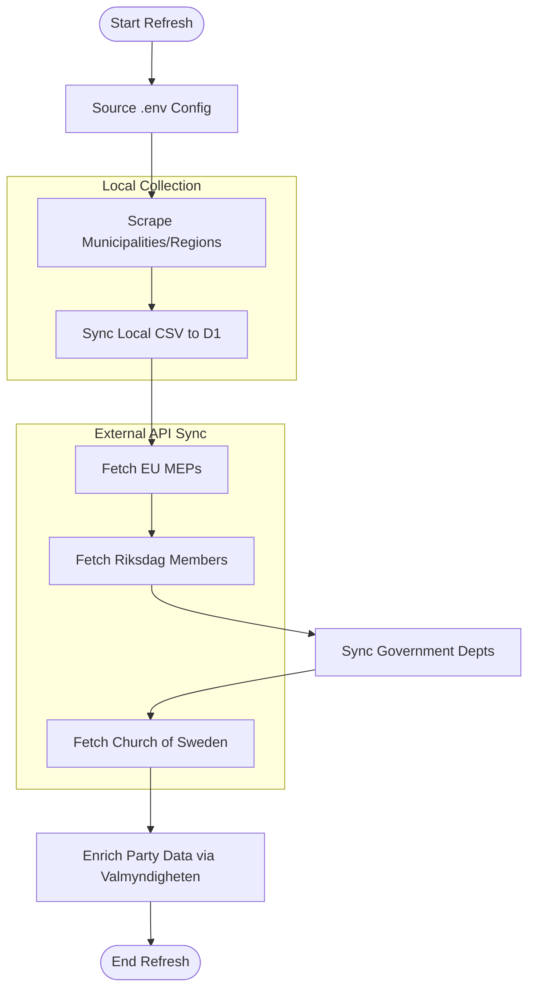

Relevant source files

The following files were used as context for generating this wiki page:

- [scraper/quarterly_refresh.sh](scraper/quarterly_refresh.sh)
- [scraper/scraper.py](scraper/scraper.py)
- [scraper/sync_to_d1.py](scraper/sync_to_d1.py)
- [scraper/fetch_eu_meps.py](scraper/fetch_eu_meps.py)
- [scraper/fetch_riksdagen_members.py](scraper/fetch_riksdagen_members.py)
- [scraper/sync_regeringen.py](scraper/sync_regeringen.py)
- [scraper/fetch_kyrka.py](scraper/fetch_kyrka.py)
- [scraper/sync_party_from_val.py](scraper/sync_party_from_val.py)

# Quarterly Refresh Script

The **Quarterly Refresh Script** (`quarterly_refresh.sh`) is a centralized automation shell script designed to perform a complete re-scraping and synchronization of the politician contact database. It orchestrates multiple sub-scrapers and synchronization tools to ensure that data for Swedish municipalities, regions, the national parliament (Riksdagen), the EU Parliament, the Government (Regeringen), and the Church of Sweden (Svenska kyrkan) is up-to-date in the Cloudflare D1 database.

Sources: [scraper/quarterly_refresh.sh:1-6](scraper/quarterly_refresh.sh#L1-L6), [README.md](README.md)

## Workflow Architecture

The script operates as a linear pipeline, executing specific Python modules and Docker containers in a predefined sequence to maintain data integrity across different administrative levels.

### Execution Flow
The refresh process follows a specific order of operations to ensure dependencies (such as local CSV files generated by the primary scraper) are available for subsequent synchronization steps.

*The diagram illustrates the sequential execution of scrapers and synchronization scripts defined in the refresh script.*

Sources: [scraper/quarterly_refresh.sh:11-38](scraper/quarterly_refresh.sh#L11-L38)

## Core Components and Modules

The refresh script orchestrates the following specialized modules:

### 1. Municipal and Regional Scraper
The process begins by launching a Docker Compose service that runs `scraper.py`. This component uses Playwright to navigate complex web structures (Netpublicator, Troman, etc.) and extracts contact information into a canonical CSV format.

*  **Primary Script**: `scraper/scraper.py`
*  **Output**: `Alla_kommuner_och_regioner.csv`

Sources: [scraper/quarterly_refresh.sh:19-21](scraper/quarterly_refresh.sh#L19-L21), [scraper/scraper.py:612-620](scraper/scraper.py#L612-L620)

### 2. D1 Synchronization
After the local scraper finishes, `sync_to_d1.py` reads the generated CSV and performs an upsert into the Cloudflare D1 database. It uses a thread pool for parallelized HTTP requests to the D1 API.

*  **Primary Script**: `scraper/sync_to_d1.py`
*  **Database**: Cloudflare D1 `politicians` table

Sources: [scraper/sync_to_d1.py:15-32](scraper/sync_to_d1.py#L15-L32), [scraper/quarterly_refresh.sh:24](scraper/quarterly_refresh.sh#L24)

### 3. External Entity Fetchers
The script triggers several modules that interact with official APIs or server-rendered HTML pages for larger political entities:

| Module | Entity | Data Source |
| :--- | :--- | :--- |
| `fetch_eu_meps.py` | EU Parliament | data.europarl.europa.eu |
| `fetch_riksdagen_members.py` | Swedish Parliament | data.riksdagen.se |
| `sync_regeringen.py` | Government Depts | regeringen.se / local text file |
| `fetch_kyrka.py` | Church of Sweden | svenskakyrkan.se |

Sources: [scraper/fetch_eu_meps.py:17-19](scraper/fetch_eu_meps.py#L17-L19), [scraper/fetch_riksdagen_members.py:27-28](scraper/fetch_riksdagen_members.py#L27-L28), [scraper/fetch_kyrka.py:14-18](scraper/fetch_kyrka.py#L14-L18)

### 4. Data Enrichment (Valmyndigheten)
The final step involves running `sync_party_from_val.py`. This script complements the scraped data by matching politician names against Valmyndigheten's (The Swedish Election Authority) open data to fill in missing party affiliations for municipal and regional representatives.

Sources: [scraper/sync_party_from_val.py:11-18](scraper/sync_party_from_val.py#L11-L18), [scraper/quarterly_refresh.sh:37](scraper/quarterly_refresh.sh#L37)

## Configuration and Environment

The script relies on environment variables stored in a specific configuration path (`~/.appdata/.config/.env`).

### Required Environment Variables
| Variable | Purpose |
| :--- | :--- |
| `CLOUDFLARE_ACCOUNT_ID` | Identity of the Cloudflare account owning the D1 database. |
| `CLOUDFLARE_API_TOKEN` | API token with read/write permissions for the D1 database. |
| `D1_DATABASE_UUID` | The unique identifier for the target D1 database. |
| `OUTPUT_DIR` | Directory where the primary scraper writes CSV and VCF results. |

Sources: [scraper/quarterly_refresh.sh:13-15](scraper/quarterly_refresh.sh#L13-L15), [scraper/d1.py:24-30](scraper/d1.py#L24-L30)

## Scheduling
The script is designed to run every three months (quarterly). According to the codebase comments, the first major run is intended to coincide with the conclusion of the 2026 Swedish general elections to capture the new mandate period.

Sources: [scraper/quarterly_refresh.sh:5-7](scraper/quarterly_refresh.sh#L5-L7)

## Error Handling
The script uses `set -e`, which halts the remaining pipeline steps as soon as any individual scraping or synchronization step fails. This only stops later stages from running — it does not roll back or undo writes already made to the production database by earlier steps in the same run. There is no explicit rollback or cleanup mechanism.

Sources: [scraper/quarterly_refresh.sh:8](scraper/quarterly_refresh.sh#L8)

The Quarterly Refresh Script serves as the primary maintenance engine for the politician-kontakter project, consolidating disparate scraping logics into a single, automated lifecycle for the project's data.
