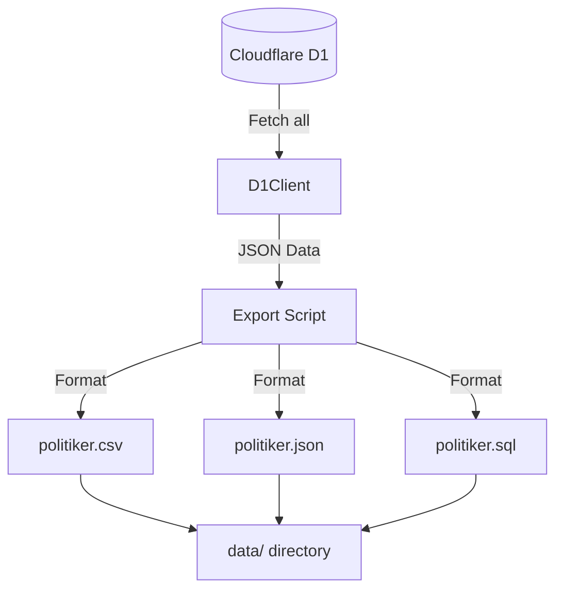
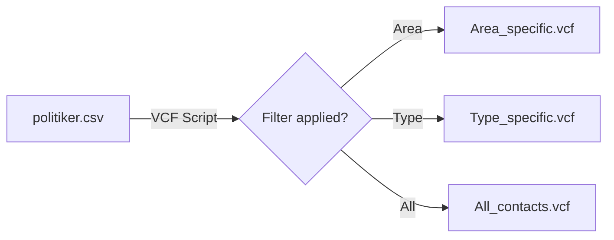

<details>
<summary>Relevant source files</summary>

The following files were used as context for generating this wiki page:

- [export/export_d1.py](export/export_d1.py)
- [README.md](README.md)
- [scraper/d1.py](scraper/d1.py)
- [scraper/sync_to_d1.py](scraper/sync_to_d1.py)
- [CLAUDE.md](CLAUDE.md)
</details>

# D1 Data Export

The **D1 Data Export** system is a critical component of the `politiker-kontakter` project, responsible for extracting data from the live Cloudflare D1 database and generating public-facing data files. It provides a bridge between the internal database used by the [politiker-webapp](https://politiker.denied.se) and the open data repository. Sources: [README.md:4-6](README.md#L4-L6), [export/export_d1.py:1-12](export/export_d1.py#L1-L12)

This system ensures that the contact information for approximately 17,000 elected officials—including names, emails, areas, parties, and roles—is available in canonical, machine-readable, and portable formats. The export process is designed to be deterministic and "noise-free," excluding volatile fields like timestamps to ensure meaningful version control diffs. Sources: [README.md:9-12](README.md#L9-L12), [export/export_d1.py:14-16](export/export_d1.py#L14-L16), [CLAUDE.md:45-48](CLAUDE.md#L45-L48)

## System Architecture and Data Flow

The export system utilizes a Python-based client to interface with the Cloudflare D1 HTTP API. It fetches records from the `politicians` table and serializes them into three distinct formats: CSV, JSON, and SQL. Sources: [export/export_d1.py:3-10](export/export_d1.py#L3-L10), [scraper/d1.py:38-42](scraper/d1.py#L38-L42)

### High-Level Export Process

The following diagram illustrates the flow of data from the D1 Database to the final output files stored in the `data/` directory.



The export process is automated via GitHub Workflows, which run weekly and open auto-merged Pull Requests when data changes are detected. Sources: [README.md:15-18](README.md#L15-L18), [CLAUDE.md:45-47](CLAUDE.md#L45-L47)

## Implementation Details

### Data Retrieval (Keyset Pagination)
To ensure data integrity during exports (avoiding skipped or duplicated rows if writes occur simultaneously), the system uses **keyset pagination** instead of standard `LIMIT`/`OFFSET`. The keyset is based on a unique tuple of `(email, area_name)`. Sources: [export/export_d1.py:23-28](export/export_d1.py#L23-L28)

```python
# Keyset pagination logic
sql = (
    f"SELECT {cols} FROM politicians "
    f"WHERE (email, area_name) > (?, ?) ORDER BY email, area_name LIMIT {PAGE}"
)
params = list(last)
```

Sources: [export/export_d1.py:38-42](export/export_d1.py#L38-L42)

### Deterministic Sorting
After retrieval, rows are sorted in Python based on `(area_type, area_name, name, email)`. This ensures that every export generates identical files if the underlying data hasn't changed, preventing "noise" in the git repository. Sources: [export/export_d1.py:28-30](export/export_d1.py#L28-L30), [export/export_d1.py:47](export/export_d1.py#L47)

### Output Formats
The system generates three primary files in the `data/` directory:

| File | Format | Description |
| :--- | :--- | :--- |
| `politiker.csv` | CSV | Canonical, human-readable database for Excel/Pandas. |
| `politiker.json` | JSON | Structured data for programmatic use. |
| `politiker.sql` | SQL | `INSERT OR IGNORE` statements for direct D1 import. |

Sources: [README.md:11-14](README.md#L11-L14), [export/export_d1.py:4-8](export/export_d1.py#L4-L8)

## Data Model and Schema

The export specifically filters for "stable" fields, omitting metadata such as `last_scraped_at` or `verification_status` to maintain clean diffs. Sources: [export/export_d1.py:14-16](export/export_d1.py#L14-L16), [export/export_d1.py:21](export/export_d1.py#L21)

### Exported Fields

| Field Name | Type | Description |
| :--- | :--- | :--- |
| `name` | String | The full name of the official. |
| `email` | String | The public email address (lowercase). |
| `area_name` | String | The municipality (kommun) or region name. |
| `area_type` | String | Category: `kommun`, `region`, `riksdag`, `regering`, or `eu`. |
| `party` | String | Political party affiliation. |
| `role` | String | Position or title (e.g., Ordförande, Ledamot). |

Sources: [export/export_d1.py:21](export/export_d1.py#L21), [scraper/sync_to_d1.py:35-42](scraper/sync_to_d1.py#L35-L42), [scraper/sync_to_d1.py:47-53](scraper/sync_to_d1.py#L47-L53)

### ID Generation
For the SQL export, a deterministic ID is generated by hashing the unique constraint fields. A SHA1 hash is created from the string `"{email}|{area_name}"`. Sources: [export/export_d1.py:84-88](export/export_d1.py#L84-L88)

## Configuration
The export scripts require environment variables to authenticate with Cloudflare. These are managed by the `D1Client` class. Sources: [scraper/d1.py:18-24](scraper/d1.py#L18-L24)

| Variable | Description |
| :--- | :--- |
| `CLOUDFLARE_ACCOUNT_ID` | Cloudflare account identifier. |
| `CLOUDFLARE_API_TOKEN` | API Token with D1 read/write permissions. |
| `D1_DATABASE_ID` | The UUID of the D1 database. |

Sources: [scraper/d1.py:26-36](scraper/d1.py#L26-L36), [export/export_d1.py:11-14](export/export_d1.py#L11-L14)

## VCF Export (Mobile Contacts)
In addition to the D1-to-repository export, a secondary export tool `export/to_vcf.py` generates Virtual Contact Files (VCF) from the local `data/politiker.csv`. This tool allows users to filter by area or type to import contacts into mobile devices. Sources: [README.md:23-31](README.md#L23-L31)



Sources: [README.md:27-33](README.md#L27-L33), [CLAUDE.md:38-40](CLAUDE.md#L38-L40)

## Conclusion
The D1 Data Export module provides a robust, deterministic, and automated way to share political contact data with the public. By employing keyset pagination and stable field selection, it ensures that the project's data remains consistent, accessible, and easily trackable via version control. Sources: [export/export_d1.py:1-12](export/export_d1.py#L1-L12), [README.md:15-19](README.md#L15-L19)
