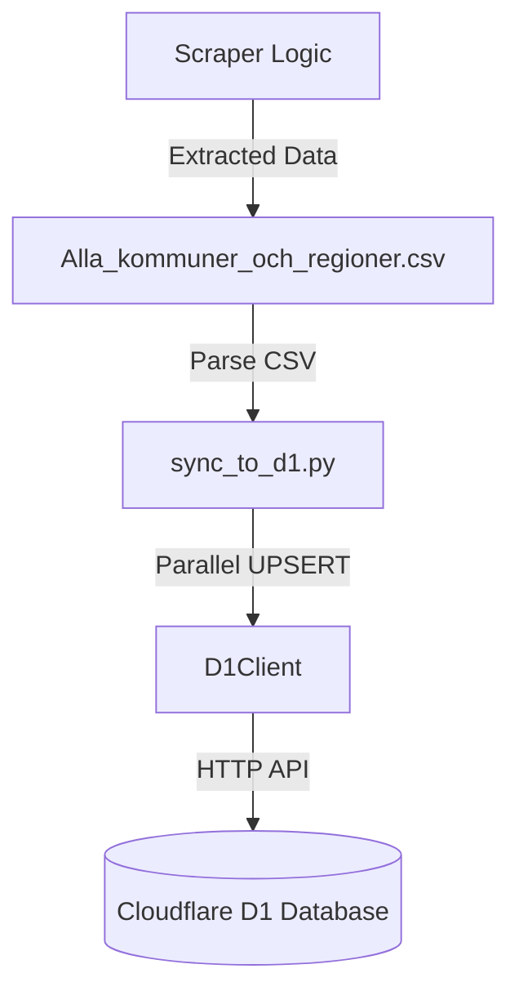
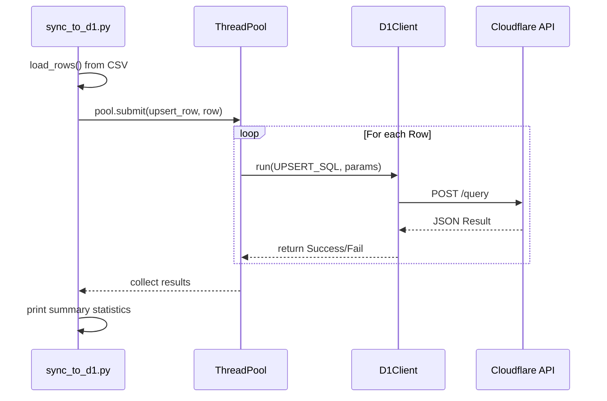

Relevant source files

The following files were used as context for generating this wiki page:

- [scraper/sync_to_d1.py](scraper/sync_to_d1.py)
- [scraper/d1.py](scraper/d1.py)
- [scraper/scraper.py](scraper/scraper.py)
- [scraper/quarterly_refresh.sh](scraper/quarterly_refresh.sh)
- [tests/test_sync_to_d1.py](tests/test_sync_to_d1.py)
- [CLAUDE.md](CLAUDE.md)

# Synchronizing to D1

The synchronization system is a critical component of the `politiker-kontakter` project, responsible for taking scraped contact information and uploading it to a Cloudflare D1 database. This database powers the [politiker-webapp](https://politiker.denied.se), providing a live backend for contact data of Swedish representatives across municipalities, regions, the national parliament (Riksdagen), the government (Regeringen), and the EU Parliament.

Sources: [scraper/sync_to_d1.py:1-12](scraper/sync_to_d1.py#L1-L12), [README.md:1-5](README.md#L1-L5)

## System Architecture

The synchronization process is decoupled from the main scraper logic to keep the scraper's primary responsibility focused on data extraction. The system follows a pipeline where the scraper outputs a machine-readable CSV file, which is then parsed and uploaded to D1 by the synchronization script.

### Data Flow Overview

The following diagram illustrates the data flow from the initial scraping phase to the final D1 database update.

The diagram shows how `sync_to_d1.py` acts as the bridge between local CSV artifacts and the remote Cloudflare database.
Sources: [scraper/sync_to_d1.py:12-16](scraper/sync_to_d1.py#L12-L16), [CLAUDE.md:38-42](CLAUDE.md#L38-L42)

## Core Components

### D1Client
The `D1Client` is a shared utility class used by all scripts that interact with the Cloudflare D1 database. It manages authentication, URL construction, and error handling for the D1 HTTP API. It utilizes a `requests.Session` to provide connection pooling for high-performance updates.

Sources: [scraper/d1.py:1-15](scraper/d1.py#L1-L15)

### Synchronization Script (`sync_to_d1.py`)
This script performs the heavy lifting of reading the CSV data and executing the synchronization logic. Because the D1 HTTP API does not support parameters with multiple statements in a single call, the script parallelizes individual `UPSERT` operations using a `ThreadPoolExecutor` with 10 workers to achieve reasonable speed.

Sources: [scraper/sync_to_d1.py:18-24](scraper/sync_to_d1.py#L18-L24)

## Data Mapping and Transformation

Before data is sent to D1, it undergoes mapping to ensure it fits the database schema. A key part of this is determining the `area_type` based on the `area_name`.

| Input Area Name | Resulting Area Type |
| :--- | :--- |
| Starts with "Region " | `region` |
| "Sveriges riksdag" or "Riksdagen" | `riksdag` |
| Contains "departementet", "regeringskansliet", or "Regeringen" | `regering` |
| Other | `kommun` |

Sources: [scraper/sync_to_d1.py:34-42](scraper/sync_to_d1.py#L34-L42), [tests/test_sync_to_d1.py:6-12](tests/test_sync_to_d1.py#L6-L12)

### Database Schema Mapping
The synchronization targets the `politicians` table with the following field mappings:

| CSV Column | D1 Field | Notes |
| :--- | :--- | :--- |
| (Generated) | `id` | Generated using `lower(hex(randomblob(11)))` |
| `name` | `name` | Cleaned and stripped string |
| `email` | `email` | Normalized to lowercase |
| `area_name` | `area_name` | Name of the municipality, region, etc. |
| (Calculated) | `area_type` | Based on `area_type_for()` logic |
| `party` | `party` | Normalized party abbreviation |
| `role` | `role` | Representative's role/title |
| (System Time) | `last_scraped_at` | Milliseconds since epoch |

Sources: [scraper/sync_to_d1.py:27-32](scraper/sync_to_d1.py#L27-L32), [scraper/sync_to_d1.py:48-63](scraper/sync_to_d1.py#L48-L63)

## Execution Logic

The synchronization logic uses an `INSERT ... ON CONFLICT` (UPSERT) strategy. This ensures that existing records are updated if the combination of `email` and `area_name` already exists, while new records are created for new representatives.

The sequence diagram highlights the concurrent nature of the synchronization, where multiple rows are processed simultaneously.
Sources: [scraper/sync_to_d1.py:84-100](scraper/sync_to_d1.py#L84-L100)

### Configuration and Environment
The system relies on specific environment variables for authentication and database targeting:

| Variable | Description | Aliases |
| :--- | :--- | :--- |
| `CLOUDFLARE_ACCOUNT_ID` | Cloudflare Account ID | - |
| `CLOUDFLARE_API_TOKEN_POLITIKER` | API Token with D1 write access | `CLOUDFLARE_API_TOKEN` |
| `D1_DATABASE_UUID` | Target D1 Database UUID | `D1_DATABASE_ID` |
| `RESULTAT_CSV` | Path to the scraper's CSV output | (Default: `../resultat/Alla_kommuner_och_regioner.csv`) |

Sources: [scraper/d1.py:16-24](scraper/d1.py#L16-L24), [scraper/sync_to_d1.py:21-25](scraper/sync_to_d1.py#L21-L25)

## Integration in Refresh Cycle

Synchronization is not a standalone event but part of the `quarterly_refresh.sh` cycle. This script orchestrates the full update process:
1.  **Scrape**: Run the Playwright/Docker scraper for municipalities and regions.
2.  **Sync**: Execute `sync_to_d1.py` to upload the CSV results.
3.  **Fetch External**: Run dedicated fetchers for EU MEPs, Riksdagen, Regeringen, and Kyrkan.
4.  **Backfill**: Update party information from Valmyndigheten data.

Sources: [scraper/quarterly_refresh.sh:1-35](scraper/quarterly_refresh.sh#L1-L35)

## Summary

Synchronizing to D1 is a specialized pipeline that transforms the flat-file output of the scrapers into a structured, remote database. By using a parallelized UPSERT strategy via the `D1Client`, the system maintains high data integrity and performance, ensuring the [politiker-webapp](https://politiker.denied.se) remains updated with the latest representative contact information.

Sources: [scraper/sync_to_d1.py:1-12](scraper/sync_to_d1.py#L1-L12), [README.md:10-15](README.md#L10-L15)
