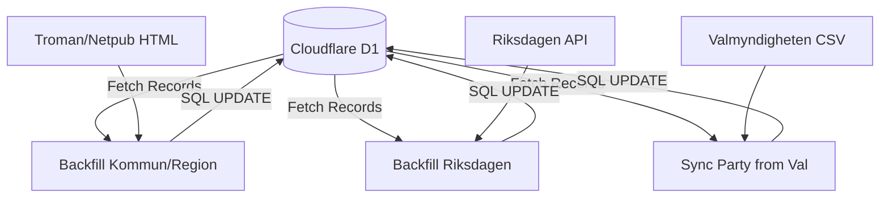
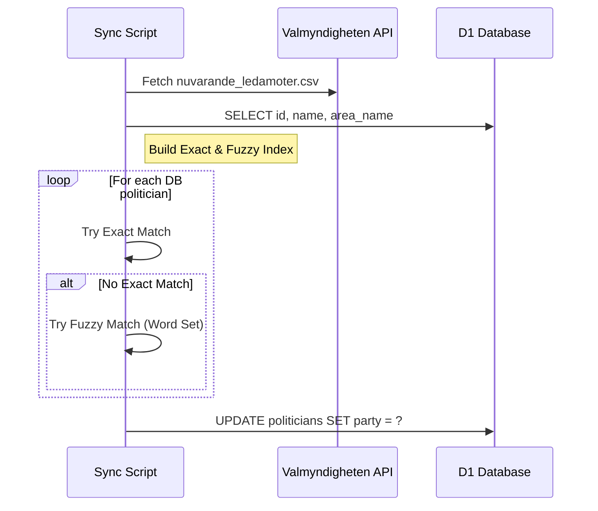

<details>
<summary>Relevant source files</summary>

The following files were used as context for generating this wiki page:

- [scraper/backfill_kommun_role_party.py](scraper/backfill_kommun_role_party.py)
- [scraper/backfill_riksdagen_role.py](scraper/backfill_riksdagen_role.py)
- [scraper/sync_party_from_val.py](scraper/sync_party_from_val.py)
- [scraper/scraper.py](scraper/scraper.py)
- [scraper/sync_to_d1.py](scraper/sync_to_d1.py)
- [README.md](README.md)
</details>

# Data Backfilling

Data Backfilling in the `politiker-kontakter` project refers to the automated process of enriching existing records in the Cloudflare D1 database with missing metadata, specifically political party affiliations and official roles. While the primary [Scraper Logic](#scraper-logic) handles the initial extraction of names and emails, backfilling scripts act as a secondary enhancement layer to fill in gaps that were either missed during the initial scrape or require data from external authority sources.

The scope of backfilling covers Swedish municipal (kommun), regional (region), and national (riksdag) politicians. It utilizes various techniques including server-side HTML parsing for legacy systems, matching against Valmyndigheten's (the Swedish Election Authority) open data, and querying the Riksdagen Web API.

Sources: [README.md:50-65](README.md#L50-L65), [scraper/backfill_kommun_role_party.py:1-25](scraper/backfill_kommun_role_party.py#L1-L25)

## Backfilling Architecture and Workflow

The backfilling system is designed to be re-runnable and operates on records already present in the `politicians` table. It matches existing records based on unique identifiers (like email and area name) to perform SQL `UPDATE` operations rather than creating new entries.



*The diagram above shows the flow of data from external sources and existing database records into the backfilling scripts, which then update the central database.*

Sources: [scraper/backfill_kommun_role_party.py:15-20](scraper/backfill_kommun_role_party.py#L15-L20), [scraper/backfill_riksdagen_role.py:15-20](scraper/backfill_riksdagen_role.py#L15-L20), [scraper/sync_party_from_val.py:10-25](scraper/sync_party_from_val.py#L10-L25)

## Municipal and Regional Backfilling

This module targets municipalities and regions using specific administrative systems like Troman and Netpublicator. Unlike the main scraper which uses Playwright, the backfill script uses lightweight `requests` and regex for faster execution on server-rendered HTML.

### Key Logic and Components
- **Source Selection**: It filters targets from `regioner.json` where the type is "troman" or "netpublicator".
- **Role Extraction**: It specifically looks for roles associated with "fullmäktige" (the assembly) to prioritize high-level positions.
- **Normalization**: Party names are normalized using shared utilities to ensure database consistency.

| Function | Source System | Description |
| :--- | :--- | :--- |
| `troman_rows()` | Troman | Extracts names, emails, parties, and roles from Troman person profiles. |
| `netpublicator_rows()` | Netpublicator | Scrapes Netpublicator board listings and politician profiles. |
| `extract_h1_text()` | Both | Cleans HTML tags from headers to extract name/party strings. |

Sources: [scraper/backfill_kommun_role_party.py:38-45](scraper/backfill_kommun_role_party.py#L38-L45), [scraper/backfill_kommun_role_party.py:73-80](scraper/backfill_kommun_role_party.py#L73-L80), [scraper/backfill_kommun_role_party.py:118-125](scraper/backfill_kommun_role_party.py#L118-L125)

## National Assembly (Riksdagen) Role Backfilling

The Riksdagen backfiller focuses on determining the most significant current role for a member of parliament (MP). Since the standard chamber status often just lists "Riksdagsledamot", this script parses committee assignments to find higher-ranking titles.

### Priority Ranking
If a politician has multiple assignments, the script selects the role based on the following hierarchy:
1. Ordförande (Chair)
2. Vice ordförande (Vice Chair)
3. Ledamot (Member)
4. Suppleant (Substitute)

Sources: [scraper/backfill_riksdagen_role.py:27-28](scraper/backfill_riksdagen_role.py#L27-L28), [scraper/backfill_riksdagen_role.py:43-55](scraper/backfill_riksdagen_role.py#L43-L55)

## Party Matching via Valmyndigheten

This process matches scraped politicians against Valmyndigheten's official list of current mandate holders. This is critical for cases where the municipality's own website does not explicitly list the party affiliation alongside the contact info.

### Matching Strategies
1. **Exact Match**: Matches on `(area_name, full_name)`. If a name is ambiguous (multiple people with the same name in the same area but different parties), the match is discarded.
2. **Fuzzy Match**: Normalizes names into word sets (e.g., handling "Andrea Birgitta Möllerberg" vs "Andrea Möllerberg"). It succeeds if the scraped name is a subset of the official name and is unique within that area.



*Sequence showing the party synchronization process using external authority data.*

Sources: [scraper/sync_party_from_val.py:45-65](scraper/sync_party_from_val.py#L45-L65), [scraper/sync_party_from_val.py:85-115](scraper/sync_party_from_val.py#L85-L115)

## Database Update Model

All backfilling operations use a consistent SQL pattern to ensure existing data is preserved while missing fields are updated.

```sql
UPDATE politicians 
SET party = COALESCE(?, party), 
    role = COALESCE(?, role), 
    last_scraped_at = ? 
WHERE area_name = ? AND email = ?
```

Sources: [scraper/backfill_kommun_role_party.py:168-172](scraper/backfill_kommun_role_party.py#L168-L172), [scraper/sync_to_d1.py:30-34](scraper/sync_to_d1.py#L30-L34)

## Summary of Backfilling Components

| Script | Purpose | Data Source |
| :--- | :--- | :--- |
| `backfill_kommun_role_party.py` | Fills party/role for municipal/regional politicians. | Troman/Netpublicator HTML |
| `backfill_riksdagen_role.py` | Updates MP roles based on committee priority. | data.riksdagen.se API |
| `sync_party_from_val.py` | Cross-references party names with election data. | resultat.val.se CSV |

Sources: [README.md:50-70](README.md#L50-L70), [scraper/backfill_kommun_role_party.py:1-10](scraper/backfill_kommun_role_party.py#L1-L10)
