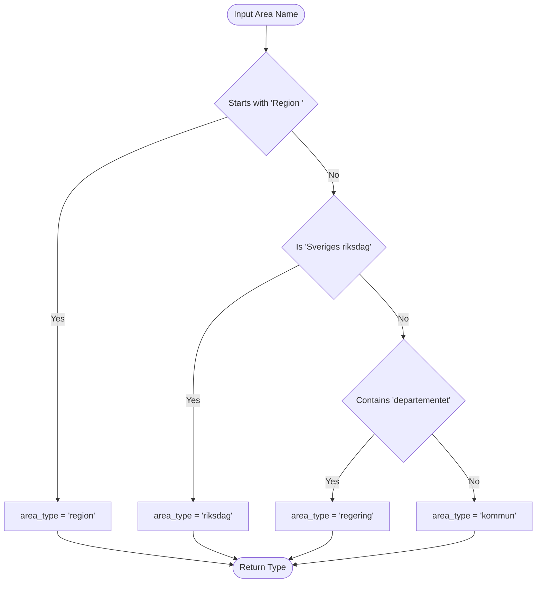
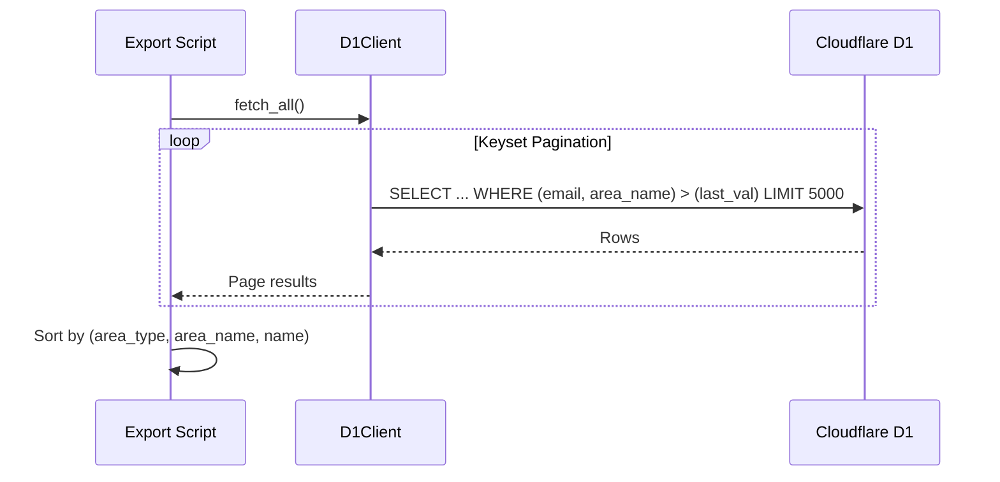

<details>
<summary>Relevant source files</summary>

The following files were used as context for generating this wiki page:

- [scraper/scraper.py](scraper/scraper.py)
- [scraper/sync\_to\_d1.py](scraper/sync_to_d1.py)
- [export/export\_d1.py](export/export_d1.py)
- [CLAUDE.md](CLAUDE.md)
- [scraper/fetch\_kyrka.py](scraper/fetch_kyrka.py)
- [README.md](README.md)
</details>

# Common Data Utilities

Common Data Utilities within the `politiker-kontakter` project represent a suite of shared logic, normalization functions, and database interfaces designed to standardize contact information gathered from various government and religious entities. These utilities ensure that data scraped from diverse sources—ranging from municipal PDF lists to the European Parliament API—is formatted consistently for the project's central Cloudflare D1 database.

The utilities are primarily distributed between specialized modules like `politiker_common.py` (shared party/name helpers) and the `D1Client` class, which manages persistence. These components handle critical tasks such as Swedish-specific string sorting, party name normalization, and the classification of geographical areas into categories like "kommun" (municipality), "region," or "riksdag" (parliament).

## Data Normalization and Validation

Normalization utilities transform irregular raw strings into structured data. This logic is crucial because Swedish political data often contains special characters (å, ä, ö) and varied party naming conventions across 290 municipalities and 21 regions.

### Swedish Alphabetical Sorting
Standard OS locales may not sort Swedish characters correctly (where å, ä, and ö follow z). The project uses a custom `swedish_key` function to ensure deterministic sorting for both human-readable text files and CSV exports.

```python
def swedish_key(name: str):
    """Sorts å/ä/ö after z in the correct order."""
    s = name.lower()
    return s.replace("å", "{").replace("ä", "|").replace("ö", "}")
```

Sources: [scraper/scraper.py:110-113](scraper/scraper.py#L110-L113)

### Contact Validation and Sanitization
The system filters out generic administrative email addresses and validates the structure of personal emails using regular expressions.

| Utility Function | Purpose | Logic Detail |
| :--- | :--- | :--- |
| `is_valid_email` | Filters invalid or generic emails | Excludes keywords like `noreply`, `support@`, `info@region`. |
| `clean_name` | Sanitizes name strings | Removes parenthetical party info, titles like "Biskop", and excess whitespace. |
| `normalize_party` | Standardizes party names | Shared logic via `politiker_common.py` to map various spellings to canonical forms. |

Sources: [scraper/scraper.py:59-67](scraper/scraper.py#L59-L67), [scraper/fetch_kyrka.py:61-66](scraper/fetch_kyrka.py#L61-L66), [CLAUDE.md:18-21](CLAUDE.md#L18-L21)

## Area Classification

When syncing data to the database, the system must categorize the "area" of the politician. This classification determines the `area_type` field, which is used for filtering in the web application.



The logic above is implemented in the `area_type_for` helper function, ensuring that diverse input strings are mapped to one of the four canonical types.
Sources: [scraper/sync_to_d1.py:44-52](scraper/sync_to_d1.py#L44-L52)

## Database Connectivity (D1Client)

The `D1Client` is the central interface for interacting with Cloudflare D1. It is used by scrapers to `sync` data, by verification scripts to update `verification_status`, and by export scripts to retrieve records.

### Configuration and Environment
The client relies on specific environment variables for authentication and targeting the correct database instance.
*  `CLOUDFLARE_ACCOUNT_ID`: The unique identifier for the Cloudflare account.
*  `CLOUDFLARE_API_TOKEN`: Token with D1 read/write permissions.
*  `D1_DATABASE_ID`: The UUID of the target database.

Sources: [CLAUDE.md:32-35](CLAUDE.md#L32-L35), [export/export_d1.py:11-15](export/export_d1.py#L11-L15)

### Query Execution and Paging
For large-scale data retrieval (e.g., during full database exports), the utility uses "keyset pagination" instead of standard `OFFSET`. This prevents data duplication or skipping if the database is modified during the export process.



Sources: [export/export_d1.py:35-56](export/export_d1.py#L35-L56)

## Data Formatting and Export

The utilities include logic to convert internal database records into public-facing formats. The system maintains a set of "stable fields" to ensure that automated exports do not contain noisy changes (like timestamps) that would clutter version control diffs.

### Canonical Field Mapping
The following fields are considered stable and are included in the public datasets:
1. `name`: The politician's full name.
2. `email`: Normalized lowercase email address.
3. `area_name`: The specific region, municipality, or department.
4. `area_type`: The category (kommun, region, riksdag, regering, kyrka).
5. `party`: Standardized party abbreviation.
6. `role`: The position held (e.g., Ordförande, Ledamot).

Sources: [export/export_d1.py:24-25](export/export_d1.py#L24-L25), [README.md:16-22](README.md#L16-L22)

### Output Formats
| Format | Utility Responsibility | Usage |
| :--- | :--- | :--- |
| **CSV** | `export_d1.py` / `spara_csv` | Primary machine-readable transfer form and canonical database record. |
| **JSON** | `export_d1.py` | Programmatic access for external applications. |
| **SQL** | `export_d1.py` | `INSERT OR IGNORE` statements for database seeding/restoration. |
| **VCF** | `to_vcf.py` | Mobile contact cards (generated on demand from CSV). |

Sources: [export/export_d1.py:68-100](export/export_d1.py#L68-L100), [README.md:36-40](README.md#L36-L40), [CLAUDE.md:46-52](CLAUDE.md#L46-L52)

## Summary
Common Data Utilities serve as the connective tissue between the raw scraping logic and the finalized data storage. By centralizing sorting logic (`swedish_key`), classification rules (`area_type_for`), and database communication (`D1Client`), the project ensures that any new scraper or maintenance script adheres to the established data model and normalization standards required by the [politiker-webapp](https://politiker.denied.se).
