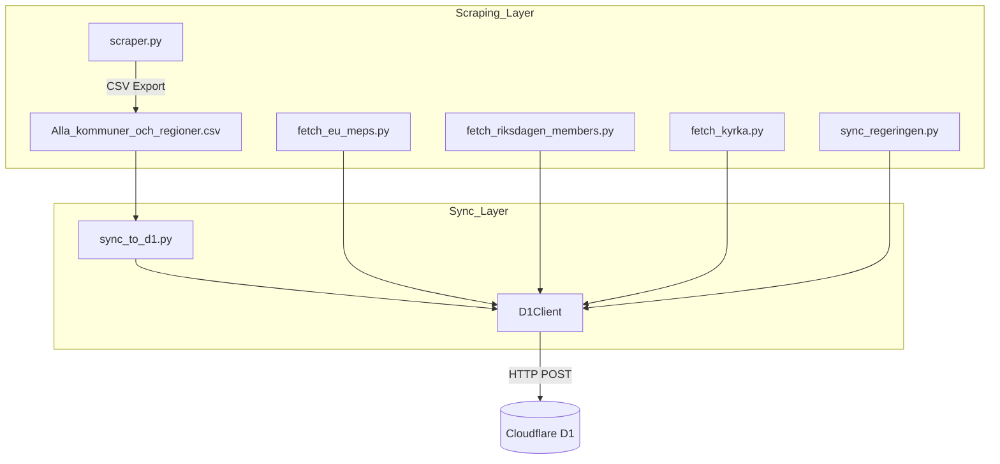
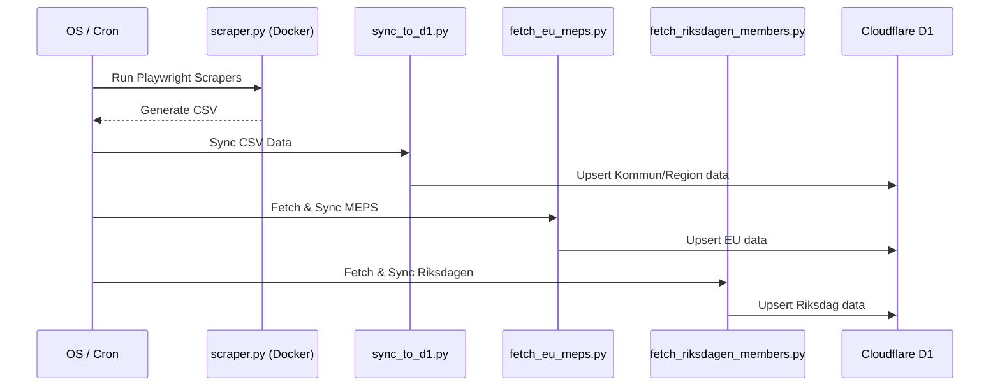

<details>
<summary>Relevant source files</summary>

The following files were used as context for generating this wiki page:

- [scraper/sync_to_d1.py](scraper/sync_to_d1.py)
- [scraper/d1.py](scraper/d1.py)
- [scraper/scraper.py](scraper/scraper.py)
- [scraper/fetch_eu_meps.py](scraper/fetch_eu_meps.py)
- [scraper/fetch_riksdagen_members.py](scraper/fetch_riksdagen_members.py)
- [scraper/fetch_kyrka.py](scraper/fetch_kyrka.py)
- [scraper/sync_regeringen.py](scraper/sync_regeringen.py)
- [scraper/quarterly_refresh.sh](scraper/quarterly_refresh.sh)
</details>

# Synchronizing Data to D1

Synchronization to D1 is the process of uploading scraped contact information for Swedish and EU elected officials into a Cloudflare D1 database. This database powers the [politiker-webapp](https://politiker.denied.se) and serves as the central repository for names, email addresses, party affiliations, and roles across various levels of government.

The system utilizes a specialized client and various synchronization scripts to handle data from local CSV exports (for municipalities and regions) and direct API fetches (for EU, Riksdagen, and Church of Sweden officials).

Sources: [scraper/sync_to_d1.py:1-12](scraper/sync_to_d1.py#L1-L12), [README.md:1-10](README.md#L1-L10)

## Architecture and Core Components

The synchronization architecture relies on the `D1Client` to abstract communication with the Cloudflare D1 HTTP API. Because the D1 API does not support multiple parameterized statements in a single call, synchronization is typically performed via individual upsert operations.

### The D1 Client
The `D1Client` class manages authentication using Cloudflare API tokens and provides a wrapper for executing SQL queries and runs. It uses `requests.Session` to maintain connection pooling, which is critical for performance when performing thousands of individual record updates.

Sources: [scraper/d1.py:10-48](scraper/d1.py#L10-L48), [scraper/sync_to_d1.py:19-21](scraper/sync_to_d1.py#L19-L21)

### Data Flow Overview
The following diagram illustrates the data flow from various scraping sources into the D1 database.



*The diagram shows the transition from raw scraping/fetching to the final upsert into the D1 database via the D1Client.*

Sources: [scraper/sync_to_d1.py:14-18](scraper/sync_to_d1.py#L14-L18), [scraper/quarterly_refresh.sh:15-38](scraper/quarterly_refresh.sh#L15-L38)

## Primary Synchronization Modules

### sync_to_d1.py (Municipalities and Regions)
This script is responsible for syncing the bulk of the data generated by `scraper.py`. It reads a machine-readable CSV file (`Alla_kommuner_och_regioner.csv`) and performs parallelized upserts using a `ThreadPoolExecutor`.

*  **Logic**: It parses the CSV, determines the `area_type` (kommun, region, etc.), and executes an `INSERT ... ON CONFLICT` statement.
*  **Parallelization**: Uses `MAX_WORKERS = 10` to speed up the thousands of required POST requests.

Sources: [scraper/sync_to_d1.py:23-38](scraper/sync_to_d1.py#L23-L38), [scraper/sync_to_d1.py:73-90](scraper/sync_to_d1.py#L73-L90)

### External API Synchronizers
Several scripts fetch data directly from official APIs and sync them immediately to D1 without an intermediate CSV step:

| Script | Source | Area Type |
| :--- | :--- | :--- |
| `fetch_eu_meps.py` | EU Open Data API | `eu` |
| `fetch_riksdagen_members.py` | data.riksdagen.se | `riksdag` |
| `fetch_kyrka.py` | svenskakyrkan.se (HTML) | `kyrka` |
| `sync_regeringen.py` | Local text file | `regering` |

Sources: [scraper/fetch_eu_meps.py:1-12](scraper/fetch_eu_meps.py#L1-L12), [scraper/fetch_riksdagen_members.py:1-15](scraper/fetch_riksdagen_members.py#L1-L15), [scraper/fetch_kyrka.py:1-10](scraper/fetch_kyrka.py#L1-L10)

## Data Model and Schema

The synchronization process targets the `politicians` table. The primary key logic in the D1 database often relies on a unique constraint over the combination of `email` and `area_name`.

### Field Mapping
| Field | Type | Description |
| :--- | :--- | :--- |
| `id` | TEXT | Randomly generated 11-byte hex blob. |
| `name` | TEXT | Full name of the elected official. |
| `email` | TEXT | Contact email (stored in lowercase). |
| `area_name` | TEXT | Name of the municipality, region, or organization. |
| `area_type` | TEXT | Category: `kommun`, `region`, `riksdag`, `eu`, `regering`, or `kyrka`. |
| `party` | TEXT | Political party affiliation. |
| `role` | TEXT | Position or title (e.g., Ordförande, Ledamot). |
| `last_scraped_at` | INTEGER | Millisecond timestamp of the last successful sync. |

Sources: [scraper/sync_to_d1.py:32-37](scraper/sync_to_d1.py#L32-L37), [scraper/fetch_eu_meps.py:34-38](scraper/fetch_eu_meps.py#L34-L38), [scraper/fetch_kyrka.py:46-51](scraper/fetch_kyrka.py#L46-L51)

### Upsert Logic
The synchronization uses an `INSERT OR UPDATE` (Upsert) pattern to ensure that existing records are updated with new roles or parties while new records are added.

```sql
INSERT INTO politicians (id, name, email, area_name, area_type, party, role, last_scraped_at)
VALUES (lower(hex(randomblob(11))), ?, ?, ?, ?, ?, ?, ?)
ON CONFLICT(email, area_name) DO UPDATE SET 
    name = excluded.name, 
    party = excluded.party, 
    role = excluded.role, 
    last_scraped_at = excluded.last_scraped_at
```

Sources: [scraper/sync_to_d1.py:32-37](scraper/sync_to_d1.py#L32-L37)

## Orchestration: Quarterly Refresh

Complete synchronization is orchestrated by the `quarterly_refresh.sh` shell script. This script ensures a clean update of the entire database by running all scrapers and sync modules in a specific sequence.



*The sequence diagram shows the order of operations during a full system refresh.*

Sources: [scraper/quarterly_refresh.sh:13-38](scraper/quarterly_refresh.sh#L13-L38)

## Configuration and Environment

Synchronization requires specific environment variables for Cloudflare authentication. These are utilized by `scraper/d1.py`.

*  `CLOUDFLARE_ACCOUNT_ID`: The unique ID for the Cloudflare account.
*  `CLOUDFLARE_API_TOKEN_POLITIKER`: API token with D1 write permissions (alias: `CLOUDFLARE_API_TOKEN`).
*  `D1_DATABASE_UUID`: The UUID of the specific D1 database (alias: `D1_DATABASE_ID`).

Sources: [scraper/d1.py:15-23](scraper/d1.py#L15-L23), [CLAUDE.md:38-42](CLAUDE.md#L38-L42)

## Summary
The "Synchronizing Data to D1" system is a robust, multi-module pipeline designed to keep the national politician contact database current. By combining local file processing for scraped web data and direct API integration for high-level government bodies, it provides a centralized, up-to-date repository. The use of a parallelized D1 client ensures that the limitations of the D1 HTTP API are mitigated for high-volume updates.
