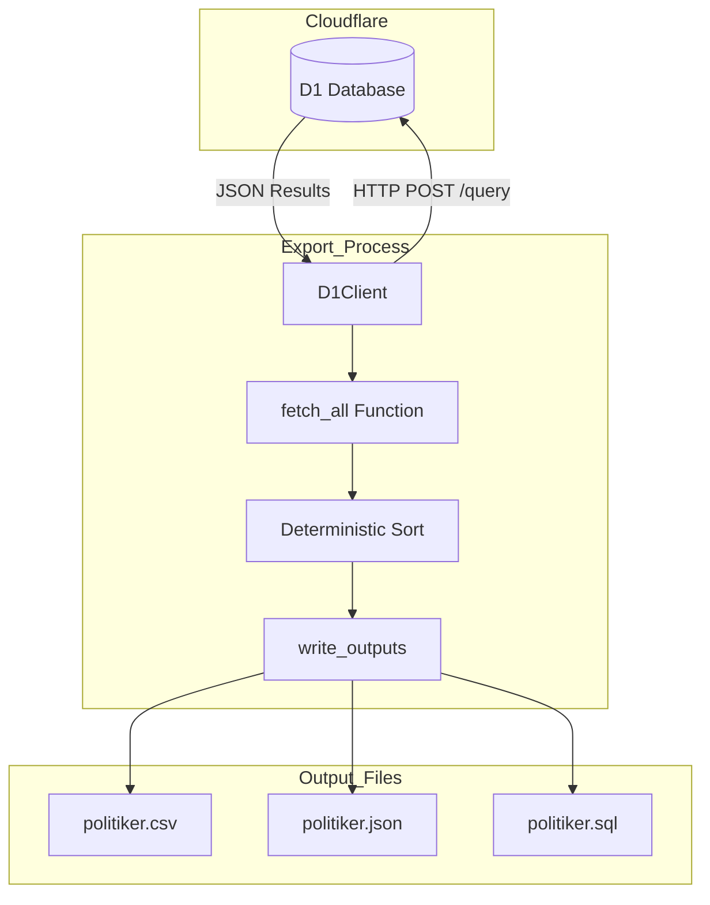
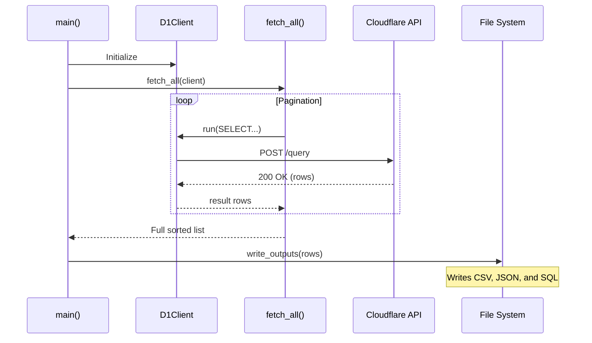

<details>
<summary>Relevant source files</summary>

The following files were used as context for generating this wiki page:

- [export/export_d1.py](export/export_d1.py)
- [scraper/d1.py](scraper/d1.py)
- [README.md](README.md)
- [CLAUDE.md](CLAUDE.md)
- [scraper/sync_to_d1.py](scraper/sync_to_d1.py)
</details>

# D1 Data Export Process

The D1 Data Export Process is a critical component of the `politiker-kontakter` project, responsible for extracting records from the live Cloudflare D1 database and generating publicly consumable data files. This process ensures that the contact information for elected officials—scraped from various regional, municipal, and national sources—is available in human-readable and machine-readable formats without requiring direct database access.

The export utility focuses on producing deterministic outputs (CSV, JSON, and SQL) to ensure that version control diffs remain meaningful by excluding volatile data such as timestamps. This process is typically automated via GitHub Actions to keep the repository's `data/` directory synchronized with the live database.

Sources: [export/export_d1.py:1-18](export/export_d1.py#L1-L18), [README.md:14-25](README.md#L14-L25), [CLAUDE.md:46-51](CLAUDE.md#L46-L51)

## System Architecture and Data Flow

The export process utilizes a specialized `D1Client` to communicate with the Cloudflare D1 HTTP API. It performs keyset pagination to safely retrieve large datasets from the `politicians` table.



The diagram shows the flow of data from the remote Cloudflare D1 database through the Python export utility to the local file system.
Sources: [export/export_d1.py:33-60](export/export_d1.py#L33-L60), [scraper/d1.py:44-59](scraper/d1.py#L44-L59)

## Data Extraction Logic

### Keyset Pagination
Instead of using `LIMIT/OFFSET`, which can cause rows to be skipped or duplicated if the database is being written to during the export, the system uses **keyset pagination**. It orders results by the unique key `(email, area_name)` and fetches subsequent pages where the key is greater than the last record of the previous page. Each page is an independent query rather than a single database snapshot, so this does not guarantee a fully consistent point-in-time view: a row inserted or changed during the export that sorts before the current cursor can still be missed.

Sources: [export/export_d1.py:33-40](export/export_d1.py#L33-L40)

### Field Selection
To maintain "clean" diffs in Git, the export process filters out unstable fields. Only the "canonical" fields are exported to public files.

| Field | Description |
| :--- | :--- |
| `name` | The name of the politician |
| `email` | Unique contact email address |
| `area_name` | Name of the municipality, region, or department |
| `area_type` | Category (e.g., kommun, region, riksdag, regering) |
| `party` | Political party affiliation |
| `role` | Official position or role |

Sources: [export/export_d1.py:29](export/export_d1.py#L29), [README.md:14-20](README.md#L14-L20)

## Output Formats and Generation

The export process generates three distinct file types in the `data/` directory.

### 1. CSV (politiker.csv)
A human-readable format designed for use in spreadsheet applications like Excel or data analysis tools like pandas.
Sources: [export/export_d1.py:73-77](export/export_d1.py#L73-L77)

### 2. JSON (politiker.json)
A structured format intended for programmatic consumption by other applications or web services.
Sources: [export/export_d1.py:79-84](export/export_d1.py#L79-L84)

### 3. SQL (politiker.sql)
Contains `INSERT OR IGNORE` statements. It generates a deterministic ID using a SHA-1 hash of the `email|area_name` string. To prevent unnecessary file changes, `last_scraped_at` is hardcoded to `0` and `verification_status` is set to `'unknown'`.
Sources: [export/export_d1.py:86-102](export/export_d1.py#L86-L102)

```python
# Example of SQL record ID generation
rid = hashlib.sha1(f"{r['email']}|{r['area_name']}".encode()).hexdigest()
```

Sources: [export/export_d1.py:94](export/export_d1.py#L94)

## Configuration and Environment

The export process requires specific environment variables to authenticate with Cloudflare. These are handled by the `D1Client` class.

| Variable | Alias | Description |
| :--- | :--- | :--- |
| `CLOUDFLARE_ACCOUNT_ID` | - | The Cloudflare Account UUID |
| `CLOUDFLARE_API_TOKEN_POLITIKER` | `CLOUDFLARE_API_TOKEN` | API Token with D1 read permissions |
| `D1_DATABASE_UUID` | `D1_DATABASE_ID` | The specific D1 Database UUID |

Sources: [export/export_d1.py:12-16](export/export_d1.py#L12-L16), [scraper/d1.py:17-25](scraper/d1.py#L17-L25)

## Execution Workflow

The main execution logic is encapsulated in `export_d1.py`, which integrates the client and the output writers.



The sequence diagram illustrates the initialization, paginated data retrieval, and final file writing steps.
Sources: [export/export_d1.py:105-110](export/export_d1.py#L105-L110), [scraper/d1.py:44-53](scraper/d1.py#L44-L53)

## Summary
The D1 Data Export Process serves as the bridge between the project's internal data storage and its public data distribution. By utilizing keyset pagination and deterministic sorting/hashing, it provides a robust, reliable, and version-control-friendly method for publishing politician contact information.

Sources: [export/export_d1.py:1-18](export/export_d1.py#L1-L18), [README.md:14-25](README.md#L14-L25)
