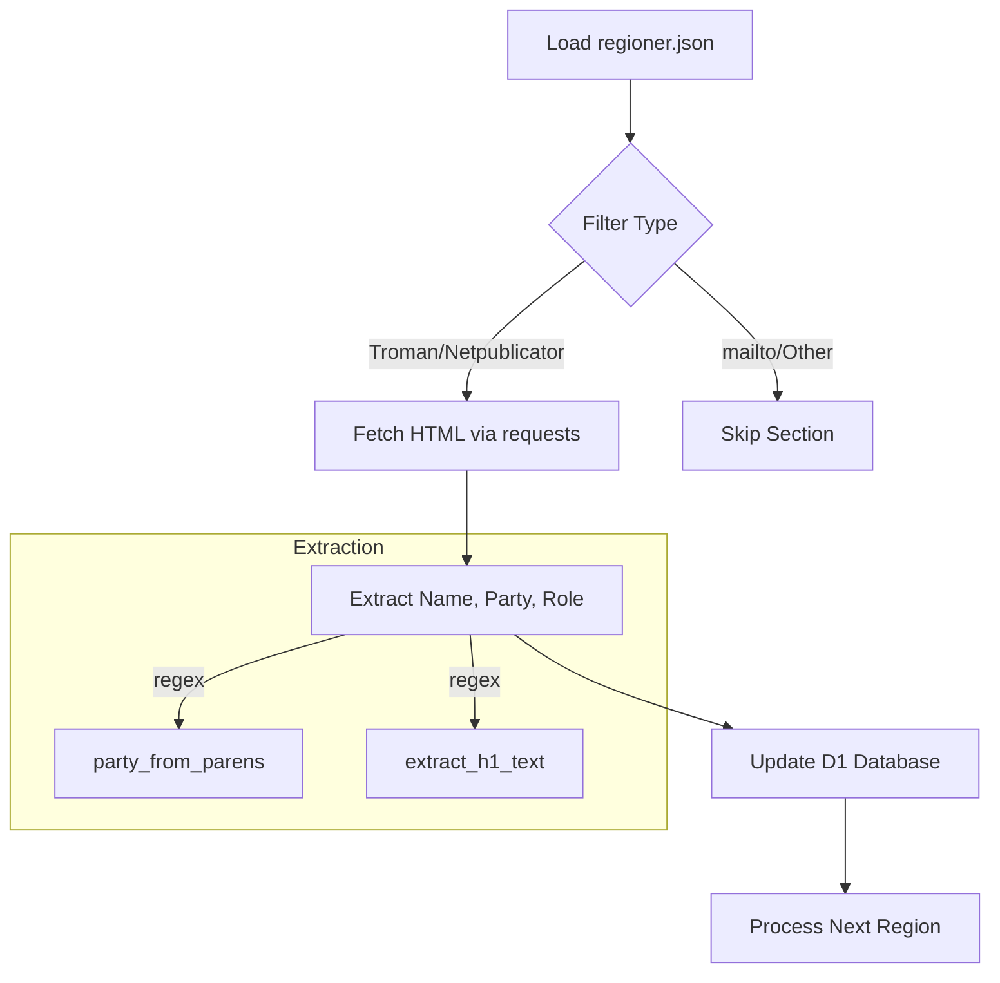
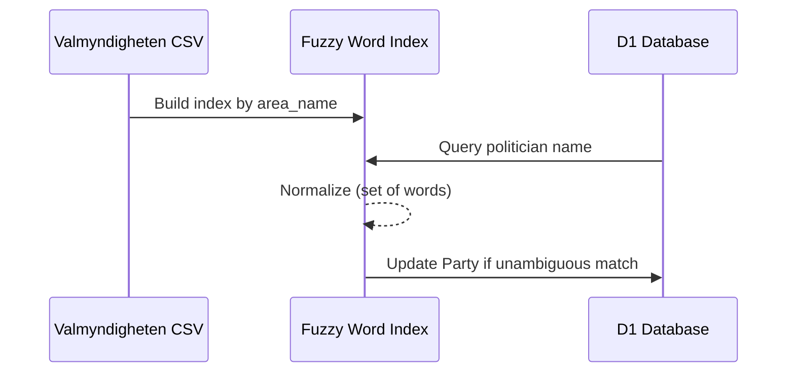

<details>
<summary>Relevant source files</summary>

The following files were used as context for generating this wiki page:

- [scraper/backfill_kommun_role_party.py](scraper/backfill_kommun_role_party.py)
- [scraper/scraper.py](scraper/scraper.py)
- [scraper/sync_party_from_val.py](scraper/sync_party_from_val.py)
- [scraper/sync_to_d1.py](scraper/sync_to_d1.py)
- [scraper/politiker_common.py](scraper/politiker_common.py)
- [scraper/d1.py](scraper/d1.py)
</details>

# Municipal/Regional Backfilling

Municipal/Regional Backfilling is a specialized data enrichment process within the `politiker-kontakter` project. Its primary purpose is to populate missing political party and role (title) information for politicians already stored in the Cloudflare D1 database. This process targets approximately 192 out of 273 municipalities and regions, specifically those utilizing "Troman" or "Netpublicator" systems.

Unlike the main [Scraper](#scraper.py) which uses Playwright for browser-based automation, the backfilling module utilizes lightweight `requests` and regular expressions to extract data from server-rendered HTML pages. This design allows for repeatable updates to the database without the overhead of the full scraping infrastructure.

Sources: [scraper/backfill_kommun_role_party.py:11-28](scraper/backfill_kommun_role_party.py#L11-L28), [scraper/scraper.py:46-48](scraper/scraper.py#L46-L48)

## System Architecture and Data Flow

The backfilling system operates as a secondary synchronization layer. It identifies target regions based on the `typ` field in `regioner.json` and performs targeted HTTP requests to fetch detailed profile information.

### Core Processing Logic
The backfill script matches existing database records using a unique composite key consisting of `email` and `area_name`. This ensures that existing politician entries are updated with more granular data—such as their specific role in the municipal council (e.g., "Ordförande" or "Ersättare")—without creating duplicate records.



Sources: [scraper/backfill_kommun_role_party.py:30-45](scraper/backfill_kommun_role_party.py#L30-L45), [scraper/backfill_kommun_role_party.py:168-185](scraper/backfill_kommun_role_party.py#L168-L185)

## Source-Specific Extraction Logic

The system handles different CMS providers (Troman and Netpublicator) using distinct logic patterns to navigate their specific HTML structures.

### Troman Systems
Troman integration involves fetching a central organization page, identifying all person-specific URLs, and then visiting each profile. The script specifically looks for the `engagementTable` to find roles related to "fullmäktige" (the council).

| Component | Logic Description |
| :--- | :--- |
| **URL Discovery** | Finds links matching `/person/[a-f0-9-]+`. |
| **Name/Party** | Parsed from `<h1>` tags using `party_from_parens`. |
| **Role Extraction** | Iterates through `engagementTable` rows; prioritizes rows containing "fullmäktige". |

Sources: [scraper/backfill_kommun_role_party.py:73-108](scraper/backfill_kommun_role_party.py#L73-L108)

### Netpublicator Systems
Netpublicator extraction utilizes a registry ID and board ID to construct target URLs. It uses a robust logic to distinguish role cells from name or party cells, specifically by looking for text fields without nested `<a>` tags.

| Component | Logic Description |
| :--- | :--- |
| **Board URL** | `https://www.netpublicator.com/elected/registry/{reg_id}/board/{board_id}` |
| **Role Logic** | Skips cells with links or purely numeric content (like seat numbers). |
| **Party Logic** | Extracts the `title` attribute from `` tags or specific `td` attributes. |

Sources: [scraper/backfill_kommun_role_party.py:111-158](scraper/backfill_kommun_role_party.py#L111-L158)

## Database Integration

The backfill process uses the `D1Client` to perform `UPDATE` operations. The SQL logic utilizes `COALESCE` to ensure existing data is only overwritten if new, non-null values are found.

```sql
UPDATE politicians 
SET party = COALESCE(?, party), 
    role = COALESCE(?, role), 
    last_scraped_at = ? 
WHERE area_name = ? AND email = ?
```

Sources: [scraper/backfill_kommun_role_party.py:186-193](scraper/backfill_kommun_role_party.py#L186-L193)

## Party Matching via Valmyndigheten

As a secondary form of backfilling, the system includes a module to match names against Valmyndigheten's (the Swedish Election Authority) open data. This is used for politicians where the party could not be determined during the initial scraping.

### Matching Strategies
1.  **Exact Match**: Matches on `area_name` and full name.
2.  **Fuzzy Match**: Normalizes names into word sets (treating hyphens as spaces) and performs subset matching to handle middle names or varying name formats (e.g., "Andrea Birgitta Möllerberg" vs "Andrea Möllerberg").



Sources: [scraper/sync_party_from_val.py:13-25](scraper/sync_party_from_val.py#L13-L25), [scraper/sync_party_from_val.py:79-115](scraper/sync_party_from_val.py#L79-L115)

## Technical Specifications

### Key Functions
| Function | File | Description |
| :--- | :--- | :--- |
| `troman_rows` | `backfill_kommun_role_party.py` | Extracts person details from Troman-based HTML structures. |
| `netpublicator_rows` | `backfill_kommun_role_party.py` | Extracts person details from Netpublicator registry boards. |
| `build_fuzzy_index` | `sync_party_from_val.py` | Creates a word-set index for name matching. |
| `extract_h1_text` | `backfill_kommun_role_party.py` | Cleans HTML tags and entities from header text. |

### Configuration Requirements
The backfilling scripts require environment variables for Cloudflare D1 access:
- `CLOUDFLARE_ACCOUNT_ID`
- `CLOUDFLARE_API_TOKEN_POLITIKER`
- `D1_DATABASE_UUID`

Sources: [scraper/backfill_kommun_role_party.py:23-28](scraper/backfill_kommun_role_party.py#L23-L28), [scraper/d1.py](scraper/d1.py)

The Municipal/Regional Backfilling module is a critical maintenance component that ensures the completeness of the politician database by retroactively applying detailed roles and parties where initial scraping might have been limited. It acts as a bridge between the broad reach of the main scraper and the high-precision data requirements of the final application.
