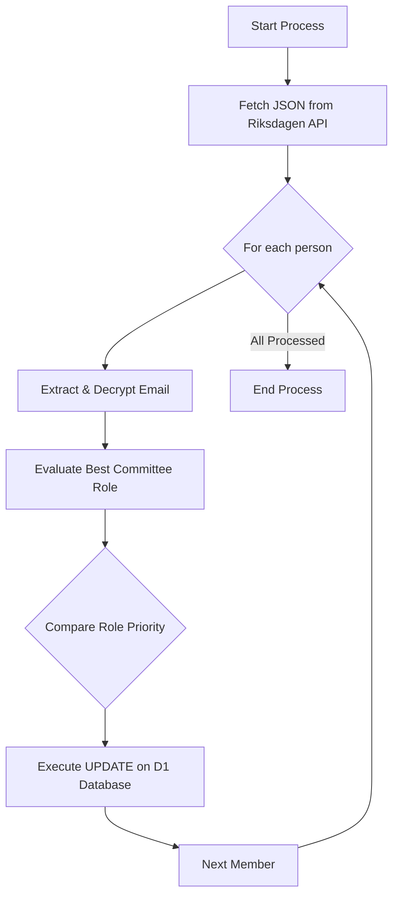
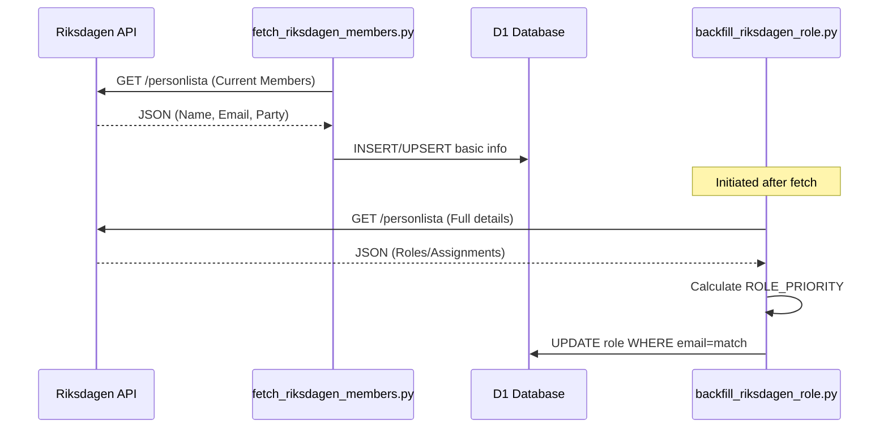

<details>
<summary>Relevant source files</summary>

The following files were used as context for generating this wiki page:

- [scraper/backfill_riksdagen_role.py](scraper/backfill_riksdagen_role.py)
- [scraper/fetch_riksdagen_members.py](scraper/fetch_riksdagen_members.py)
- [scraper/d1.py](scraper/d1.py)
- [README.md](README.md)
- [scraper/quarterly_refresh.sh](scraper/quarterly_refresh.sh)
- [CLAUDE.md](CLAUDE.md)
</details>

# Riksdagen Role Backfilling

Riksdagen Role Backfilling is a specialized process within the `politiker-kontakter` project designed to enrich the data of members of the Swedish Parliament (Riksdagen) in the Cloudflare D1 database. While basic member information is fetched via [fetch_riksdagen_members.py](scraper/fetch_riksdagen_members.py), that initial step often lacks specific functional roles because the primary chamber assignment ("kammaruppdrag") simply lists "Riksdagsledamot" for all members.

The backfilling system specifically targets committee assignments ("utskottsuppdrag") to determine a member's most prominent current role, such as Chairman (Ordförande) or Member (Ledamot). This process matches parliamentary data against existing database records using email addresses as the unique identifier.
Sources: [scraper/backfill_riksdagen_role.py:11-20](scraper/backfill_riksdagen_role.py#L11-L20), [README.md:65-67](README.md#L65-L67)

## Architecture and Data Flow

The backfilling logic is implemented as a standalone Python script that interacts with the Riksdagen Open Data API and the project's central D1 database. It relies on a priority-based selection algorithm to handle individuals who hold multiple simultaneous roles.

### Logic Flow Diagram
The following diagram illustrates how the system fetches data, evaluates role prominence, and updates the database.



Sources: [scraper/backfill_riksdagen_role.py:30-41](scraper/backfill_riksdagen_role.py#L30-L41), [scraper/backfill_riksdagen_role.py:73-89](scraper/backfill_riksdagen_role.py#L73-L89)

## Component Breakdown

### Role Prioritization
Because a member can have several assignments (e.g., a member might be a Deputy in one committee and a Chairman in another), the system uses a ranking dictionary to select the most "significant" role to display in the `politicians` table.

| Role (Swedish) | Rank (Lower is better) |
| :--- | :--- |
| Ordförande | 0 |
| Vice ordförande | 1 |
| Ledamot | 2 |
| Suppleant | 3 |
| Other | 50+ |

Sources: [scraper/backfill_riksdagen_role.py:27-28](scraper/backfill_riksdagen_role.py#L27-L28), [scraper/backfill_riksdagen_role.py:53-56](scraper/backfill_riksdagen_role.py#L53-L56)

### API Integration
The system interacts with the `data.riksdagen.se` endpoint. A critical technical detail is the handling of email addresses, which are obfuscated in the API response using `[på]` instead of the `@` symbol to prevent simple scraping by third parties.

```python
def extract_email(person: dict) -> str | None:
    for u in person.get("personuppgift", {}).get("uppgift", []):
        if u.get("kod") == "Officiell e-postadress":
            raw = u["uppgift"][0] if u.get("uppgift") else None
            if raw:
                return raw.replace("[på]", "@")
    return None
```

Sources: [scraper/backfill_riksdagen_role.py:62-68](scraper/backfill_riksdagen_role.py#L62-L68), [scraper/fetch_riksdagen_members.py:46-52](scraper/fetch_riksdagen_members.py#L46-L52)

## Implementation Details

### Database Operations
The script performs an `UPDATE` operation on the `politicians` table. It specifically filters by `area_type = 'riksdag'` and matches on the `email` column to ensure no other political categories (like municipalities or regions) are affected.

Key SQL parameters updated:
- `role`: The highest-ranking committee title found.
- `last_scraped_at`: A millisecond timestamp of the operation.

Sources: [scraper/backfill_riksdagen_role.py:84-87](scraper/backfill_riksdagen_role.py#L84-L87), [CLAUDE.md:27-31](CLAUDE.md#L27-L31)

### Execution Environment
The backfiller requires specific environment variables to authenticate with Cloudflare D1, typically managed via a `.env` file. It is often executed as part of a larger refresh cycle.

| Variable | Description |
| :--- | :--- |
| `CLOUDFLARE_ACCOUNT_ID` | Cloudflare Account Identifier |
| `CLOUDFLARE_API_TOKEN_POLITIKER` | API Token with D1 write permissions |
| `D1_DATABASE_UUID` | Unique ID for the target database |

Sources: [scraper/backfill_riksdagen_role.py:22-25](scraper/backfill_riksdagen_role.py#L22-L25), [scraper/quarterly_refresh.sh:11-14](scraper/quarterly_refresh.sh#L11-L14)

## Sequence of Operations
The relationship between fetching the members and backfilling their roles is sequential. The roles cannot be backfilled until the primary member records exist in the database.



Sources: [scraper/fetch_riksdagen_members.py:55-75](scraper/fetch_riksdagen_members.py#L55-L75), [scraper/backfill_riksdagen_role.py:73-89](scraper/backfill_riksdagen_role.py#L73-L89), [scraper/quarterly_refresh.sh:22-26](scraper/quarterly_refresh.sh#L22-L26)

## Summary
Riksdagen Role Backfilling is an essential data enrichment step that transforms generic "Member of Parliament" labels into specific titles like "Chairman" or "Vice Chairman" based on committee assignments. By utilizing a priority ranking system and matching via official email addresses, it ensures that the project's contact database provides high-quality, relevant information for end-users.
Sources: [scraper/backfill_riksdagen_role.py:11-20](scraper/backfill_riksdagen_role.py#L11-L20), [README.md:1-8](README.md#L1-L8)
