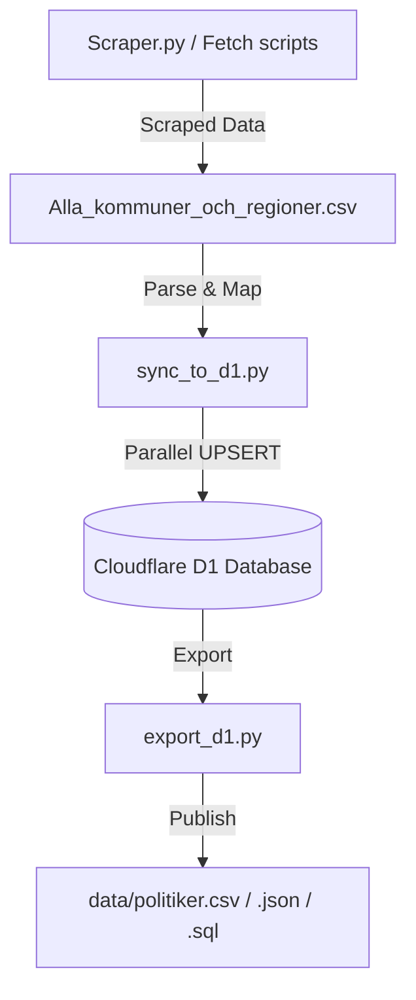

<details>
<summary>Relevant source files</summary>

The following files were used as context for generating this wiki page:

- [scraper/politiker_common.py](scraper/politiker_common.py)
- [scraper/scraper.py](scraper/scraper.py)
- [scraper/sync_to_d1.py](scraper/sync_to_d1.py)
- [export/export_d1.py](export/export_d1.py)
- [scraper/fetch_kyrka.py](scraper/fetch_kyrka.py)
- [scraper/sync_party_from_val.py](scraper/sync_party_from_val.py)
- [CLAUDE.md](CLAUDE.md)
</details>

# Common Data Utilities

Common Data Utilities refers to the collection of shared functions, scripts, and logic used across the project to normalize, validate, and synchronize data concerning Swedish politicians. This system ensures that data scraped from disparate sources—such as municipal websites, PDF documents, and national APIs—remains consistent when stored in the central Cloudflare D1 database.

These utilities handle critical tasks such as Swedish-specific string sorting, political party normalization, email validation, and area type classification. By centralizing this logic in `scraper/politiker_common.py` and dedicated synchronization scripts, the project maintains a "canonical" machine-readable CSV format used as the primary bridge between raw scraping and database persistence.

## Core Data Normalization logic

Data normalization is primarily handled by `scraper/politiker_common.py` and specific helper functions in `scraper/scraper.py`. These utilities ensure that names, party affiliations, and roles follow a standard format regardless of the source.

### String and Name Processing
The project implements specific sorting and cleaning logic to handle Swedish characters and inconsistent source formatting.
*  **Swedish Sorting:** The `swedish_key()` function provides a custom sorting key to ensure "å", "ä", and "ö" are sorted correctly after "z" without relying on OS-level locales.
*  **Email Sanitization:** Emails are converted to lowercase, stripped of URL-encoded whitespace, and validated against a regex and a blacklist of generic keywords (e.g., "info@", "support@").
*  **Name Guessing:** For sources without direct email links, the `_email_local_part()` utility transliterates names by removing accents and converting characters (e.g., "ö" to "o") to construct predicted email addresses.

Sources: [scraper/scraper.py:126-130](scraper/scraper.py#L126-L130), [scraper/scraper.py:46-52](scraper/scraper.py#L46-L52), [scraper/scraper.py:348-354](scraper/scraper.py#L348-L354)

### Party Affiliation Handling
Political party data is normalized using shared helpers. The `normalize_party` function (derived from `scraper/politiker_common.py`) maps various spelling variations or abbreviations to a standard set of identifiers. Additionally, `sync_party_from_val.py` provides a mechanism to backfill party information by matching names against Valmyndigheten's official records using both exact and "fuzzy" word-set matching.

Sources: [scraper/sync_party_from_val.py:89-118](scraper/sync_party_from_val.py#L89-L118), [scraper/scraper.py:33-37](scraper/scraper.py#L33-L37)

## Data Flow and Synchronization

The project follows a tiered data flow where raw scraped data is first converted to a shared CSV format before being synchronized to the live database.



*This diagram illustrates the pipeline from raw data extraction to public data distribution via the canonical CSV format.*

Sources: [scraper/sync_to_d1.py:11-23](scraper/sync_to_d1.py#L11-L23), [export/export_d1.py:1-15](export/export_d1.py#L1-L15), [CLAUDE.md:43-52](CLAUDE.md#L43-L52)

### Classification of Area Types
The `area_type_for` utility in `sync_to_d1.py` categorizes data entries based on the `area_name` string. This classification is essential for downstream filtering and reporting. It does not classify church data — `kyrka` entries are produced separately by `fetch_kyrka.py`, which sets the area type itself rather than going through this function.

| Keyword / Pattern | Area Type |
| :--- | :--- |
| Starts with "Region " | `region` |
| "Sveriges riksdag" or "Riksdagen" | `riksdag` |
| Contains "departementet" or "regeringskansliet" (case-insensitive), or exactly "Regeringen" | `regering` |
| Default | `kommun` |

Sources: [scraper/sync_to_d1.py:38-46](scraper/sync_to_d1.py#L38-L46)

Church ("Svenska kyrkan") classifications come from `fetch_kyrka.py`, not from `area_type_for`. Sources: [scraper/fetch_kyrka.py:53-58](scraper/fetch_kyrka.py#L53-L58)

## Database Persistence Logic

Synchronization to the Cloudflare D1 database is handled primarily by `sync_to_d1.py` and `d1.py`. Due to API limitations, the system uses a thread-pooled approach to perform individual `UPSERT` operations.

### The UPSERT Strategy
The system uses an `INSERT ... ON CONFLICT` SQL pattern to ensure that existing records are updated rather than duplicated when a politician's role or party changes. The unique constraint is defined by the pair of `(email, area_name)`.

```sql
INSERT INTO politicians (id, name, email, area_name, area_type, party, role, last_scraped_at)
VALUES (lower(hex(randomblob(11))), ?, ?, ?, ?, ?, ?, ?)
ON CONFLICT(email, area_name) DO UPDATE SET 
    name = excluded.name, 
    party = excluded.party, 
    role = excluded.role, 
    last_scraped_at = excluded.last_scraped_at
```

Sources: [scraper/sync_to_d1.py:31-36](scraper/sync_to_d1.py#L31-L36), [scraper/fetch_kyrka.py:53-58](scraper/fetch_kyrka.py#L53-L58)

### Keyset Pagination for Export
When exporting data for public consumption, `export_d1.py` uses keyset pagination (also known as the "seek method") to ensure stable exports even if the database is being written to during the process. This avoids duplicates or missed rows common with `LIMIT/OFFSET` pagination.

Sources: [export/export_d1.py:35-50](export/export_d1.py#L35-L50)

## Export Formats and Distribution

The utilities support multiple output formats to cater to different end-users:

1.  **VCF (Virtual Contact File):** Generated by `scraper.py` and `export/to_vcf.py` for mobile contact import.
2.  **Canonical CSV:** The primary machine-readable format (`Alla_kommuner_och_regioner.csv`) including a `source` column to distinguish between `scraped` and `pattern-guess` addresses.
3.  **JSON & SQL:** Standard formats provided in the `data/` directory for programmatic use and database initialization.

Sources: [scraper/scraper.py:530-545](scraper/scraper.py#L530-L545), [CLAUDE.md:47-52](CLAUDE.md#L47-L52), [README.md:12-23](README.md#L12-L23)

## Summary

The Common Data Utilities provide the connective tissue of the project, transforming inconsistent public records into a structured, validated database. By employing shared normalization logic, specialized Swedish sorting, and robust synchronization strategies like keyset pagination and threaded UPSERTs, the system maintains high data integrity across its various distribution formats.
