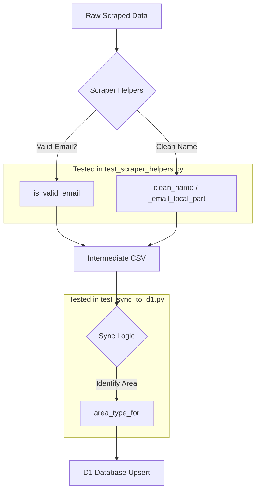

<details>
<summary>Relevant source files</summary>

The following files were used as context for generating this wiki page:

- [tests/test_sync_to_d1.py](tests/test_sync_to_d1.py)
- [tests/test_kyrka.py](tests/test_kyrka.py)
- [tests/test_scraper_helpers.py](tests/test_scraper_helpers.py)
- [scraper/scraper.py](scraper/scraper.py)
- [scraper/sync_to_d1.py](scraper/sync_to_d1.py)
- [scraper/fetch_kyrka.py](scraper/fetch_kyrka.py)
</details>

# Test Suite Overview

The test suite for the **politiker-kontakter** project is designed to ensure the reliability of the scraping logic, data transformation helpers, and database synchronization processes. It utilizes the `pytest` framework to validate core functionalities, ranging from string manipulation and Swedish-specific sorting to complex CSV parsing and role classification for various political entities.

The scope of the testing infrastructure covers the primary scraping engine, specialized fetchers for religious organizations (Svenska kyrkan), and the synchronization layer that pushes scraped data to the Cloudflare D1 database. Sources: [AGENTS.md](AGENTS.md), [CLAUDE.md](CLAUDE.md), [tests/test_sync_to_d1.py](tests/test_sync_to_d1.py)

## Test Architecture and Components

The test suite is organized into functional modules that mirror the project's structure. It focuses on validating the "pure" logic of the scrapers and synchronizers by isolating them from external network calls or database writes where possible.

### Core Helper Validation
Tests in `tests/test_scraper_helpers.py` focus on the utility functions used throughout the main scraper. This includes:
*  **Email Validation:** Ensuring only legitimate contact addresses are kept while filtering out generic addresses like "noreply" or "webmaster".
*  **Translitteration:** Verifying that Swedish characters (å, ä, ö) and accents (é) are correctly converted for e-post local parts.
*  **Sorting:** Confirming that the `swedish_key` function correctly implements Swedish alphabetical order (where Å, Ä, Ö follow Z).

Sources: [scraper/scraper.py:47-60](scraper/scraper.py#L47-L60), [tests/test_scraper_helpers.py:10-40](tests/test_scraper_helpers.py#L10-L40)

### Synchronization Logic
The `tests/test_sync_to_d1.py` file validates the logic responsible for moving data from local CSV files to the D1 database. It tests:
*  **Area Classification:** Mapping organization names to their specific types (e.g., "Region Skåne" to "region", "Regeringen" to "regering").
*  **CSV Parsing:** Ensuring the `DictReader` correctly handles various edge cases, such as missing names, parties, or roles.
*  **Error Handling:** Verifying that the system exits gracefully if the required source CSV is missing.

Sources: [scraper/sync_to_d1.py:38-70](scraper/sync_to_d1.py#L38-L70), [tests/test_sync_to_d1.py:6-45](tests/test_sync_to_d1.py#L6-L45)

### Specialized Fetcher Testing
For specific modules like `fetch_kyrka.py`, the tests validate the extraction of complex, unstructured data.
*  **Name Cleaning:** Stripping titles (e.g., "Biskop") and political group identifiers from raw text.
*  **Role Extraction:** Classifying organizational roles based on keyword proximity and order within HTML-derived lines.

Sources: [scraper/fetch_kyrka.py:61-110](scraper/fetch_kyrka.py#L61-L110), [tests/test_kyrka.py:4-46](tests/test_kyrka.py#L4-L46)

## Data Flow and Logic

The following diagram illustrates the flow of data from raw scraped sources through the validation helpers tested in the suite, eventually reaching the synchronization layer.



The test suite ensures that each transformation step maintains data integrity before it is committed to the production database. Sources: [tests/test_scraper_helpers.py](tests/test_scraper_helpers.py), [tests/test_sync_to_d1.py](tests/test_sync_to_d1.py)

## Summary of Key Test Functions

| Test Module | Function | Description | Source |
| :--- | :--- | :--- | :--- |
| `test_scraper_helpers` | `test_is_valid_email` | Validates filtering of `SKIP_KEYWORDS` (noreply, support, etc.) | [tests/test_scraper_helpers.py:10](tests/test_scraper_helpers.py#L10) |
| `test_scraper_helpers` | `test_swedish_key` | Confirms Å, Ä, Ö are sorted after Z | [tests/test_scraper_helpers.py:32](tests/test_scraper_helpers.py#L32) |
| `test_sync_to_d1` | `test_area_type_for` | Checks mapping of area names to types (kommun, region, riksdag) | [tests/test_sync_to_d1.py:6](tests/test_sync_to_d1.py#L6) |
| `test_kyrka` | `test_clean_name` | Verifies stripping of titles like "Biskop" and party codes | [tests/test_kyrka.py:4](tests/test_kyrka.py#L4) |
| `test_kyrka` | `test_role_from` | Validates classification of Ordförande/Vice/Ledamot | [tests/test_kyrka.py:13](tests/test_kyrka.py#L13) |

## Implementation Details: Name Translitteration

A critical part of the system is guesstimating email addresses based on names. The test suite ensures the translitteration logic follows standard Swedish conventions.

```python
# From scraper/scraper.py:461-468
def _email_local_part(namn_del):
    """Translittererar ett namn till en e-postlokaldel (å/ä/ö, versaler, accenter bort)."""
    s = namn_del.strip().lower()
    s = (s.replace("å", "a").replace("ä", "a").replace("ö", "o")
           .replace("é", "e").replace("ü", "u").replace("ø", "o"))
    s = re.sub(r"[´’'`]", "", s)
    s = re.sub(r"[^a-z0-9\-]", "", s)
    return s
```

Sources: [scraper/scraper.py:461-468](scraper/scraper.py#L461-L468), [tests/test_scraper_helpers.py:25-30](tests/test_scraper_helpers.py#L25-L30)

## Conclusion
The test suite provides essential coverage for the project's data processing pipeline. By focusing on the transformation logic—such as Swedish-specific string handling and area classification—it ensures that the data synchronized to the D1 database remains accurate and consistent across diverse political and religious organizations. This modular testing approach allows for safe expansion as new municipalities or data sources are added to `regioner.json`. Sources: [tests/test_sync_to_d1.py](tests/test_sync_to_d1.py), [tests/test_kyrka.py](tests/test_kyrka.py)
