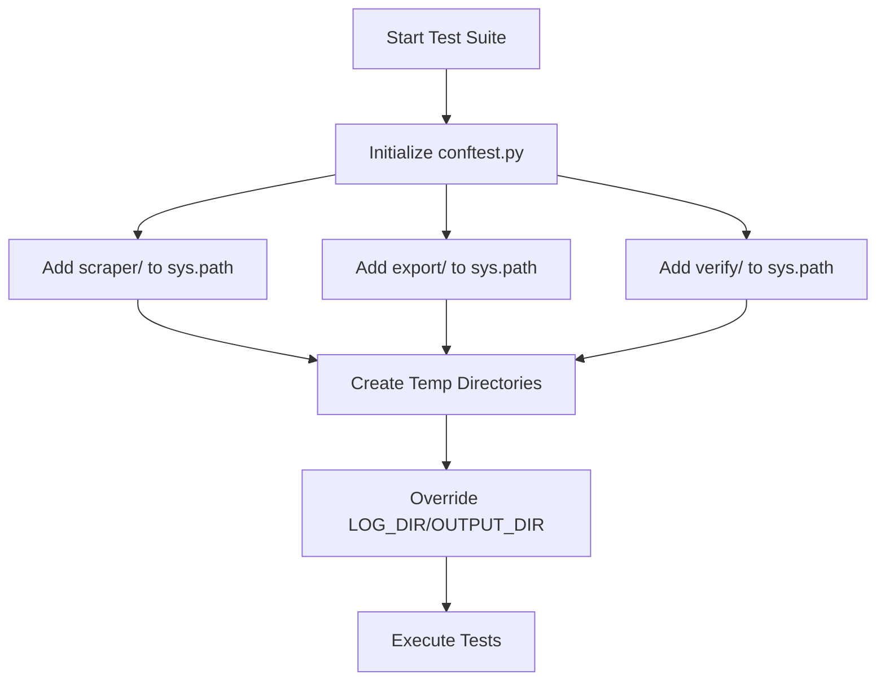
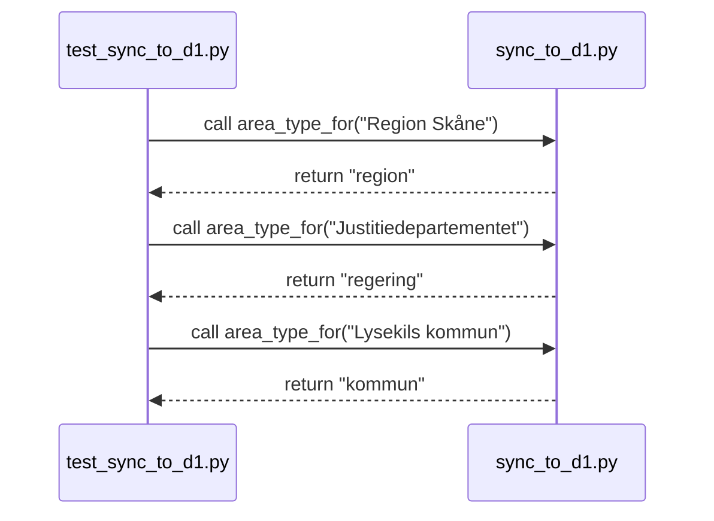

Relevant source files

The following files were used as context for generating this wiki page:

- [tests/test\_sync\_to\_d1.py](tests/test_sync_to_d1.py)
- [tests/conftest.py](tests/conftest.py)
- [scraper/scraper.py](scraper/scraper.py)
- [scraper/sync\_to\_d1.py](scraper/sync_to_d1.py)
- [scraper/fetch\_kyrka.py](scraper/fetch_kyrka.py)

# Testing Scraper Helpers

Testing scraper helpers ensures the reliability of the utility functions used to parse, validate, and categorize Swedish politician contact information. These helpers are responsible for critical tasks such as identifying valid email addresses, normalizing names, and mapping geographic areas to their respective types (e.g., municipality or region).

The testing suite validates that data extracted from various sources—including server-rendered HTML, PDFs, and external APIs—is correctly processed before being synchronized to the project's D1 database. This prevents corrupt or incorrectly categorized data from entering the central [politiker-webapp](#README.md) system.

## Test Environment Infrastructure

The project uses a shared test configuration to manage dependencies and environment variables. This setup is crucial for allowing modules to be imported correctly across different subdirectories and for ensuring that test execution does not interfere with the host system's file structure.

### Global Configuration and Path Management
The `conftest.py` file serves as the backbone for the test environment. It dynamically updates `sys.path` to include core directories such as `scraper/`, `export/`, and `verify/`, making their modules available for testing. Furthermore, it redirects output and log directories to temporary folders to prevent permission errors or cluttering during headless execution.

Sources: [tests/conftest.py:1-20](tests/conftest.py#L1-L20)

The diagram above illustrates the initialization sequence performed by the test configuration before any individual test case is executed.

## Data Validation and Normalization Helpers

Core scraper logic relies on several helper functions to clean and validate input data. These are tested to ensure they handle edge cases like URL-encoded characters in mailto links or non-standard Swedish characters in names.

### Email and Name Validation
The `scraper.py` module defines several filters that determine if a string is a valid contact entry. These are validated through tests that check:
*  **Email Validity**: Filtering out generic addresses (e.g., "noreply@", "info@") using `is_valid_email`.
*  **Name Recognition**: Identifying strings that look like human names using `_looks_like_name` and `NAME_CANDIDATE_RE`.
*  **Mailto Extraction**: Decoding URL-encoded strings (e.g., `%20` to spaces) before extracting the email address.

Sources: [scraper/scraper.py:64-70](scraper/scraper.py#L64-L70), [scraper/scraper.py:84-90](scraper/scraper.py#L84-L90), [scraper/scraper.py:73-77](scraper/scraper.py#L73-L77)

### Swedish Sorting Logic
Because standard OS locales may vary, the project uses a custom `swedish_key` function to ensure that characters like **Å**, **Ä**, and **Ö** are sorted correctly after **Z**. This logic is critical for generating consistent, human-readable human text and VCF files.

Sources: [scraper/scraper.py:118-121](scraper/scraper.py#L118-L121)

| Function | Purpose | Logic Detail |
| :--- | :--- | :--- |
| `is_valid_email` | Validates email strings | Checks `EMAIL_RE` and filters `SKIP_KEYWORDS`. |
| `swedish_key` | Custom sort order | Replaces Å, Ä, Ö with bracket characters for ASCII sorting. |
| `_looks_like_name` | Name identification | Validates length (<60) and regex pattern matching. |
| `clean_name` | String sanitization | Removes titles (e.g., "Biskop") and parenthetical parties. |

Sources: [scraper/scraper.py:64-121](scraper/scraper.py#L64-L121), [scraper/fetch_kyrka.py:84-90](scraper/fetch_kyrka.py#L84-L90)

## Synchronization and Area Mapping Logic

The `sync_to_d1.py` module contains logic for mapping raw area names to specific types. Testing this logic ensures that data is inserted into the database with the correct metadata.

### Area Type Categorization
The function `area_type_for` is tested against various strings to ensure correct classification. This mapping determines how the web application filters politicians.

Sources: [scraper/sync_to_d1.py:38-46](scraper/sync_to_d1.py#L38-L46)

The sequence above demonstrates the functional testing of the categorization logic for different government tiers.

### CSV Parsing Validation
Tests for `parse_csv` use temporary files to simulate the scraper's output. They verify that the parser correctly handles:
1.  **Missing Data**: Rows with empty names or roles are converted to `None` or empty strings.
2.  **Normalization**: Emails are converted to lowercase.
3.  **Integrity**: Rows missing an email address are skipped entirely.

Sources: [tests/test_sync_to_d1.py:13-28](tests/test_sync_to_d1.py#L13-L28)

## Specific Module Helpers: Church and Parliament
Specific scrapers like `fetch_kyrka.py` and `fetch_eu_meps.py` utilize unique helpers for decoding obfuscated data or determining leadership roles.

### Role Priority Mapping
In modules like `fetch_kyrka.py` and `fetch_eu_meps.py`, politicians often have multiple roles. Helpers determine the "best" role based on a priority list (e.g., Ordförande > Ledamot).
*  **Church Roles**: Parsed from role keyword strings like "kyrkostyrelsen" or "ordförande".
*  **EU MEP Emails**: Decoded from spam-protected strings by replacing `[dot]` with `.` and `[at]` with `@`, then reversing the string.

Sources: [scraper/fetch_kyrka.py:93-106](scraper/fetch_kyrka.py#L93-L106), [scraper/fetch_eu_meps.py:78-83](scraper/fetch_eu_meps.py#L78-L83)

## Conclusion
Testing scraper helpers provides the foundational accuracy required for the `politiker-kontakter` project. By isolating utility functions for sorting, validation, and categorization, the project ensures that the complex task of scraping 273+ different government entities results in a clean, standardized database. The use of a central `conftest.py` ensures these tests are portable and easy to run in diverse environments.
