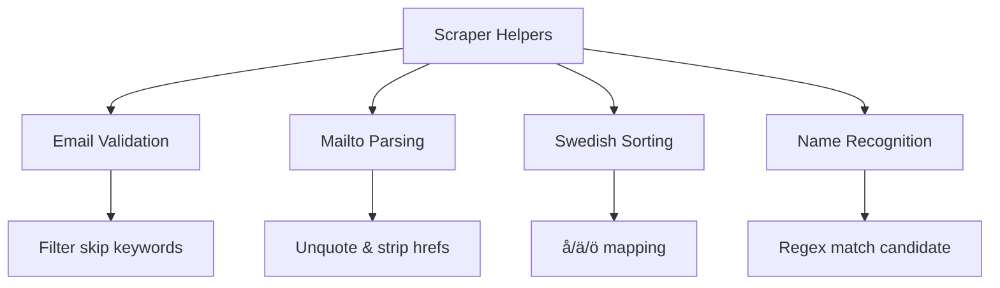
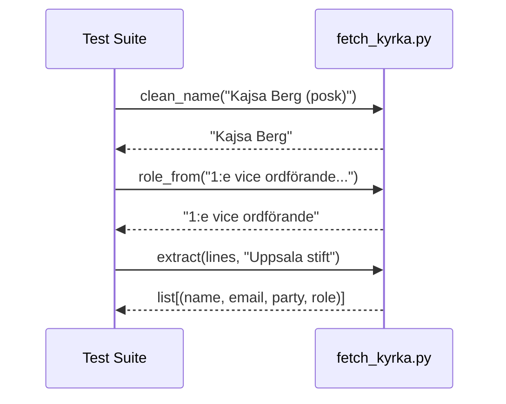

Relevant source files

The following files were used as context for generating this wiki page:

- [tests/test_sync_to_d1.py](tests/test_sync_to_d1.py)
- [tests/test_kyrka.py](tests/test_kyrka.py)
- [tests/test_scraper_helpers.py](tests/test_scraper_helpers.py)
- [scraper/scraper.py](scraper/scraper.py)
- [scraper/fetch_kyrka.py](scraper/fetch_kyrka.py)
- [scraper/sync_to_d1.py](scraper/sync_to_d1.py)

# Test Suite Overview

The test suite for the `politiker-kontakter` project is designed to validate the core logic of various scraping and synchronization modules. It ensures that data extraction from heterogeneous sources (PDFs, HTML tables, and church registries), string normalization for Swedish locales, and database synchronization logic operate correctly without regressing the main application features.

Sources: [tests/test_scraper_helpers.py](tests/test_scraper_helpers.py), [tests/test_kyrka.py](tests/test_kyrka.py), [tests/test_sync_to_d1.py](tests/test_sync_to_d1.py)

## Core Testing Components

The testing architecture focuses on unit testing helper functions and parsing logic. The suite leverages `pytest` and includes specific checks for environment-dependent dependencies like Playwright and pypdf.

### Scraper Helper Validation
Tests in `test_scraper_helpers.py` verify the utility functions used throughout the main scraping process. This includes email validation, mailto link parsing, and Swedish-specific sorting logic.

The diagram shows the functional decomposition of helper utilities verified by the test suite.
Sources: [scraper/scraper.py:46-135](scraper/scraper.py#L46-L135), [tests/test_scraper_helpers.py:10-44](tests/test_scraper_helpers.py#L10-L44)

### Synchronization Logic
The `test_sync_to_d1.py` module validates how extracted data is mapped to the Cloudflare D1 database schema. It specifically tests the categorization of geographic areas and the parsing of the canonical CSV transfer format.

| Feature | Test Focus | Description |
| :--- | :--- | :--- |
| `area_type_for` | Classification | Maps area names (e.g., "Region Skåne") to types like `region`, `riksdag`, or `kommun`. |
| `parse_csv` | Data Integrity | Ensures CSV rows are correctly converted into tuples for database ingestion. |
| `load_rows` | File Handling | Validates system exits on missing files and correct reading of `RESULTAT_CSV`. |

Sources: [tests/test_sync_to_d1.py:6-41](tests/test_sync_to_d1.py#L6-L41), [scraper/sync_to_d1.py:40-49](scraper/sync_to_d1.py#L40-L49)

## Specialized Module Testing

### Church Registry Extraction
Tests for the `fetch_kyrka.py` module focus on the specialized parsing required for Swedish Church registries. This includes cleaning names of titles (like "Biskop") and mapping organizational roles.

The sequence shows the validation of data cleaning and extraction for church-specific datasets.
Sources: [tests/test_kyrka.py:4-46](tests/test_kyrka.py#L4-L46), [scraper/fetch_kyrka.py:61-110](scraper/fetch_kyrka.py#L61-L110)

### Logic and Data Flow Verification
Significant portions of the test suite are dedicated to ensuring string normalization remains consistent across different platforms.

*  **Swedish Sorting:** The `swedish_key` function is tested to ensure that characters like 'å', 'ä', and 'ö' are sorted after 'z' without relying on the OS-locale. Sources: [scraper/scraper.py:126-129](scraper/scraper.py#L126-L129), [tests/test_scraper_helpers.py:36-41](tests/test_scraper_helpers.py#L36-L41)
*  **Email Translitteration:** The `_email_local_part` function is verified to correctly transform Swedish names (e.g., "Görel") into standard email formats (e.g., "gorel") by removing accents and mapping special characters. Sources: [scraper/scraper.py:490-497](scraper/scraper.py#L490-L497), [tests/test_scraper_helpers.py:28-33](tests/test_scraper_helpers.py#L28-L33)

## Summary of Testing Scope

The test suite covers critical data transformations and classification logic. By mocking file paths and using `monkeypatch` for environment variables, the tests verify that the system can handle missing data gracefully and maintain a consistent data model across `riksdag`, `region`, `kommun`, `kyrka`, and `regering` area types.

Sources: [tests/test_sync_to_d1.py:29-41](tests/test_sync_to_d1.py#L29-L41), [scraper/sync_to_d1.py:40-49](scraper/sync_to_d1.py#L40-L49)
