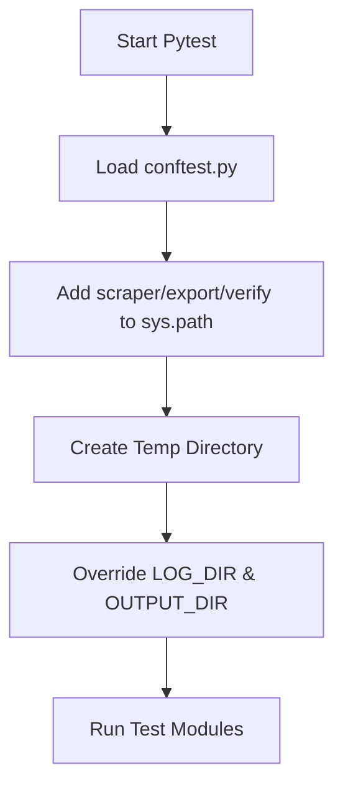

<details>
<summary>Relevant source files</summary>

The following files were used as context for generating this wiki page:

- [tests/test\_sync\_to\_d1.py](tests/test_sync_to_d1.py)
- [tests/conftest.py](tests/conftest.py)
- [scraper/sync\_to\_d1.py](scraper/sync_to_d1.py)
- [scraper/scraper.py](scraper/scraper.py)
- [scraper/fetch\_kyrka.py](scraper/fetch_kyrka.py)
- [scraper/politiker\_common.py](scraper/politiker_common.py)
</details>

# Testing Scraper Helpers

The testing and helper infrastructure of the `politiker-kontakter` project ensures the reliability of data extraction from various Swedish political entities, including municipalities, regions, the Riksdag, and the Church of Sweden. These helpers manage common tasks such as name normalization, party identification, and synchronization logic, while the testing suite validates that these utilities handle edge cases in web-scraped data correctly.

Sources: [scraper/scraper.py](scraper/scraper.py), [scraper/fetch\_kyrka.py](scraper/fetch\_kyrka.py), [README.md](README.md)

## Test Configuration and Environment

The project utilizes `pytest` for its testing framework. A central `conftest.py` file manages the environment to ensure that tests do not interfere with the host system, particularly regarding file I/O and module imports.

### Shared Test Setup
To allow for seamless imports of modules located in different subdirectories (like `scraper/`, `export/`, and `verify/`), the test configuration dynamically adjusts the `sys.path`. Additionally, it redirects side effects—such as the creation of log and output directories—to temporary folders to avoid requiring root permissions during execution.

Sources: [tests/conftest.py:1-18](tests/conftest.py#L1-L18)



The diagram shows the initialization flow of the test environment. Sources: [tests/conftest.py:7-18](tests/conftest.py#L7-L18)

## Data Synchronization Testing

Testing the synchronization helpers involves validating the parsing of scraped CSV data and the correct categorization of political areas.

### CSV Parsing Logic
The synchronization logic in `sync_to_d1.py` is tested to ensure it can handle various data states, such as missing names, parties, or roles, and correctly lowercase email addresses for consistency in the D1 database.

| Component | Test Focus | Relevant Source |
| :--- | :--- | :--- |
| `area_type_for` | Categorizing names into 'region', 'riksdag', 'regering', or 'kommun' | [tests/test\_sync\_to\_d1.py:6-12](tests/test\_sync\_to\_d1.py#L6-L12) |
| `parse_csv` | Converting raw CSV rows into structured tuples with proper defaults | [tests/test\_sync\_to\_d1.py:15-28](tests/test\_sync\_to\_d1.py#L15-L28) |
| `load_rows` | Validating file existence and error handling when files are missing | [tests/test\_sync\_to\_d1.py:31-41](tests/test\_sync\_to\_d1.py#L31-L41) |

### Area Categorization
The `area_type_for` helper uses string matching to determine the database category for an entity.

```python
def area_type_for(area_name: str) -> str:
    if area_name.startswith("Region "):
        return "region"
    if area_name in ("Sveriges riksdag", "Riksdagen"):
        return "riksdag"
    if "departementet" in area_name.lower() or "regeringskansliet" in area_name.lower() or area_name == "Regeringen":
        return "regering"
    return "kommun"
```

Sources: [scraper/sync\_to\_d1.py:38-45](scraper/sync\_to\_d1.py#L38-L45)

## Scraping Utility Helpers

The project includes several helper functions designed to extract and clean data from messy HTML or PDF sources.

### Name and Email Extraction
- **`is_valid_email`**: Filters out non-personal addresses like "webmaster" or "noreply". Sources: [scraper/scraper.py:65-69](scraper/scraper.py#L65-L69)
- **`clean_name`**: Specifically used in `fetch_kyrka.py` to strip titles like "Biskop" or trailing organizational info from names. Sources: [scraper/fetch\_kyrka.py:76-81](scraper/fetch\_kyrka.py#L76-L81)
- **`_looks_like_name`**: Validates string candidates against a regex to ensure they resemble human names before saving. Sources: [scraper/scraper.py:84-88](scraper/scraper.py#L84-L88)

### Text Normalization
The `swedish_key` function provides a custom sorting mechanism that ensures Swedish characters (å, ä, ö) are sorted correctly regardless of the operating system's locale settings.

```mermaid
graph TD
    Input[Name String] --> Low[Convert to Lowercase]
    Low --> R_AA[Replace å with '{']
    R_AA --> R_AE[Replace ä with '|']
    R_AE --> R_OE[Replace ö with '}']
    R_OE --> Output[Sorted Key]
```

The diagram illustrates the character replacement sequence for Swedish alphabetical sorting. Sources: [scraper/scraper.py:126-129](scraper/scraper.py#L126-L129)

## Church of Sweden (Kyrka) Extraction Logic

Specialized helpers are used to parse server-rendered HTML for Church of Sweden representatives. The extraction logic identifies specific patterns: `[Name, Role, "E-post:", Email]`.

### Role Determination
A helper function `role_from` maps raw strings to standardized roles based on priority keywords.

| Input Keyword | Mapped Role |
| :--- | :--- |
| "1:e vice" / "förste vice" | 1:e vice ordförande |
| "2:e vice" / "andre vice" | 2:e vice ordförande |
| "(ersättare)" | Ersättare |
| Default | Ledamot |

Sources: [scraper/fetch\_kyrka.py:84-96](scraper/fetch\_kyrka.py#L84-L96)

## Summary of Helper Implementation
The testing and helper systems are designed to bridge the gap between volatile web data and a structured Cloudflare D1 database. By utilizing specialized test configurations in `conftest.py` and robust extraction utilities in `scraper.py` and `sync_to_d1.py`, the project maintains high data quality across ~17,000 entries.

Sources: [README.md](README.md), [scraper/d1.py](scraper/d1.py), [scraper/scraper.py](scraper/scraper.py)
