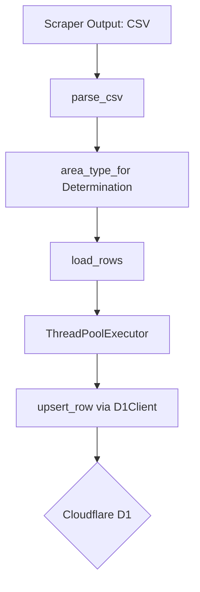
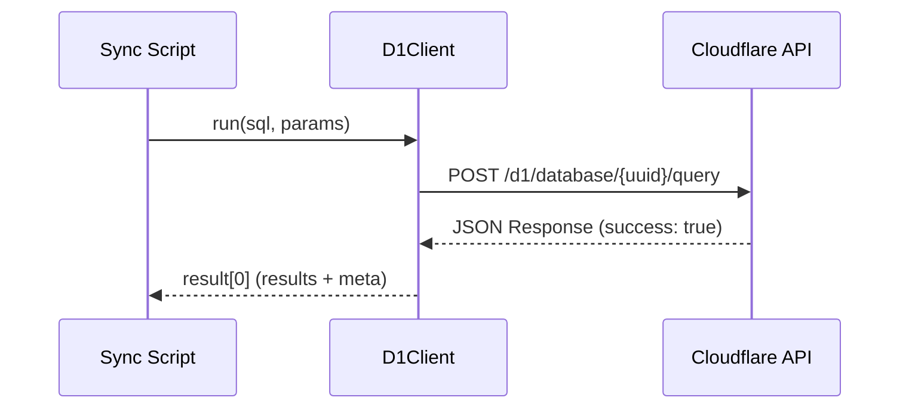

<details>
<summary>Relevant source files</summary>

The following files were used as context for generating this wiki page:

- [tests/test\_sync\_to\_d1.py](tests/test_sync_to_d1.py)
- [scraper/sync\_to\_d1.py](scraper/sync_to_d1.py)
- [scraper/d1.py](scraper/d1.py)
- [export/export\_d1.py](export/export_d1.py)
- [verify/verify\_emails.py](verify/verify_emails.py)
- [tests/test\_kyrka.py](tests/test_kyrka.py)
</details>

# Testing Synchronization Logic

Testing synchronization logic within the `politiker-kontakter` project ensures the integrity of data as it moves from local scrapers to the Cloudflare D1 database. The synchronization process involves parsing CSV artifacts generated by the primary scraper and performing `UPSERT` operations to maintain an up-to-date record of politicians and their contact details. Sources: [scraper/sync_to_d1.py:1-15](scraper/sync_to_d1.py#L1-L15), [README.md](README.md)

## Core Synchronization Logic

The synchronization system is built around `scraper/sync_to_d1.py`, which acts as a bridge between the scraper's output and the live database. It uses a `D1Client` to communicate with the Cloudflare API. Sources: [scraper/sync_to_d1.py:27-33](scraper/sync_to_d1.py#L27-L33), [scraper/d1.py:38-42](scraper/d1.py#L38-L42)

### Data Flow for Synchronization

The data flow starts with a machine-readable CSV file (`Alla_kommuner_och_regioner.csv`). The script parses this file, determines the `area_type` (e.g., kommun, region, riksdag), and uses a thread pool to execute concurrent HTTP requests to the D1 API. Sources: [scraper/sync_to_d1.py:44-60](scraper/sync_to_d1.py#L44-L60), [scraper/sync_to_d1.py:84-100](scraper/sync_to_d1.py#L84-L100)



The diagram shows the sequential transformation of scraped CSV data into database records via a multi-threaded upsert process. Sources: [scraper/sync_to_d1.py:44-115](scraper/sync_to_d1.py#L44-L115)

## Unit Testing Framework

Testing is primarily conducted using `pytest`. The tests validate critical logic components such as area classification, CSV parsing, and environment handling. Sources: [tests/test_sync_to_d1.py:1-40](tests/test_sync_to_d1.py#L1-L40)

### Area Classification Logic

The `area_type_for` function is tested to ensure that area names are correctly mapped to their respective types. This is crucial for database categorization and filtering in the web application. Sources: [tests/test_sync_to_d1.py:6-12](tests/test_sync_to_d1.py#L6-L12)

| Input Area Name | Expected area_type | logic |
| :--- | :--- | :--- |
| Region Skåne | region | Starts with "Region " |
| Sveriges riksdag | riksdag | Exact match or "Riksdagen" |
| Regeringen | regering | Includes "regering" or "departement" |
| Lysekils kommun | kommun | Default fallback |

Sources: [scraper/sync_to_d1.py:36-42](scraper/sync_to_d1.py#L36-L42), [tests/test_sync_to_d1.py:6-12](tests/test_sync_to_d1.py#L6-L12)

### CSV Parsing and Data Integrity

Tests for `parse_csv` verify that the system correctly handles various data states, such as missing names, parties, or roles. The test ensures that empty strings in the CSV are handled appropriately (e.g., converted to `None` where applicable). Sources: [tests/test_sync_to_d1.py:15-28](tests/test_sync_to_d1.py#L15-L28)

```python
def test_parse_csv(tmp_path):
    csv_path = tmp_path / "resultat.csv"
    csv_path.write_text(
        "area_name,name,email,party,role,source\n"
        "Lysekils kommun,Anna Ek,anna@lysekil.se,S,Ordförande,scraped\n",
        encoding="utf-8",
    )
    rows = s.parse_csv(str(csv_path))
    assert ("Anna Ek", "anna@lysekil.se", "Lysekils kommun", "kommun", "S", "Ordförande") in rows
```

Sources: [tests/test_sync_to_d1.py:15-25](tests/test_sync_to_d1.py#L15-L25)

## Database Interaction Component

The `D1Client` in `scraper/d1.py` provides the abstraction for database operations. It handles authentication via environment variables and manages the HTTP session for connection pooling. Sources: [scraper/d1.py:31-50](scraper/d1.py#L31-L50)

### D1 Client Sequence

The client follows a standard request-response pattern against the Cloudflare API, specifically targeting the `/query` endpoint. Sources: [scraper/d1.py:44-55](scraper/d1.py#L44-L55)



The diagram illustrates how the `D1Client` wraps the underlying HTTP communication to provide a simplified SQL interface for the synchronization scripts. Sources: [scraper/d1.py:53-65](scraper/d1.py#L53-L65)

## SQL Upsert Logic

Synchronization uses an `INSERT ... ON CONFLICT` pattern. This ensures that existing records are updated with the latest scrape time and metadata (name, party, role) while preventing duplicate entries based on the `(email, area_name)` unique constraint. Sources: [scraper/sync_to_d1.py:27-31](scraper/sync_to_d1.py#L27-L31), [export/export_d1.py:80-92](export/export_d1.py#L80-L92)

### Politician Data Model

| Field | Type | Constraint | Description |
| :--- | :--- | :--- | :--- |
| id | TEXT | PRIMARY KEY | Random 11-byte hex blob |
| email | TEXT | UNIQUE (with area) | Politician's email address |
| area_name | TEXT | UNIQUE (with email) | Municipality or Region name |
| area_type | TEXT | - | kommun, region, riksdag, regering, eu, kyrka |
| last_scraped_at | INTEGER | - | Millisecond timestamp of sync |

Sources: [scraper/sync_to_d1.py:27-31](scraper/sync_to_d1.py#L27-L31), [export/export_d1.py:80-92](export/export_d1.py#L80-L92), [scraper/fetch_kyrka.py:52-58](scraper/fetch_kyrka.py#L52-L58)

## Verification and Maintenance Tests

Beyond basic sync, the system includes logic for verifying the continued validity of synchronized emails through SMTP callouts. Sources: [verify/verify_emails.py:10-25](verify/verify_emails.py#L10-L25)

### SMTP Classification Logic

The `verify_emails.py` script classifies email status based on SMTP response codes. Tests (simulated in logic) ensure that different providers (e.g., catch-all domains) do not produce false positives. Sources: [verify/verify_emails.py:61-75](verify/verify_emails.py#L61-L75)

*  **2xx Codes**: Classified as `valid` (unless catch-all is detected).
*  **5xx Codes**: Classified as `dead` (permanent failure).
*  **4xx Codes**: Classified as `temporary` (e.g., greylisting).

Sources: [verify/verify_emails.py:68-75](verify/verify_emails.py#L68-L75)

## Conclusion

Testing the synchronization logic is critical for maintaining the accuracy of the `politician-kontakter` database. By combining unit tests for parsing logic with a robust, concurrent `UPSERT` mechanism, the system ensures that data remains consistent across periodic updates and exports. Sources: [scraper/sync_to_d1.py:108-115](scraper/sync_to_d1.py#L108-L115), [export/export_d1.py:1-15](export/export_d1.py#L1-L15)
