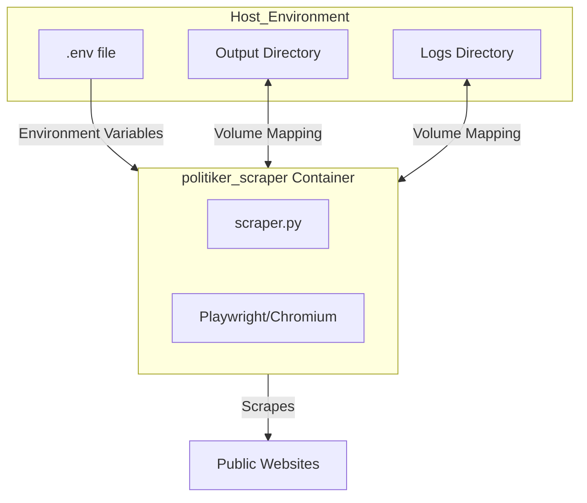
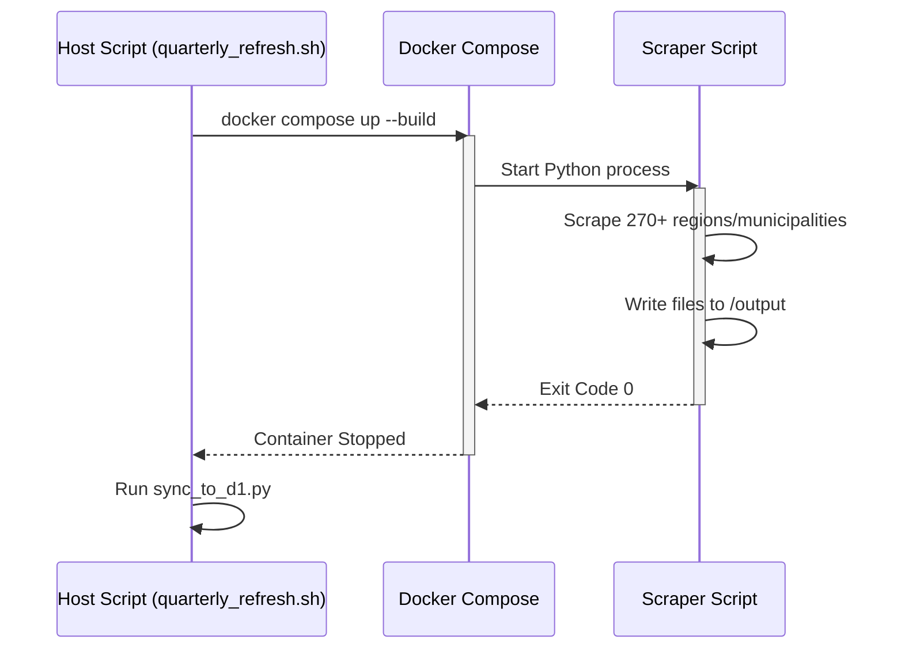

Relevant source files

The following files were used as context for generating this wiki page:

- [docker-compose.yml](docker-compose.yml)
- [scraper/scraper.py](scraper/scraper.py)
- [AGENTS.md](AGENTS.md)
- [CLAUDE.md](CLAUDE.md)
- [README.md](README.md)
- [scraper/quarterly_refresh.sh](scraper/quarterly_refresh.sh)

# Docker Infrastructure

The Docker infrastructure of the `politiker-kontakter` project provides a containerized environment to execute web scrapers that extract contact information for Swedish politicians. This infrastructure ensures that the complex dependencies required for browser automation—specifically Playwright and headless Chromium—are consistently managed across different environments.

The primary role of the Docker setup is to encapsulate the core scraping logic found in `scraper/scraper.py`, providing persistent storage for logs and output data through volume mapping. It is designed to be executed as a transient task rather than a long-running service, typically triggered manually or via scheduled maintenance scripts.

Sources: [AGENTS.md:14-14](AGENTS.md#L14), [CLAUDE.md:14-14](CLAUDE.md#L14), [README.md:65-71](README.md#L65-L71)

## Service Configuration

The project utilizes Docker Compose to define and manage the scraper service. The configuration is centralized in the `docker-compose.yml` file, which specifies the build context, container naming, and environmental parameters.

### Scraper Service Architecture

The infrastructure consists of a single service named `scraper`. It is configured with a custom build context pointing to the `./scraper` directory, where the `Dockerfile` and `entrypoint.sh` are located. The service is explicitly set to `restart: "no"`, reflecting its nature as a batch processing tool that completes its task and exits.

The following diagram illustrates the relationship between the host environment and the Docker container:

Sources: [docker-compose.yml:1-12](docker-compose.yml#L1-L12), [AGENTS.md:27-27](AGENTS.md#L27)

## Volume and Environment Management

The Docker infrastructure relies heavily on host-to-container mappings to handle data persistence and runtime configuration.

### Data Persistence
Two critical volumes are mapped from the host to the container to ensure that the results of the scraping process are preserved after the container exits:
*  **Output Data**: Mapped to `/output` in the container. This contains generated VCF, TXT, and CSV files.
*  **Logs**: Mapped to `/logs` in the container, capturing the execution history of the Python scripts.

### Configuration Options
Environmental variables are used to inject configuration without modifying the image. These are typically defined in a `.env` file on the host.

| Variable | Host Default | Container Path | Description |
| :--- | :--- | :--- | :--- |
| `OUTPUT_DIR` | `./output` | `/output` | Destination for scraped contact files. |
| `LOG_DIR` | `./logs` | `/logs` | Destination for `scraper.log`. |
| `TZ` | N/A | `Europe/Stockholm` | Sets the container timezone. |
| `SENTRY_DSN` | N/A | N/A | Optional DSN for error tracking via Sentry. |

Sources: [docker-compose.yml:6-12](docker-compose.yml#L6-L12), [scraper/scraper.py:40-42](scraper/scraper.py#L40-L42), [README.md:73-77](README.md#L73-L77)

## Execution Lifecycle

The Docker infrastructure is primarily invoked to run the `scraper/scraper.py` logic. This script uses Playwright with specific flags optimized for container environments.

### Container Runtime Logic
When the container runs, it executes the scraper with several Chromium-specific arguments to ensure stability within a Docker environment:
*  `--no-sandbox`: Required because the container often runs as root.
*  `--disable-dev-shm-usage`: Prevents crashes caused by the limited size of `/dev/shm` in standard Docker containers.
*  `--disable-http2`: A workaround for specific HTTP/2 bugs encountered during scraping.

### Automation and Orchestration
The Docker infrastructure is integrated into broader maintenance workflows, such as the quarterly refresh script. This script automates the process of building and running the container, ensuring the container exits with a proper code before proceeding to subsequent synchronization steps.

Sources: [scraper/scraper.py:537-545](scraper/scraper.py#L537-L545), [scraper/quarterly_refresh.sh:13-17](scraper/quarterly_refresh.sh#L13-L17)

## Conclusion

The Docker Infrastructure of `politiker-kontakter` provides a robust, isolated environment for web scraping. By leveraging Docker Compose and carefully configured Chromium parameters, it overcomes common hurdles associated with browser automation in containers, such as shared memory limits and sandbox requirements. This setup ensures that the contact database can be updated reliably across different hosting environments while maintaining clear separation between the application logic and persistent data storage.
