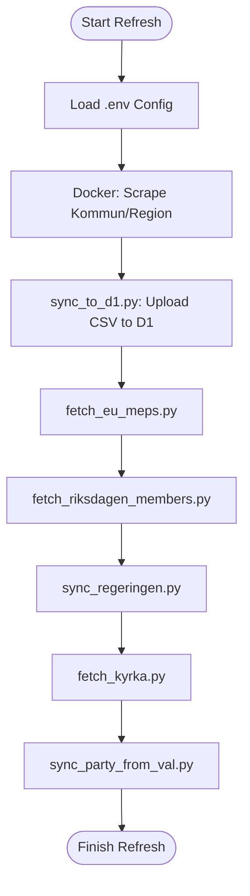
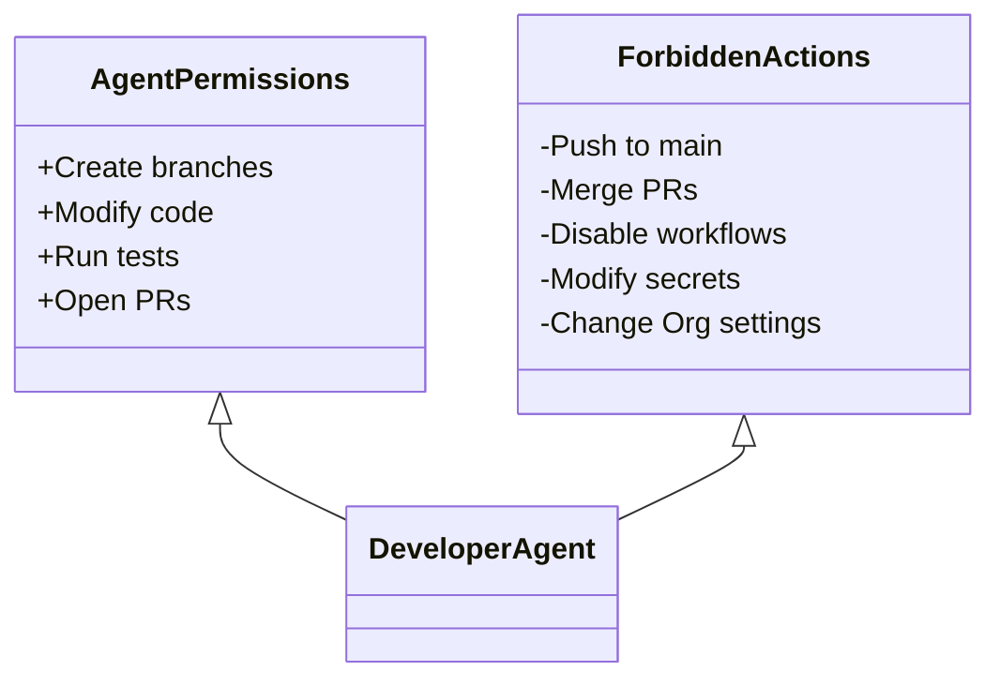

Relevant source files

The following files were used as context for generating this wiki page:

- [README.md](README.md)
- [renovate.json](renovate.json)
- [CLAUDE.md](CLAUDE.md)
- [scraper/quarterly_refresh.sh](scraper/quarterly_refresh.sh)
- [export/export_d1.py](export/export_d1.py)
- [AGENTS.md](AGENTS.md)
- [SECURITY.md](SECURITY.md)

# CI/CD and Automation Workflows

The CI/CD and automation workflows in the `politiker-kontakter` project are designed to maintain a fresh and accurate database of Swedish political contacts. These workflows manage the end-to-end process of scraping diverse data sources (local municipalities, regions, national parliament, EU parliament, and the Swedish Church), synchronizing this data to a Cloudflare D1 database, and exporting it back to the repository as static assets for public consumption.

The automation strategy relies on a combination of scheduled shell scripts, GitHub Actions for data exports, and automated dependency management. This ensures that the contact information for approximately 17,000 elected officials remains current with minimal manual intervention.
Sources: [README.md:1-15](README.md#L1-L15), [CLAUDE.md:46-52](CLAUDE.md#L46-L52)

## Data Synchronization and Refresh Pipeline

The core automation is encapsulated in a scheduled refresh cycle that coordinates multiple specialized scraping and synchronization scripts. While the scraper can be run manually via Docker Compose, the full pipeline is designed for quarterly execution, particularly following major election cycles.

### Quarterly Refresh Workflow

The `scraper/quarterly_refresh.sh` script acts as the primary orchestrator for the data lifecycle. It follows a strict sequence to ensure data integrity across different political levels.

This diagram illustrates the sequential execution of the data collection and synchronization tools.
Sources: [scraper/quarterly_refresh.sh:1-35](scraper/quarterly_refresh.sh#L1-L35)

### Automation Components

| Component | Responsibility | Source File |
| :--- | :--- | :--- |
| **Playwright Scraper** | Headless browser scraping of 290 municipalities and 21 regions. | [scraper/scraper.py](scraper/scraper.py) |
| **D1 Synchronizer** | Parallelized upsert of CSV results to Cloudflare D1 database. | [scraper/sync_to_d1.py](scraper/sync_to_d1.py) |
| **Data Exporter** | Weekly export of D1 database to CSV, JSON, and SQL formats. | [export/export_d1.py](export/export_d1.py) |
| **Validation Sync** | Matches names against Valmyndigheten data to ensure correct party affiliation. | [scraper/sync_party_from_val.py](scraper/sync_party_from_val.py) |

## Automated Data Publication

The project employs a "Data-as-Code" approach where the live Cloudflare D1 database is periodically exported back into the repository's `data/` directory.

### Weekly Export Workflow
A GitHub Action defined in `.github/workflows/export-politiker.yml` (referenced in documentation) runs `export/export_d1.py` weekly. This script performs the following:
1.  **Keyset Pagination:** Uses `(email, area_name)` as a unique key to fetch all records from D1 without skipping data during concurrent writes.
2.  **Deterministic Sorting:** Sorts output by `area_type`, `area_name`, `name`, and `email` to ensure stable, noise-free git diffs.
3.  **Static Asset Generation:** Produces `politiker.csv`, `politiker.json`, and `politiker.sql`.
4.  **Auto-Merge PR:** If changes are detected, it opens a Pull Request that is automatically merged to keep the repository's public data in sync with the live database.

Sources: [export/export_d1.py:15-50](export/export_d1.py#L15-L50), [README.md:10-20](README.md#L10-L20), [CLAUDE.md:46-52](CLAUDE.md#L46-L52)

## Maintenance and Dependency Automation

Automation extends to security and project maintenance through standardized GitHub tools and configurations.

### Dependency Management
The project uses **Renovate** and **Dependabot** to maintain software supply chain security.
*  **Renovate:** Configured via `renovate.json` using the `config:recommended` extension to manage general library updates.
*  **Dependabot:** Specifically monitors security vulnerabilities (CVEs) in critical libraries like `Playwright` and `pypdf`.

Sources: [renovate.json:1-6](renovate.json#L1-L6), [SECURITY.md:20-25](SECURITY.md#L20-L25)

### Development and Agent Constraints
The project defines strict rules for automation agents (AI agents) to prevent unauthorized changes to the CI/CD environment.

This diagram represents the security boundaries for automated agents interacting with the repository.
Sources: [AGENTS.md:38-55](AGENTS.md#L38-L55)

## Summary
The CI/CD and automation workflows in `politiker-kontakter` provide a robust framework for maintaining a high-volume contact database. By combining scheduled collection scripts with GitHub-native automation for data exports and dependency management, the system ensures that the information remains technically accurate and publicly accessible without requiring constant manual oversight.

Sources: [README.md](README.md), [scraper/quarterly_refresh.sh](scraper/quarterly_refresh.sh)
