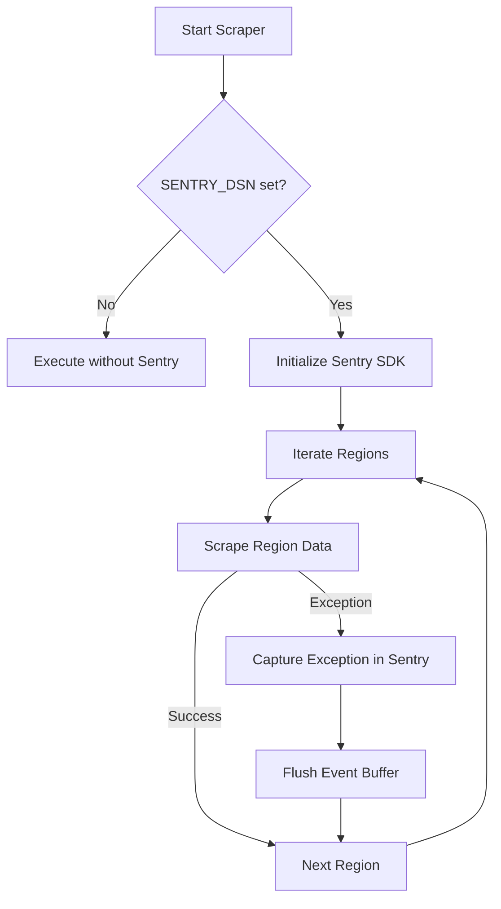
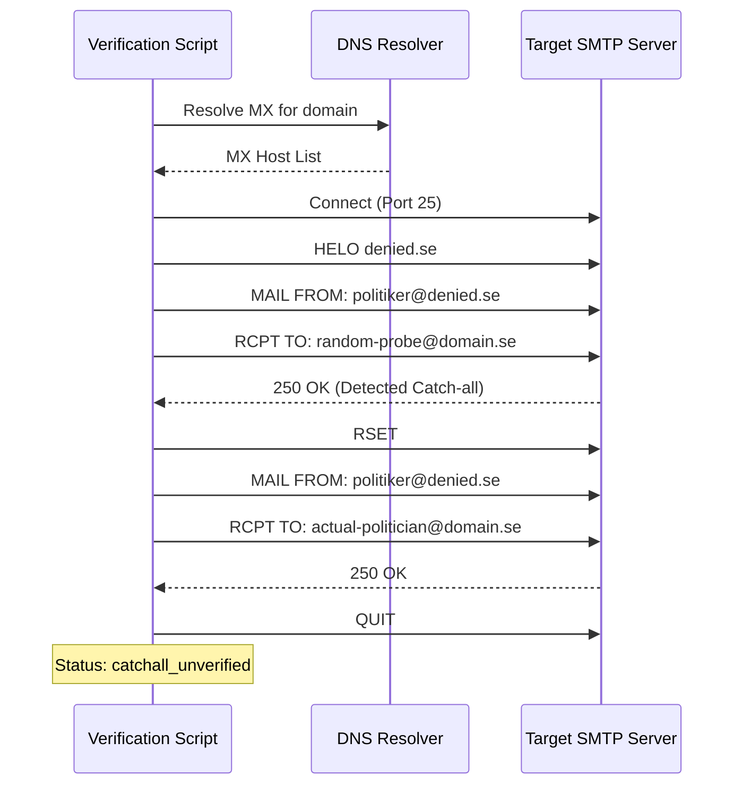

Relevant source files

The following files were used as context for generating this wiki page:

- [SECURITY.md](SECURITY.md)
- [README.md](README.md)
- [scraper/scraper.py](scraper/scraper.py)
- [verify/verify_emails.py](verify/verify_emails.py)
- [AGENTS.md](AGENTS.md)
- [CLAUDE.md](CLAUDE.md)

# Security and Error Tracking

## Introduction

The Security and Error Tracking framework of the **politiker-kontakter** project focuses on the safe acquisition and validation of publicly available contact information for Swedish elected officials. The system is designed to handle only public data, explicitly avoiding the storage or processing of sensitive personal information or credentials. Security is maintained through strict TLS validation requirements, dependency management, and a private vulnerability reporting process.

Error tracking is implemented via integration with Sentry, monitoring both localized scraping failures and global application crashes. Additionally, a dedicated email verification system performs SMTP callouts to validate collected addresses without sending actual messages, ensuring data quality and protecting sender reputation.

Sources: [SECURITY.md:5-10](SECURITY.md#L5-L10), [README.md:46-49](README.md#L46-L49), [AGENTS.md:38-40](AGENTS.md#L38-L40)

## Security Policy and Data Handling

The project adheres to a "Public Data Only" scope. It scrapes information already published by municipalities and regions on their own websites. The tech stack utilizes Playwright with headless Chromium and `pypdf` for data extraction.

### Security Guidelines
*  **Vulnerability Reporting:** Vulnerabilities related to input handling, dependencies, or Docker configurations must be reported privately via GitHub Security Advisories.
*  **Dependency Management:** Third-party libraries like Playwright and `pypdf` are monitored via Dependabot for known CVEs.
*  **TLS Validation:** Hardening or disabling TLS validation (e.g., using `ignore_https_errors`) is strictly forbidden in committed code to ensure secure connections.
*  **Credential Safety:** The project does not handle login credentials or secrets; all data is public.

Sources: [SECURITY.md:12-23](SECURITY.md#L12-L23), [AGENTS.md:38-40](AGENTS.md#L38-L40), [CLAUDE.md:65-68](CLAUDE.md#L65-L68)

## Error Tracking Architecture

The project utilizes **Sentry** for real-time error monitoring. The integration is configured to capture unhandled exceptions during both global execution and specific regional scraping tasks.

### Sentry Implementation
When the `SENTRY_DSN` environment variable is provided, the system initializes the Sentry SDK. If the variable is missing, the tracker operates as a no-op, allowing the scraper to run normally without external tracking.

The diagram shows the logic for initializing error tracking and the flow for capturing regional scraping failures without halting the entire process.
Sources: [README.md:46-50](README.md#L46-L50), [scraper/scraper.py:44-50, 483-487](scraper/scraper.py#L44-L50)

### Tracking Configuration
| Parameter | Value/Behavior | Description |
| :--- | :--- | :--- |
| `traces_sample_rate` | 1.0 | Captures all traces for performance monitoring. |
| `send_default_pii` | `False` | Disables sending Personally Identifiable Information to Sentry. |
| `include_local_variables` | `False` | Prevents local variable values from being included in crash reports for security. |

Sources: [scraper/scraper.py:45-49](scraper/scraper.py#L45-L49)

## Email Verification System

A dedicated module, `verify/verify_emails.py`, provides periodic validation of the `politicians` D1 database table. This is critical for maintaining data accuracy and preventing bounces that could damage sender reputation.

### SMTP Callout Logic
The system uses "SMTP callouts" to verify addresses. It connects to the recipient's MX server on port 25 and simulates a mail transfer up to the `RCPT TO` command, then terminates before the `DATA` command is sent.

### Catch-all Detection
To prevent false positives from providers like Microsoft 365 or Google Workspace, the system probes a random, non-existent local part at the same domain. If the fake address is accepted, the domain is flagged as a "catch-all," and all addresses on that domain are marked as `catchall_unverified`.

The sequence shows the interaction between the verifier and the target mail server, highlighting the catch-all detection probe.
Sources: [verify/verify_emails.py:12-32, 85-115](verify/verify_emails.py#L12-L32)

### Verification Statuses
| Status | Meaning |
| :--- | :--- |
| `valid` | SMTP server accepted the address and is not a catch-all. |
| `dead` | Permanent rejection (5xx error); address does not exist. |
| `temporary` | Temporary failure (4xx error); likely greylisting or rate limit. |
| `catchall_unverified` | Domain accepts all addresses; validity cannot be confirmed via SMTP. |
| `unreachable_*` | Network issues or missing MX records. |

Sources: [verify/verify_emails.py:64-75](verify/verify_emails.py#L64-L75)

## Infrastructure and Runtime Security

The project uses Docker to provide an isolated execution environment.

*  **Playwright Sandbox:** The scraper runs Chromium with `--no-sandbox` because the container runs as root. This is considered acceptable as the scraper only visits trusted government/municipality sites.
*  **Container Isolation:** The `docker-compose.yml` maps specific volumes for logs and output, ensuring the host filesystem is protected.
*  **Environment Variables:** Sensitive Cloudflare API tokens (`CLOUDFLARE_API_TOKEN`) and database IDs are managed via `.env` files and never committed to the repository.

Sources: [scraper/scraper.py:461-469](scraper/scraper.py#L461-L469), [CLAUDE.md:36-40](CLAUDE.md#L36-L40), [docker-compose.yml:7-14](docker-compose.yml#L7-L14)

## Summary

Security and error tracking in **politiker-kontakter** are built on the principles of transparency and reliability. By utilizing Sentry for runtime monitoring, SMTP callouts for data verification, and strict adherence to a public-data-only scope, the project maintains a high standard of data integrity while ensuring the scraping process is resilient to failures. The architecture ensures that errors in one municipality's data source do not disrupt the global synchronization to the D1 database.
