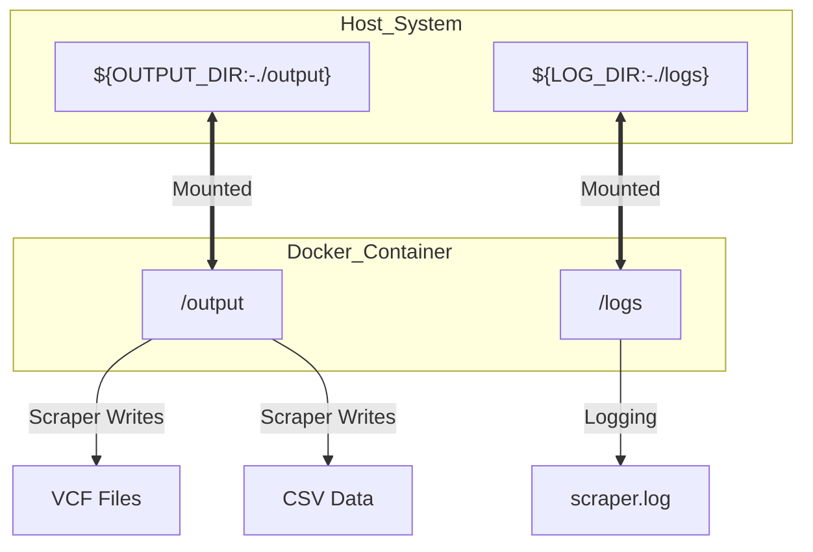
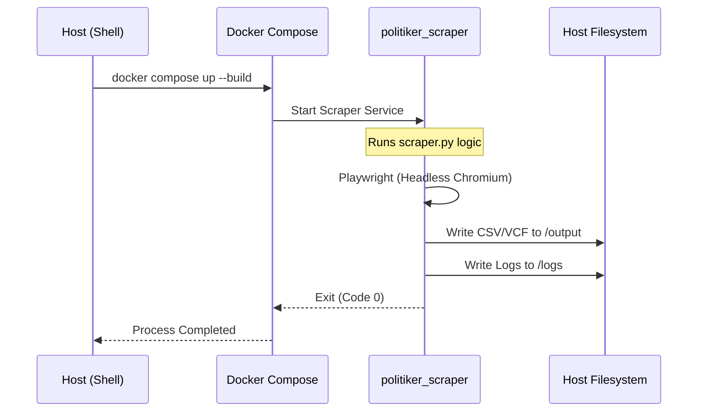

<details>
<summary>Relevant source files</summary>

The following files were used as context for generating this wiki page:

- [docker-compose.yml](docker-compose.yml)
- [README.md](README.md)
- [AGENTS.md](AGENTS.md)
- [CLAUDE.md](CLAUDE.md)
- [scraper/scraper.py](scraper/scraper.py)
- [scraper/quarterly_refresh.sh](scraper/quarterly_refresh.sh)
</details>

# Docker Infrastructure

The Docker infrastructure in the `politiker-kontakter` project provides a containerized environment to execute the scraping logic reliably. It ensures that the required tech stack—including Python 3, Playwright (headless Chromium), and `pypdf`—is available in a consistent environment regardless of the host operating system. Sources: [AGENTS.md:12-16](AGENTS.md#L12-L16), [CLAUDE.md:12-16](CLAUDE.md#L12-L16)

The primary function of this infrastructure is to run the main scraper module, which extracts contact information for elected officials across Sweden's 290 municipalities and 21 regions. By using Docker, the project avoids dependency conflicts related to browser binaries and system-level libraries required by Playwright. Sources: [README.md:1-5](README.md#L1-L5), [scraper/scraper.py:1-7](scraper/scraper.py#L1-L7)

## Container Orchestration

The project utilizes Docker Compose to manage the scraper service. The configuration is centralized in the `docker-compose.yml` file, which defines the build context, container identity, and operational constraints. Sources: [docker-compose.yml:1-12](docker-compose.yml#L1-L12)

### Service Configuration

The orchestration is composed of a single service named `scraper`. This service is configured to build from the `./scraper` directory and use a specific container name for easier management. Sources: [docker-compose.yml:2-4](docker-compose.yml#L2-L4)

| Parameter | Value | Description |
| :--- | :--- | :--- |
| `build` | `./scraper` | Path to the Dockerfile and build context. |
| `container_name` | `politiker_scraper` | Explicit name assigned to the running container. |
| `restart` | `"no"` | Ensures the scraper does not automatically restart after completion. |

Sources: [docker-compose.yml:2-5](docker-compose.yml#L2-L5)

### Volume Persistence

To ensure that scraped data and logs persist outside the container's volatile filesystem, the infrastructure uses host-to-container volume mapping. This allows the host to access the generated VCF files, TXT summaries, and CSV data. Sources: [docker-compose.yml:6-8](docker-compose.yml#L6-L8), [scraper/scraper.py:30-34](scraper/scraper.py#L30-L34)



This diagram illustrates the relationship between host directories and container mount points. Sources: [docker-compose.yml:6-8](docker-compose.yml#L6-L8), [scraper/scraper.py:30-47](scraper/scraper.py#L30-L47)

### Environment Variables

The container's behavior is modified through environment variables defined in both the `docker-compose.yml` and the local `.env` file. Sources: [docker-compose.yml:9-12](docker-compose.yml#L9-L12), [README.md:46-51](README.md#L46-L51)

*  **TZ:** Set to `Europe/Stockholm` to ensure correct timestamping in logs and metadata.
*  **SENTRY_DSN:** An optional variable used for error tracking and global crash reporting. If missing, error tracking is a no-op.
*  **OUTPUT_DIR / LOG_DIR:** Used on the host side to determine where data is saved.

Sources: [docker-compose.yml:11-12](docker-compose.yml#L11-L12), [README.md:52-56](README.md#L52-L56), [scraper/scraper.py:44-50](scraper/scraper.py#L44-L50)

## Execution Lifecycle

The Docker infrastructure is utilized in two primary scenarios: local development and automated scheduled refreshes. Sources: [README.md:46-51](README.md#L46-L51), [scraper/quarterly_refresh.sh:16-18](scraper/quarterly_refresh.sh#L16-L18)

### Build and Deployment

The build process relies on a `Dockerfile` located in the `scraper/` directory. While the container is running, it utilizes Playwright with specific arguments to bypass common containerization hurdles, such as the `--no-sandbox` flag required when running as root. Sources: [AGENTS.md:21-22](AGENTS.md#L21-L22), [scraper/scraper.py:480-488](scraper/scraper.py#L480-L488)



The sequence above shows the standard lifecycle of an execution triggered by a user or script. Sources: [AGENTS.md:14-16](AGENTS.md#L14-L16), [scraper/scraper.py:475-495](scraper/scraper.py#L475-L495), [scraper/quarterly_refresh.sh:17-18](scraper/quarterly_refresh.sh#L17-L18)

### Scheduled Tasks

The infrastructure is integrated into the `quarterly_refresh.sh` script. This script automates the full update cycle by forcing a rebuild and execution of the scraper container before proceeding with database synchronization. Sources: [scraper/quarterly_refresh.sh:11-18](scraper/quarterly_refresh.sh#L11-L18)

```bash
echo "--- Skrapar kommun/region (Playwright/Docker) ---"
cd ..
docker compose up --build --abort-on-container-exit --exit-code-from scraper
```

Sources: [scraper/quarterly_refresh.sh:16-18](scraper/quarterly_refresh.sh#L16-L18)

## Conclusion

The Docker infrastructure provides a robust and isolated environment for the project's scraping operations. By utilizing Docker Compose to manage volumes and environment variables, the system ensures that contact data is consistently extracted and persisted for further use by downstream synchronization scripts and the public database. Sources: [CLAUDE.md:12-16](CLAUDE.md#L12-L16), [README.md:58-62](README.md#L58-L62)
