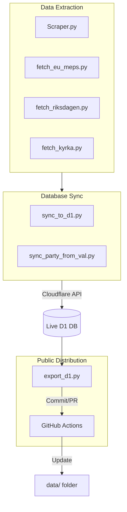
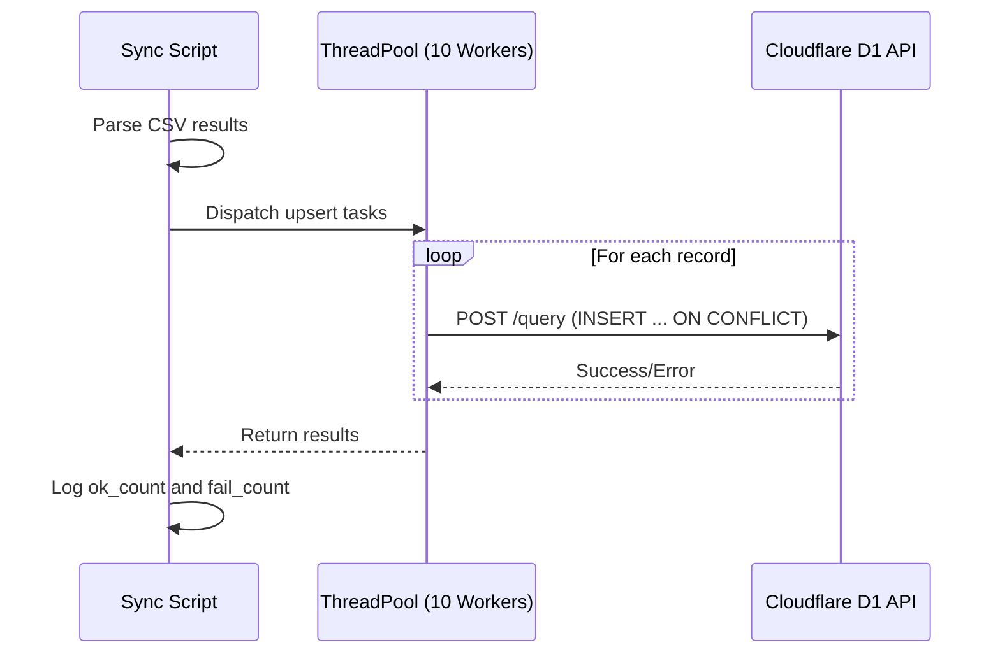

Relevant source files

The following files were used as context for generating this wiki page:

- [renovate.json](renovate.json)
- [scraper/quarterly_refresh.sh](scraper/quarterly_refresh.sh)
- [README.md](README.md)
- [CLAUDE.md](CLAUDE.md)
- [AGENTS.md](AGENTS.md)
- [export/export_d1.py](export/export_d1.py)
- [scraper/sync_to_d1.py](scraper/sync_to_d1.py)
- [SECURITY.md](SECURITY.md)

# CI/CD and Automation Workflows

The CI/CD and automation workflows in this project are designed to maintain a synchronized, up-to-date database of Swedish political contacts. The system automates the lifecycle of data from initial scraping across various government levels to validation, database synchronization, and public data export.

The core of the automation infrastructure relies on scheduled shell scripts, GitHub Actions for data publishing, and automated dependency management. These workflows ensure that the Cloudflare D1 database powering the [politiker-webapp](https://politiker.denied.se) remains accurate with minimal manual intervention.

Sources: [README.md:1-15](README.md#L1-L15), [CLAUDE.md:1-10](CLAUDE.md#L1-L10), [scraper/quarterly_refresh.sh:1-10](scraper/quarterly_refresh.sh#L1-L10)

## Automation Architecture

The automation follows a multi-stage pipeline: extraction (scraping), transformation (normalization), loading (syncing to D1), and distribution (exporting to the `data/` directory).

This diagram illustrates the flow from various scraping modules through the synchronization scripts into the live Cloudflare D1 database, and finally the export back to the repository.
Sources: [scraper/quarterly_refresh.sh:15-40](scraper/quarterly_refresh.sh#L15-L40), [README.md:17-35](README.md#L17-L35), [export/export_d1.py:1-15](export/export_d1.py#L1-L15)

## Scheduled Data Refreshes

The project utilizes a quarterly refresh cycle for a full database overhaul, specifically timed to align with Swedish mandate periods (e.g., following the 2026-09 election).

### Quarterly Refresh Pipeline
The `quarterly_refresh.sh` script orchestrates the following sequence:
1. **Containerized Scraping**: Executes the Playwright-based scraper within Docker to fetch local and regional data.
2. **D1 Synchronization**: Upserts the resulting CSV data to Cloudflare D1.
3. **Specialized Fetches**: Runs specific scripts for EU MEPs, Riksdagen members, and Church of Sweden officials.
4. **Party Alignment**: Matches party affiliations against official data from Valmyndigheten.

Sources: [scraper/quarterly_refresh.sh:1-40](scraper/quarterly_refresh.sh#L1-L40), [AGENTS.md:10-25](AGENTS.md#L10-L25)

## Data Export and Public Synchronization

A weekly automated workflow handles the distribution of live data from the production database back to the GitHub repository. This ensures that the public-facing CSV, JSON, and SQL files in the `data/` directory are kept current.

### Export Workflow Components
| Component | Function | File Reference |
| :--- | :--- | :--- |
| `export-politiker.yml` | GitHub Action that triggers weekly and opens auto-merged PRs. | `.github/workflows/export-politiker.yml` |
| `export_d1.py` | Python script that reads from D1 and writes to `data/`. | `export/export_d1.py` |
| Deterministic Sorter | Ensures stable diffs by sorting output by `area_type` and `email`. | `export/export_d1.py:46-52` |

Sources: [README.md:20-30](README.md#L20-L30), [CLAUDE.md:44-50](CLAUDE.md#L44-L50), [export/export_d1.py:10-25](export/export_d1.py#L10-L25)

## Dependency and Security Automation

Automation is also applied to maintenance and security through third-party integrations.

### Renovate and Dependabot
The project uses `renovate` for automated dependency updates, configured via a recommended schema. Additionally, `Dependabot` is utilized to monitor and patch vulnerabilities in core libraries such as Playwright and pypdf.

Sources: [renovate.json:1-6](renovate.json#L1-L6), [SECURITY.md:20-25](SECURITY.md#L20-L25)

### Error Tracking
Sentry is integrated into the scraping logic to capture unhandled exceptions during large-scale runs (covering 290 municipalities and 21 regions). This is configured via the `SENTRY_DSN` environment variable.

Sources: [scraper/scraper.py:44-50](scraper/scraper.py#L44-L50), [README.md:46-52](README.md#L46-L52)

## Database Synchronization Logic

The `sync_to_d1.py` script manages the insertion and updating of records. Because the Cloudflare D1 HTTP API does not support multiple parameterized statements in a single call, the sync process is parallelized using a `ThreadPoolExecutor`.

Sources: [scraper/sync_to_d1.py:20-30, 84-105](scraper/sync_to_d1.py#L20-L30)

## Conclusion
The automation workflows in `politiker-kontakter` create a robust loop between live data scraping and public accessibility. By utilizing scheduled shell scripts for heavy scraping tasks and GitHub Actions for data synchronization, the project maintains a high-quality database with minimal manual oversight while ensuring that all changes are tracked and audited through standard Git versioning.
