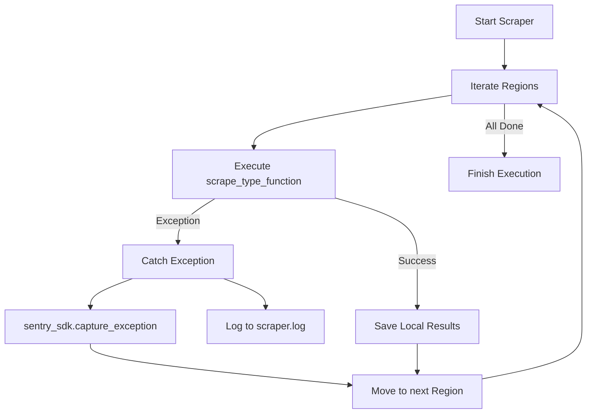
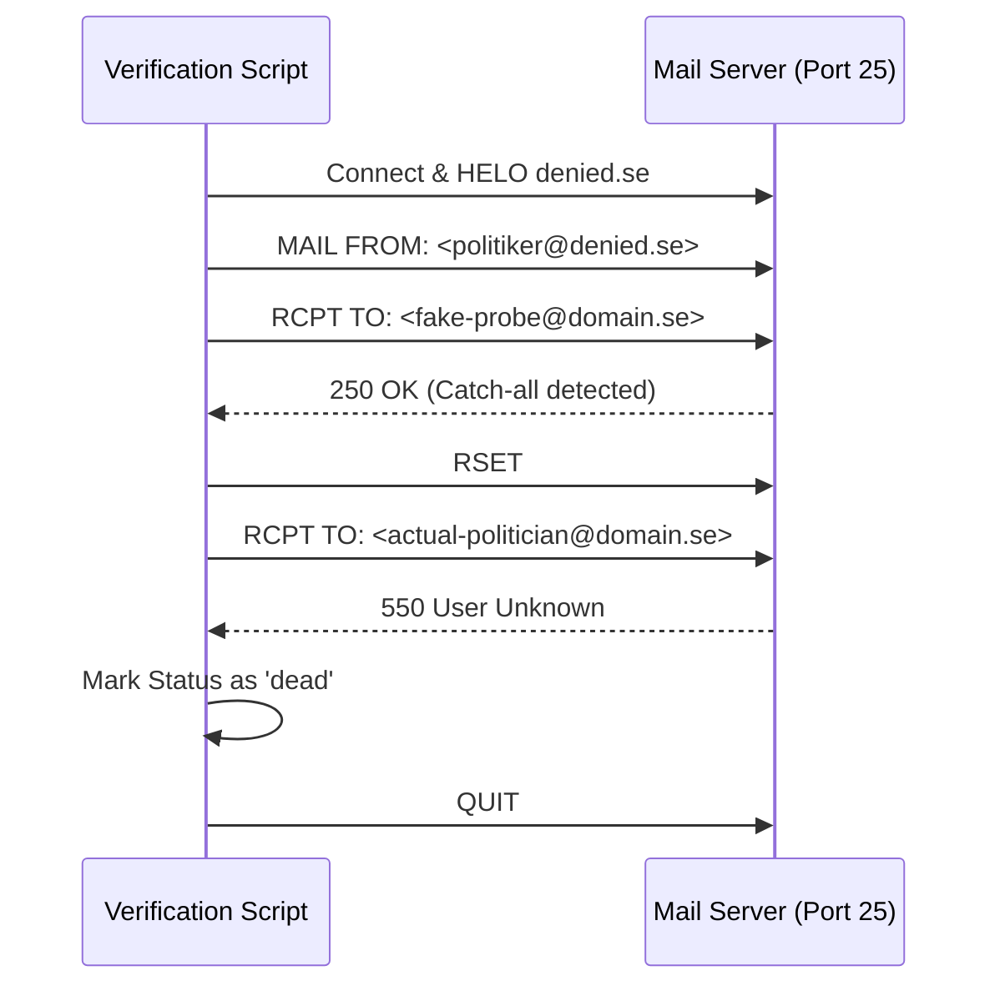

<details>
<summary>Relevant source files</summary>

The following files were used as context for generating this wiki page:

- [SECURITY.md](SECURITY.md)
- [scraper/scraper.py](scraper/scraper.py)
- [verify/verify_emails.py](verify/verify_emails.py)
- [AGENTS.md](AGENTS.md)
- [README.md](README.md)
- [scraper/sync_to_d1.py](scraper/sync_to_d1.py)
</details>

# Security and Error Tracking

## Introduction
The **Security and Error Tracking** system in the `politiker-kontakter` project is designed to ensure the integrity of scraped public contact information while monitoring the health of the automated scraping pipelines. Since the project exclusively handles publicly available professional contact details (email addresses of elected officials), the security focus is primarily on infrastructure protection, dependency management, and data validation rather than user authentication or sensitive data encryption.

Error tracking is implemented through integrated telemetry via Sentry, which captures unhandled exceptions during scraping runs, and local logging. Additionally, the project includes a specialized verification system to track the validity of collected email addresses using SMTP probes, categorizing them based on their delivery status.

## Security Policy and Data Handling
The project maintains a strict policy of only scraping publicly published data from Swedish municipalities and regions. Only publicly sourced professional contact data (elected officials' names, work email addresses, party, and role) is processed — no login credentials or other sensitive secrets are handled or stored by the scraper. Note that identifiable email addresses are still personal data even when publicly available; publication by the source does not remove applicable retention and handling obligations, so entries should remain correctable/removable on request even though the data itself is not confidential.

### Core Security Principles
*  **Infrastructure Security**: Vulnerabilities in input handling, dependencies (e.g., Playwright, pypdf), or Docker configurations are managed through private GitHub Security Advisories.
*  **Dependency Management**: Third-party library updates and CVE monitoring are automated via Dependabot.
*  **TLS/SSL Integrity**: The project strictly forbids disabling TLS validation (e.g., `ignore_https_errors`) in production code to prevent man-in-the-middle attacks.
*  **Environment Safety**: The Docker container runs with `--no-sandbox` as it operates as root, but it is limited to visiting trusted government websites.

Sources: [SECURITY.md:1-20](SECURITY.md#L1-L20), [AGENTS.md:32-34](AGENTS.md#L32-L34), [scraper/scraper.py:465-470](scraper/scraper.py#L465-L470)

## Error Tracking Architecture
The system employs Sentry for global exception monitoring and a local logging strategy for detailed execution history.

### Sentry Integration
The scraper initializes the Sentry SDK to capture crashes and unhandled errors during region-specific scraping tasks. 
*  **Global Catching**: A global `try-except` block in the main loop ensures that even if one municipality fails, the error is reported to Sentry and the scraper continues to the next target.
*  **Data Privacy**: Sentry is configured to exclude Personally Identifiable Information (PII) and local variables from error reports.

### Local Logging
Logs are stored in a dedicated directory (defaulting to `/logs`) and output to `stdout`.
*  **Log Format**: `%(asctime)s %(levelname)s %(message)s`
*  **Scope**: Captures informational status (e.g., profile pages found) and errors (e.g., Playwright timeouts or unhandled exceptions).

Sources: [scraper/scraper.py:32-52](scraper/scraper.py#L32-L52), [scraper/scraper.py:495-502](scraper/scraper.py#L495-L502), [README.md:46-50](README.md#L46-L50)

### Error Reporting Flow
The following diagram illustrates how exceptions are handled and reported during the scraping process.



A flowchart showing the error handling loop where exceptions are logged locally and sent to Sentry without stopping the entire process. Sources: [scraper/scraper.py:495-502](scraper/scraper.py#L495-L502)

## Email Verification and Status Tracking
To ensure the quality of the "Security and Error Tracking" module, the project verifies collected data through SMTP callouts. This prevents the system from propagating "dead" or "guessed" addresses that could damage sender reputation.

### Verification Logic
The `verify_emails.py` script performs SMTP probes without sending actual emails. It categorizes emails into statuses to track their reliability.

| Status | Description |
| :--- | :--- |
| `valid` | SMTP RCPT TO was accepted (2xx code). |
| `dead` | Permanent rejection (5xx code); address does not exist. |
| `temporary` | Temporary failure (4xx code), e.g., greylisting or rate limiting. |
| `catchall_unverified` | Domain accepts all addresses; validity is uncertain. |
| `unreachable_no_mx` | Domain lacks valid MX records. |

### Catch-all Detection
The system detects "catch-all" domains (common in large providers like Microsoft 365) by probing an obviously fake address (e.g., `probe-randomstring@domain.com`). If the fake address is accepted, the domain is flagged as catch-all.

Sources: [verify/verify_emails.py:40-80](verify/verify_emails.py#L40-L80), [verify/verify_emails.py:90-110](verify/verify_emails.py#L90-L110)

## Implementation Details

### SMTP Probe Sequence



A sequence diagram showing the SMTP callout process used to verify email existence without sending data. Sources: [verify/verify_emails.py:100-145](verify/verify_emails.py#L100-L145)

### Code Snippets: Sentry and Logic Error Handling

```python
# scraper/scraper.py:495-502
            except Exception as e:
                log.error(f"{namn}: ohanterat fel, hoppar över ({e})")
                sentry_sdk.capture_exception(e)
                sentry_sdk.flush(timeout=5)
                continue
```

*Sources: [scraper/scraper.py:495-502](scraper/scraper.py#L495-L502)*

```python
# verify/verify_emails.py:145-155
        for politician_id, email in rows:
            status = status_by_email.get(email, "unknown")
            counts[status] += 1
            client.run(
                "UPDATE politicians SET verification_status = ?, last_verified_at = ? WHERE id = ?",
                [status, now_ms, politician_id],
            )
```

*Sources: [verify/verify_emails.py:145-155](verify/verify_emails.py#L145-L155)*

## Summary
The Security and Error Tracking system provides a robust framework for maintaining a high-quality database of public contact information. By combining automated dependency updates, centralized error reporting via Sentry, and a custom SMTP verification engine, the project ensures that data is both safe to handle and accurate for end-users, while providing developers with the tools needed to debug failures in the complex scraping landscape of 290+ unique web targets.
